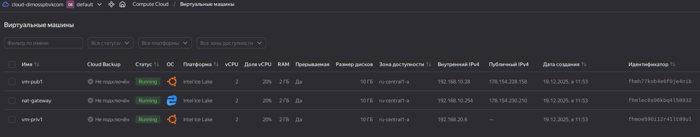
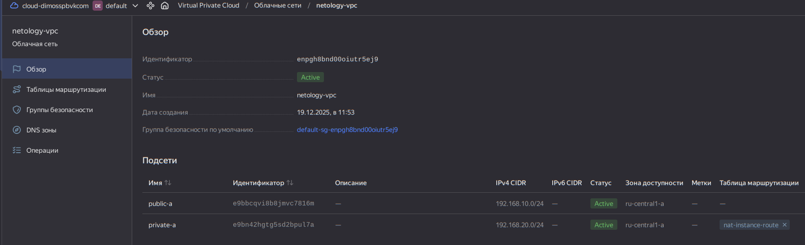
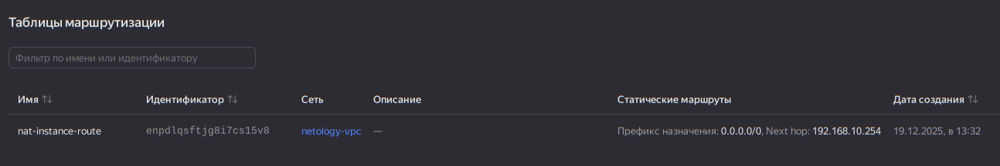
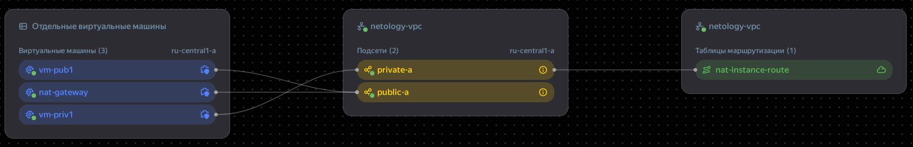

# Домашнее задание к занятию «Организация сети»

>### Подготовка к выполнению задания
>
>1. Домашнее задание состоит из обязательной части, которую нужно выполнить на провайдере Yandex Cloud, и дополнительной части в AWS (выполняется по желанию). 
>2. Все домашние задания в блоке 15 связаны друг с другом и в конце представляют пример законченной инфраструктуры.  
>3. Все задания нужно выполнить с помощью Terraform. Результатом выполненного домашнего задания будет код в репозитории. 
>4. Перед началом работы настройте доступ к облачным ресурсам из Terraform, используя материалы прошлых лекций и домашнее задание по теме «Облачные провайдеры и синтаксис Terraform». Заранее выберите регион (в случае AWS) и зону.
>
>---
>### Задание 1. Yandex Cloud 
>
>**Что нужно сделать**
>
>1. Создать пустую VPC. Выбрать зону.
>2. Публичная подсеть.
>
> - Создать в VPC subnet с названием public, сетью 192.168.10.0/24.
> - Создать в этой подсети NAT-инстанс, присвоив ему адрес 192.168.10.254. В качестве image_id использовать fd80mrhj8fl2oe87o4e1.
> - Создать в этой публичной подсети виртуалку с публичным IP, подключиться к ней и убедиться, что есть доступ к интернету.
>3. Приватная подсеть.
> - Создать в VPC subnet с названием private, сетью 192.168.20.0/24.
> - Создать route table. Добавить статический маршрут, направляющий весь исходящий трафик private сети в NAT-инстанс.
> - Создать в этой приватной подсети виртуалку с внутренним IP, подключиться к ней через виртуалку, созданную ранее, и убедиться, что есть доступ к интернету.
>
>Resource Terraform для Yandex Cloud:
>
>- [VPC subnet](https://registry.terraform.io/providers/yandex-cloud/yandex/latest/docs/resources/vpc_subnet).
>- [Route table](https://registry.terraform.io/providers/yandex-cloud/yandex/latest/docs/resources/vpc_route_table).
>- [Compute Instance](https://registry.terraform.io/providers/yandex-cloud/yandex/latest/docs/resources/compute_instance).

---
## Решение

### Замечание

- Я не увидел в Yandex Cloud настроек определяющих подсеть как приватную, только в [Yandex BareMetal](https://yandex.cloud/ru/docs/baremetal/operations/subnet-create).  
- В YC подсеть НЕ привязывается к Security Group. Подсеть - это только диапазон IP!
- Security Group - это набор правил. SG привязана к интерфейсу на уровне инстанса. `В YC нет прямой связи между подсетями и SG`. Все управление безопасностью происходит на уровне инстансов через их network interfaces. Security Groups привязываются на уровне network_interface инстанса, а не подсети.
- В VPC Default security group for network, создается автоматом, это особая системная группа с нестандартным поведением. Применяется по умолчанию ко всем сетевым интерфейсам в VPC. Default SG — это "запасной вариант" на случай, если мы забыли указать SG. В production её лучше игнорировать и всегда использовать явно определенные Security Groups.
- Любая вм с включенным nat - получает выход в интернет, если ее SG это разрешает.

Т.о. приватная подсеть или паблик - название не определяет уровня изоляции.   
Для полноты решения - создадим группы безопасности для обоих подсетей и сделаем в них необходимые настройки

### Реализация

- [Исходники решения](sol/terraform/)
- Применим
```bash
odv@matebook16s:~/project/MY/Netology-DevOps/CloudProjects/15.1/sol/terraform$ terraform apply
yandex_vpc_network.main: Refreshing state... [id=enpgh8bnd00oiutr5ej9]
yandex_vpc_route_table.nat-instance-route: Refreshing state... [id=enpdlqsftjg8i7cs15v8]
yandex_vpc_security_group.private_sg: Refreshing state... [id=enpca3jjn95ak2vkjdte]
yandex_vpc_security_group.public_sg: Refreshing state... [id=enp0e3eaeef31joil4g7]
yandex_vpc_subnet.subnets["private-a"]: Refreshing state... [id=e9bn42hgtg5sd2bpul7a]
yandex_vpc_subnet.subnets["public-a"]: Refreshing state... [id=e9bbcqvi8b8jmvc7816m]
yandex_compute_instance.hosts["vm-priv1"]: Refreshing state... [id=fhmoe590i12r41lt89ul]
yandex_compute_instance.hosts["nat-gateway"]: Refreshing state... [id=fhmlec6s96kbq4l58932]
yandex_compute_instance.hosts["vm-pub1"]: Refreshing state... [id=fhmh77kob4e6f0je4nib]

Terraform used the selected providers to generate the following execution plan. Resource actions are indicated with the following symbols:
  ~ update in-place

Terraform will perform the following actions:

  # yandex_compute_instance.hosts["vm-priv1"] will be updated in-place
  ~ resource "yandex_compute_instance" "hosts" {
        id                        = "fhmoe590i12r41lt89ul"
        name                      = "vm-priv1"
        # (16 unchanged attributes hidden)

      ~ network_interface {
          ~ nat                = true -> false
            # (10 unchanged attributes hidden)
        }

        # (5 unchanged blocks hidden)
    }

  # yandex_vpc_subnet.subnets["private-a"] will be updated in-place
  ~ resource "yandex_vpc_subnet" "subnets" {
        id             = "e9bn42hgtg5sd2bpul7a"
        name           = "private-a"
      + route_table_id = "enpdlqsftjg8i7cs15v8"
        # (8 unchanged attributes hidden)
    }

Plan: 0 to add, 2 to change, 0 to destroy.

Changes to Outputs:
  ~ master_instances_info = [
        {
            external_ip   = "178.154.230.210"
            fqdn          = "fhmlec6s96kbq4l58932.auto.internal"
            instance_name = "nat-gateway"
        },
      ~ {
          ~ external_ip   = "" -> "178.154.240.5"
            # (2 unchanged attributes hidden)
        },
        {
            external_ip   = "178.154.228.158"
            fqdn          = "fhmh77kob4e6f0je4nib.auto.internal"
            instance_name = "vm-pub1"
        },
    ]

Do you want to perform these actions?
  Terraform will perform the actions described above.
  Only 'yes' will be accepted to approve.

  Enter a value: yes

yandex_vpc_subnet.subnets["private-a"]: Modifying... [id=e9bn42hgtg5sd2bpul7a]
yandex_vpc_subnet.subnets["private-a"]: Modifications complete after 2s [id=e9bn42hgtg5sd2bpul7a]
yandex_compute_instance.hosts["vm-priv1"]: Modifying... [id=fhmoe590i12r41lt89ul]
yandex_compute_instance.hosts["vm-priv1"]: Still modifying... [id=fhmoe590i12r41lt89ul, 00m10s elapsed]
yandex_compute_instance.hosts["vm-priv1"]: Modifications complete after 10s [id=fhmoe590i12r41lt89ul]

Apply complete! Resources: 0 added, 2 changed, 0 destroyed.

Outputs:

master_instances_info = [
  {
    "external_ip" = "178.154.230.210"
    "fqdn" = "fhmlec6s96kbq4l58932.auto.internal"
    "instance_name" = "nat-gateway"
  },
  {
    "external_ip" = "178.154.240.5"
    "fqdn" = "fhmoe590i12r41lt89ul.auto.internal"
    "instance_name" = "vm-priv1"
  },
  {
    "external_ip" = "178.154.228.158"
    "fqdn" = "fhmh77kob4e6f0je4nib.auto.internal"
    "instance_name" = "vm-pub1"
  },
]
```





- Подключение кприватной вм через public вм (jump) с проверкой интернета 

```bash
odv@matebook16s:~/project/MY/Netology-DevOps/CloudProjects/15.1/sol/terraform$ ssh -i ~/.ssh/netology -o ProxyCommand="ssh -i ~/.ssh/netology -W %h:%p ubuntu@178.154.228.158" ubuntu@192.168.20.6
Welcome to Ubuntu 24.04.3 LTS (GNU/Linux 6.8.0-88-generic x86_64)

 * Documentation:  https://help.ubuntu.com
 * Management:     https://landscape.canonical.com
 * Support:        https://ubuntu.com/pro

 System information as of Fri Dec 19 10:54:52 UTC 2025

  System load:  0.0               Processes:             99
  Usage of /:   23.3% of 9.04GB   Users logged in:       0
  Memory usage: 10%               IPv4 address for eth0: 192.168.20.6
  Swap usage:   0%


Expanded Security Maintenance for Applications is not enabled.

0 updates can be applied immediately.

Enable ESM Apps to receive additional future security updates.
See https://ubuntu.com/esm or run: sudo pro status


The list of available updates is more than a week old.
To check for new updates run: sudo apt update
Failed to connect to https://changelogs.ubuntu.com/meta-release-lts. Check your Internet connection or proxy settings


Last login: Fri Dec 19 10:41:01 2025 from 192.168.10.28
To run a command as administrator (user "root"), use "sudo <command>".
See "man sudo_root" for details.

ubuntu@fhmoe590i12r41lt89ul:~$ ping ya.ru
PING ya.ru (77.88.55.242) 56(84) bytes of data.
64 bytes from ya.ru (77.88.55.242): icmp_seq=1 ttl=52 time=4.35 ms
64 bytes from ya.ru (77.88.55.242): icmp_seq=2 ttl=52 time=3.64 ms
64 bytes from ya.ru (77.88.55.242): icmp_seq=3 ttl=52 time=3.62 ms
^C
--- ya.ru ping statistics ---
3 packets transmitted, 3 received, 0% packet loss, time 2004ms
rtt min/avg/max/mdev = 3.619/3.870/4.351/0.340 ms

ubuntu@fhmoe590i12r41lt89ul:~$ ip -address
Option "-address" is unknown, try "ip -help".
ubuntu@fhmoe590i12r41lt89ul:~$ ip address
1: lo: <LOOPBACK,UP,LOWER_UP> mtu 65536 qdisc noqueue state UNKNOWN group default qlen 1000
    link/loopback 00:00:00:00:00:00 brd 00:00:00:00:00:00
    inet 127.0.0.1/8 scope host lo
       valid_lft forever preferred_lft forever
    inet6 ::1/128 scope host noprefixroute 
       valid_lft forever preferred_lft forever
2: eth0: <BROADCAST,MULTICAST,UP,LOWER_UP> mtu 1500 qdisc mq state UP group default qlen 1000
    link/ether d0:0d:18:71:52:09 brd ff:ff:ff:ff:ff:ff
    altname enp7s0
    inet 192.168.20.6/24 metric 100 brd 192.168.20.255 scope global dynamic eth0
       valid_lft 4294959998sec preferred_lft 4294959998sec
    inet6 fe80::d20d:18ff:fe71:5209/64 scope link 
       valid_lft forever preferred_lft forever
```