# Домашнее задание к занятию «Вычислительные мощности. Балансировщики нагрузки»  
---
>## Задание 1. Yandex Cloud 
>
>**Что нужно сделать**
>
>1. Создать бакет Object Storage и разместить в нём файл с картинкой:
>
> - Создать бакет в Object Storage с произвольным именем (например, _имя_студента_дата_).
> - Положить в бакет файл с картинкой.
> - Сделать файл доступным из интернета.
> 
>2. Создать группу ВМ в public подсети фиксированного размера с шаблоном LAMP и веб-страницей, содержащей ссылку на картинку из бакета:
>
> - Создать Instance Group с тремя ВМ и шаблоном LAMP. Для LAMP рекомендуется использовать `image_id = fd827b91d99psvq5fjit`.
> - Для создания стартовой веб-страницы рекомендуется использовать раздел `user_data` в [meta_data](https://cloud.yandex.ru/docs/compute/concepts/vm-metadata).
> - Разместить в стартовой веб-странице шаблонной ВМ ссылку на картинку из бакета.
> - Настроить проверку состояния ВМ.
> 
>3. Подключить группу к сетевому балансировщику:
>
> - Создать сетевой балансировщик.
> - Проверить работоспособность, удалив одну или несколько ВМ.
>4. (дополнительно)* Создать Application Load Balancer с использованием Instance group и проверкой состояния.

---
## Решение

1. 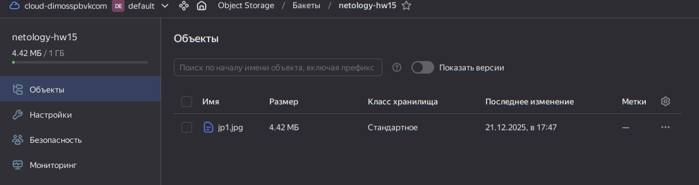
   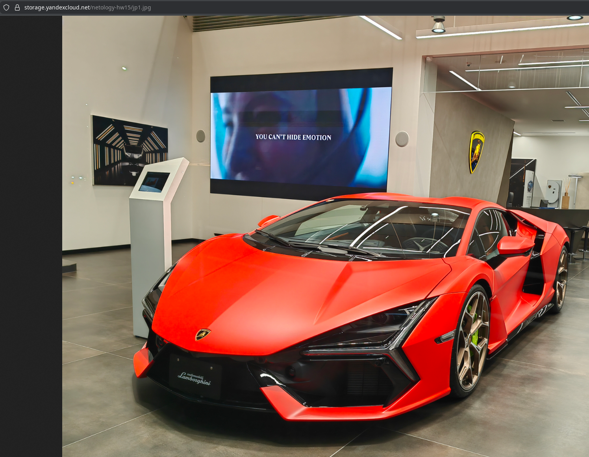

2. [Шаблон meta_data user_data для cloud-init cо страницей по умолчанию для nginx, для каждой из вм со своим именем хоста и картинкой из бакета](sol/files/cloud-init.yml.tpl). health_check вм настроен в инстанс группе.
   
   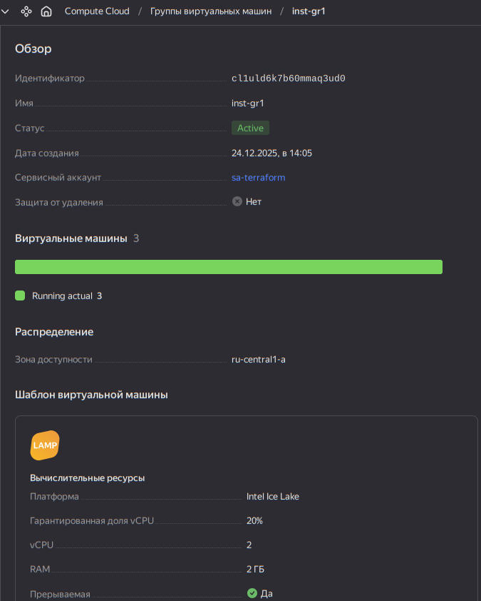
   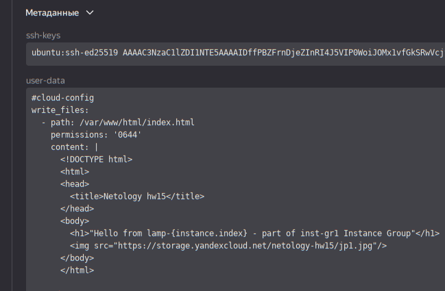
   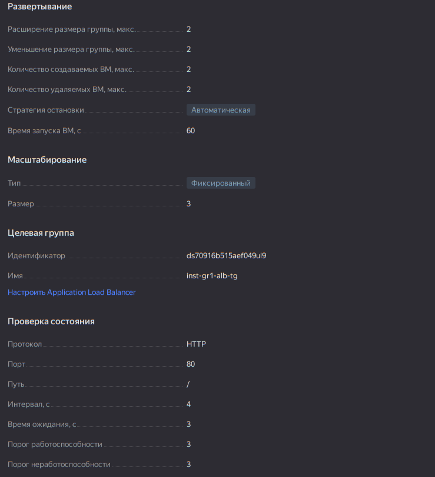

3. Сетевой балансировщик (NLB)

```bash
odv@matebook16s:~/project/MY/Netology-DevOps/CloudProjects/15.2/sol/terraform$ terraform apply
data.yandex_iam_service_account.sa: Reading...

...

yandex_compute_instance_group.group1: Still creating... [05m00s elapsed]
yandex_compute_instance_group.group1: Still creating... [05m10s elapsed]
yandex_compute_instance_group.group1: Still creating... [05m20s elapsed]
yandex_compute_instance_group.group1: Still creating... [05m30s elapsed]
yandex_compute_instance_group.group1: Creation complete after 5m39s [id=cl14hcq6arm8uoi87mp5]
yandex_lb_network_load_balancer.lb: Modifying... [id=enp8cmj3mk0mlsp0jq5h]
yandex_lb_network_load_balancer.lb: Modifications complete after 3s [id=enp8cmj3mk0mlsp0jq5h]

Apply complete! Resources: 1 added, 1 changed, 6 destroyed.
odv@matebook16s:~/project/MY/Netology-DevOps/CloudProjects/15.2/sol/terraform$ curl http://158.160.209.15
<!DOCTYPE html>
<html>
<head>
  <title>Netology hw15</title>
</head>
<body>
  <h1>"Hello from lamp-2 - part of inst-gr1 Instance Group"</h1>
  
</body>
</html>
odv@matebook16s:~/project/MY/Netology-DevOps/CloudProjects/15.2/sol/terraform$ curl http://158.160.209.15
<!DOCTYPE html>
<html>
<head>
  <title>Netology hw15</title>
</head>
<body>
  <h1>"Hello from lamp-2 - part of inst-gr1 Instance Group"</h1>
  
</body>
</html>
odv@matebook16s:~/project/MY/Netology-DevOps/CloudProjects/15.2/sol/terraform$ curl http://158.160.209.15
<!DOCTYPE html>
<html>
<head>
  <title>Netology hw15</title>
</head>
<body>
  <h1>"Hello from lamp-1 - part of inst-gr1 Instance Group"</h1>
  
</body>
</html>
```

   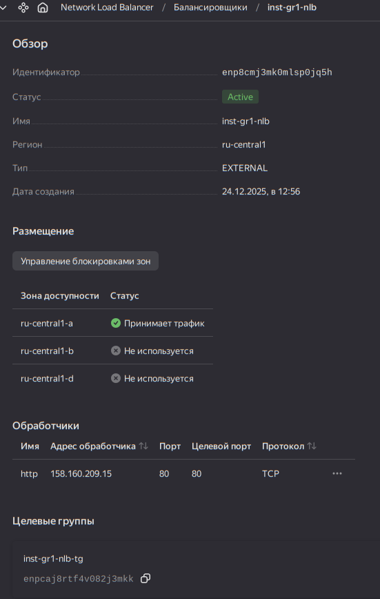
   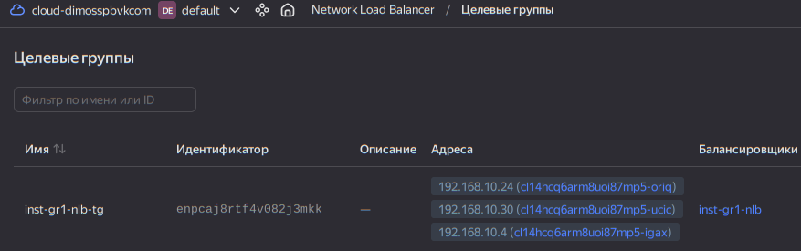
   
- Тест на удаление вм в группе с проверкой доступности и пересоздания

   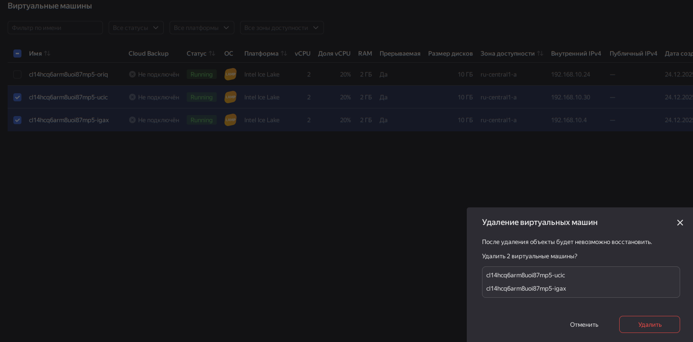
   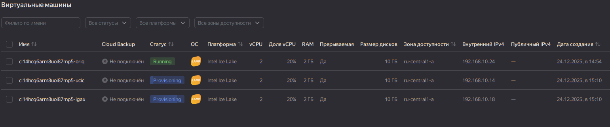
   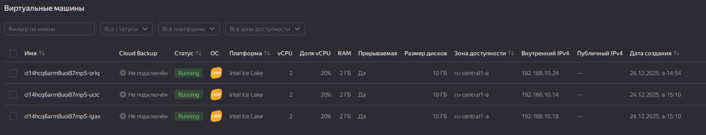

- При автоматическом пересоздании вм в группе NLB работал и отдавал контент живой вм

```
odv@matebook16s:~/project/MY/Netology-DevOps/CloudProjects/15.2/sol/terraform$ curl http://158.160.209.15
<!DOCTYPE html>
<html>
<head>
  <title>Netology hw15</title>
</head>
<body>
  <h1>"Hello from lamp-2 - part of inst-gr1 Instance Group"</h1>
  
</body>
</html>
```
4. (*) Application Load Balancer

#### Архитектура ALB

|Трафик ->| `Ext IP ALB` ->| `HTTP-Router's`->| `Virtual Host's` ->| `Route's` ->|`Backend Group` ->|`Target Group - Compute Instance Group` ->| `ВМ`|
|-|-|-|-|-|-|-|-|
|клиент|http://app.a.com/api/v1|port?=80|domain?=app.a.com|path?api/v1|BGn|TGn|BMn|

Т.е.:
- На уровне ALB например по порту 80 выбирается обработчик(и) - HTTP-Router(s), который(е) получают этот трафик
- На уровне HTTP-Router, по домену из URL должно быть соответствие для Virtual Host, их может много. Virtual Host(s) имеют списки путей Route's
- На уровне Route, по path из URL должно быть соответствие - Backend Group, которая примет трафик для Target Group. Здесь определяются политики балансировки (ROUND_ROBIN...)
- Target Group заполняет Compute Instance Group

Т.о. нам нужно создать:
1. Target Group и зарегистрировать ее в ALB в Compute Instance Group.
2. Backend Group настроить и связать ее с Target Group 
3. Создаем сам HTTP Router (контейнер для Virtual Host)
4. Создаем Virtual Host внутри роутера
5. ALB, В Load Balancer указываем роутер из п.3

- В [main.tf](sol/terraform/main.tf) в Instance Group закоментирован блок и ресурсы с NLB и задан блок и ресурсы для ALB.
- Применим и проверим работу ALB балансировщика

```bash
odv@matebook16s:~/project/MY/Netology-DevOps/CloudProjects/15.2/sol/terraform$ terraform apply
data.yandex_iam_service_account.sa: Reading...
yandex_alb_target_group.alb: Refreshing state... [id=ds7o1l1loabce11dgvel]
yandex_vpc_network.main: Refreshing state... [id=enpv969hihid4aj94cf1]
yandex_alb_http_router.main: Refreshing state... [id=ds7ruj82udidnkb9skhq]
yandex_lb_target_group.nlb: Refreshing state... [id=enptivr5odfa9mlsbaad]
yandex_storage_bucket.b15["netology-hw15"]: Refreshing state... [id=netology-hw15]
data.yandex_iam_service_account.sa: Read complete after 0s [id=aje8bj48nsuj991ompmb]
yandex_vpc_subnet.subnets["private-a"]: Refreshing state... [id=e9bug29kio2sep37mf40]
yandex_vpc_subnet.subnets["public-a"]: Refreshing state... [id=e9bd9k28ckg8oaagn7dp]
yandex_vpc_security_group.public_sg: Refreshing state... [id=enpkofe0eltd6kr5nl6v]
yandex_vpc_security_group.private_sg: Refreshing state... [id=enpkka2m85m58612r8js]
yandex_lb_network_load_balancer.lb: Refreshing state... [id=enp8cmj3mk0mlsp0jq5h]
yandex_alb_load_balancer.alb: Refreshing state... [id=ds7fnikrlfo0hk4namkj]
yandex_storage_object.file: Refreshing state... [id=jp1.jpg]
yandex_alb_backend_group.abg: Refreshing state... [id=ds7ps1orve826jr6ff9k]
yandex_alb_virtual_host.api_host: Refreshing state... [id=ds7ruj82udidnkb9skhq/api-host]

....

yandex_alb_load_balancer.alb: Still creating... [05m20s elapsed]
yandex_compute_instance_group.group1: Creation complete after 5m22s [id=cl1uld6k7b60mmaq3ud0]
yandex_alb_backend_group.abg: Creating...
yandex_alb_backend_group.abg: Creation complete after 0s [id=ds7mmhbkkeavarmc267q]
yandex_alb_virtual_host.api_host: Creating...
yandex_alb_virtual_host.api_host: Creation complete after 2s [id=ds7iqhi530nt63hcovum/api-host]
yandex_alb_load_balancer.alb: Still creating... [05m30s elapsed]
yandex_alb_load_balancer.alb: Still creating... [05m40s elapsed]

...

yandex_alb_load_balancer.alb: Still creating... [07m00s elapsed]
yandex_alb_load_balancer.alb: Still creating... [07m10s elapsed]
yandex_alb_load_balancer.alb: Creation complete after 7m13s [id=ds7k7imabtdkq586qjd4]

Apply complete! Resources: 5 added, 0 changed, 0 destroyed.
odv@matebook16s:~/project/MY/Netology-DevOps/CloudProjects/15.2/sol/terraform$ curl http://158.160.209.90
<!DOCTYPE html>
<html>
<head>
  <title>Netology hw15</title>
</head>
<body>
  <h1>"Hello from lamp-2 - part of inst-gr1 Instance Group"</h1>
  
</body>
</html>
odv@matebook16s:~/project/MY/Netology-DevOps/CloudProjects/15.2/sol/terraform$ curl http://158.160.209.90
<!DOCTYPE html>
<html>
<head>
  <title>Netology hw15</title>
</head>
<body>
  <h1>"Hello from lamp-1 - part of inst-gr1 Instance Group"</h1>
  
</body>
</html>
odv@matebook16s:~/project/MY/Netology-DevOps/CloudProjects/15.2/sol/terraform$ curl http://158.160.209.90
<!DOCTYPE html>
<html>
<head>
  <title>Netology hw15</title>
</head>
<body>
  <h1>"Hello from lamp-3 - part of inst-gr1 Instance Group"</h1>
  
</body>
</html>
odv@matebook16s:~/project/MY/Netology-DevOps/CloudProjects/15.2/sol/terraform$ curl http://158.160.209.90
<!DOCTYPE html>
<html>
<head>
  <title>Netology hw15</title>
</head>
<body>
  <h1>"Hello from lamp-2 - part of inst-gr1 Instance Group"</h1>
  
</body>
</html>
odv@matebook16s:~/project/MY/Netology-DevOps/CloudProjects/15.2/sol/terraform$ 
```

- Видно, что ответ идет по ROUND_ROBIN от наших вм (lamp-n) в группе

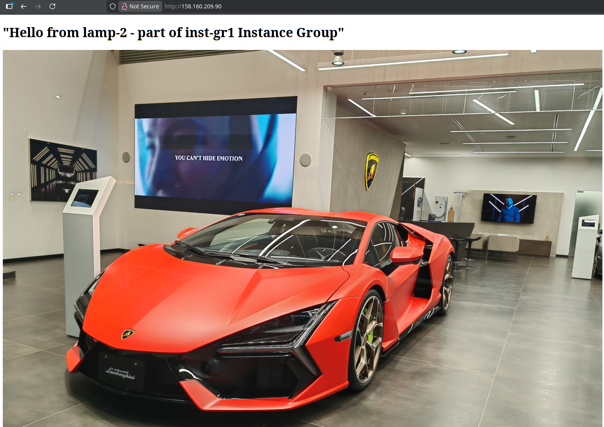

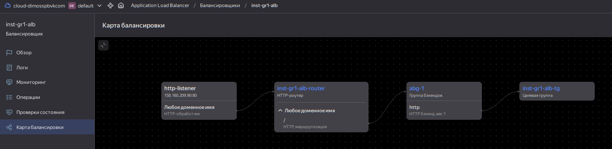


---

### Полезные документы:

#### Yandex Cloud
- [Compute instance group](https://registry.terraform.io/providers/yandex-cloud/yandex/latest/docs/resources/compute_instance_group).
- [Network Load Balancer](https://registry.terraform.io/providers/yandex-cloud/yandex/latest/docs/resources/lb_network_load_balancer).
- [Группа ВМ с сетевым балансировщиком](https://cloud.yandex.ru/docs/compute/operations/instance-groups/create-with-balancer).

#### AWS
- [S3 bucket](https://registry.terraform.io/providers/hashicorp/aws/latest/docs/resources/s3_bucket)
- [Launch Template](https://registry.terraform.io/providers/hashicorp/aws/latest/docs/resources/launch_template).
- [Autoscaling group](https://registry.terraform.io/providers/hashicorp/aws/latest/docs/resources/autoscaling_group).
- [Launch configuration](https://registry.terraform.io/providers/hashicorp/aws/latest/docs/resources/launch_configuration).
