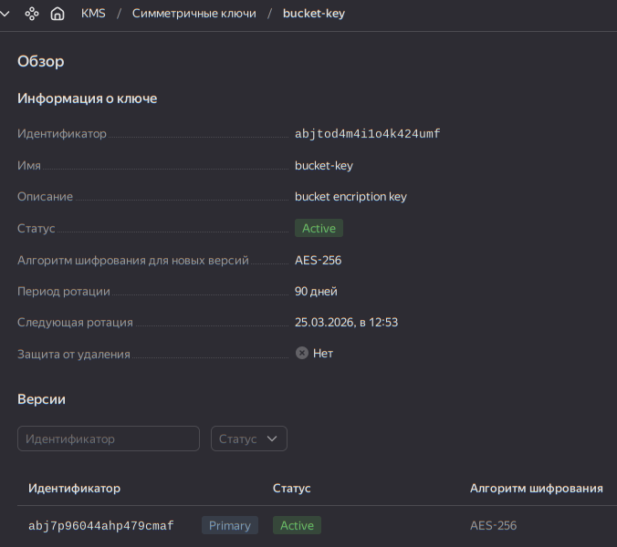
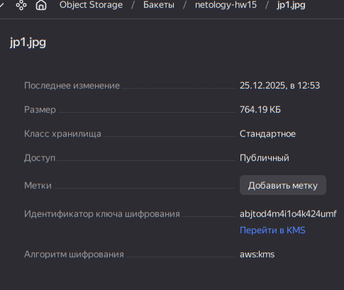
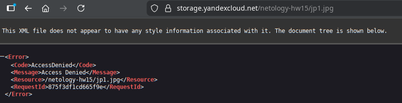
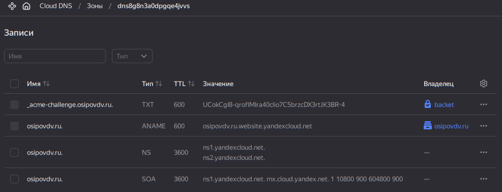
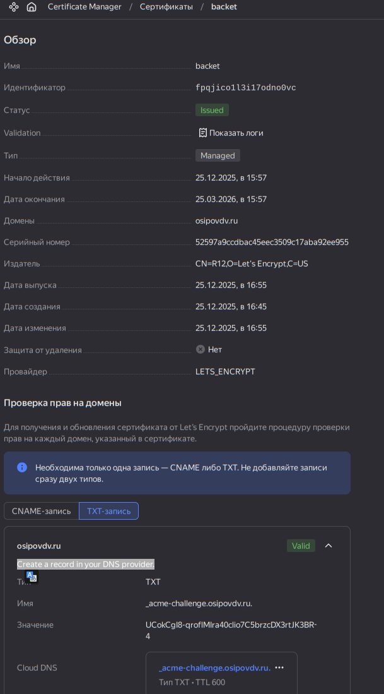
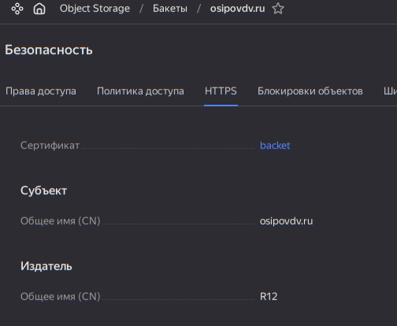
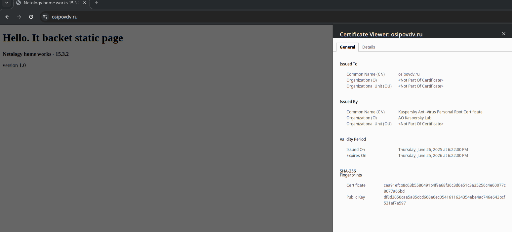

# Домашнее задание к занятию «Безопасность в облачных провайдерах»  

---
> Используя конфигурации, выполненные в рамках предыдущих домашних заданий, нужно добавить возможность шифрования бакета.
>
>## Задание 1. Yandex Cloud   
>
>1. С помощью ключа в KMS необходимо зашифровать содержимое бакета:
>
> - создать ключ в KMS;
> - с помощью ключа зашифровать содержимое бакета, созданного ранее.
>2. (Выполняется не в Terraform)* Создать статический сайт в Object Storage c собственным публичным адресом и сделать доступным по HTTPS:
>
> - создать сертификат;
> - создать статическую страницу в Object Storage и применить сертификат HTTPS;
> - в качестве результата предоставить скриншот на страницу с сертификатом в заголовке (замочек).

---
# Решение

## 1. Создадим Ключ и Зашифруем файл в бакете через [terraform](sol/terraform/main.tf)
```bash
odv@matebook16s:~/project/MY/Netology-DevOps/CloudProjects/15.3/sol/terraform$ terraform apply
yandex_vpc_network.main: Refreshing state... [id=enpa07k7bffpunshgjri]
yandex_vpc_subnet.subnets["public-a"]: Refreshing state... [id=e9bshpatj3eloabchkph]
yandex_vpc_subnet.subnets["private-a"]: Refreshing state... [id=e9b8562ud9m4qgns93ta]

Terraform used the selected providers to generate the following execution plan. Resource actions are indicated with the following symbols:
  + create

Terraform will perform the following actions:

  # yandex_kms_symmetric_key.bucket_key will be created
  + resource "yandex_kms_symmetric_key" "bucket_key" {
      + created_at          = (known after apply)
      + default_algorithm   = "AES_256"
      + deletion_protection = false
      + description         = "bucket encription key"
      + folder_id           = (known after apply)
      + id                  = (known after apply)
      + labels              = (known after apply)
      + name                = "backet_key"
      + rotated_at          = (known after apply)
      + rotation_period     = "2160h"
      + status              = (known after apply)
      + symmetric_key_id    = (known after apply)
    }

  # yandex_storage_bucket.b15 will be created
  + resource "yandex_storage_bucket" "b15" {
      + acl                   = (known after apply)
      + bucket                = "netology-hw15"
      + bucket_domain_name    = (known after apply)
      + default_storage_class = (known after apply)
      + folder_id             = (known after apply)
      + force_destroy         = false
      + id                    = (known after apply)
      + max_size              = 1073741824
      + policy                = (known after apply)
      + website_domain        = (known after apply)
      + website_endpoint      = (known after apply)

      + anonymous_access_flags {
          + list = false
          + read = true
        }

      + grant (known after apply)

      + server_side_encryption_configuration {
          + rule {
              + apply_server_side_encryption_by_default {
                  + kms_master_key_id = (known after apply)
                  + sse_algorithm     = "aws:kms"
                }
            }
        }

      + versioning (known after apply)
    }

  # yandex_storage_object.file["jp1.jpg"] will be created
  + resource "yandex_storage_object" "file" {
      + acl          = "private"
      + bucket       = "netology-hw15"
      + content_type = "image/jpeg"
      + id           = (known after apply)
      + key          = "jp1.jpg"
      + source       = "../files/2.jpg"
    }

Plan: 3 to add, 0 to change, 0 to destroy.

Do you want to perform these actions?
  Terraform will perform the actions described above.
  Only 'yes' will be accepted to approve.

  Enter a value: yes

yandex_kms_symmetric_key.bucket_key: Creating...
yandex_kms_symmetric_key.bucket_key: Creation complete after 1s [id=abjtod4m4i1o4k424umf]
yandex_storage_bucket.b15: Creating...
yandex_storage_bucket.b15: Creation complete after 5s [id=netology-hw15]
yandex_storage_object.file["jp1.jpg"]: Creating...
yandex_storage_object.file["jp1.jpg"]: Creation complete after 1s [id=jp1.jpg]

Apply complete! Resources: 3 added, 0 changed, 0 destroyed.
```




---

## 2. (*) Создадим статический сайт в этом бакет c собственным публичным адресом и настроим доступ по HTTPS 

- Загрузим в новый бакет с именем osipovdv.ru [index.html, отключив шифрование, объект не должен быть зашифрован](sol/files/index.html)
- Настроим в бакет веб-сайт хостинг на эту страницу
- Добавим в Сloud DNS зону osipovdv.ru. - этот домен зарегистрирован за мной у провайдера рег.ру где прописаны dns ns1.yandexcloud.net...



- Создадим сертификат для tls, добавим в сертификате запись для dns - Create a record in your DNS provider. 



- Добавим этот сертификат в настройки безопастности bucket https



- Проверим - работает


--- 


Полезные YC документы:

- [Настройка HTTPS статичного сайта](https://cloud.yandex.ru/docs/storage/operations/hosting/certificate).
- [Object Storage bucket](https://registry.terraform.io/providers/yandex-cloud/yandex/latest/docs/resources/storage_bucket).
- [KMS key](https://registry.terraform.io/providers/yandex-cloud/yandex/latest/docs/resources/kms_symmetric_key).

Resource AWS Terraform:

- [IAM Role](https://registry.terraform.io/providers/hashicorp/aws/latest/docs/resources/iam_role).
- [AWS KMS](https://registry.terraform.io/providers/hashicorp/aws/latest/docs/resources/kms_key).
- [S3 encrypt with KMS key](https://registry.terraform.io/providers/hashicorp/aws/latest/docs/resources/s3_bucket_object#encrypting-with-kms-key).

