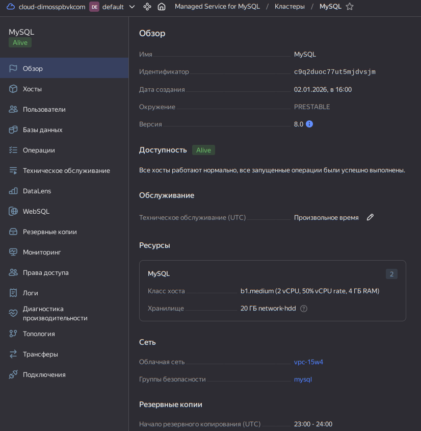
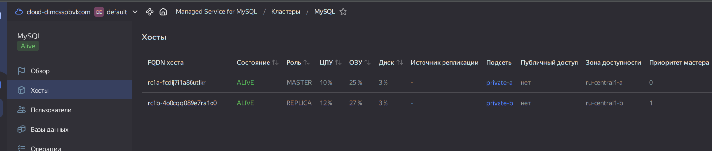
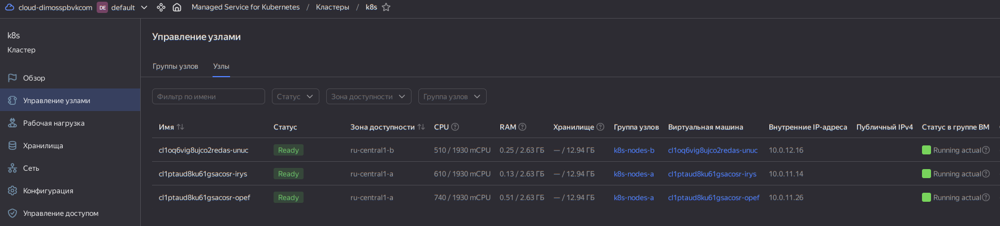
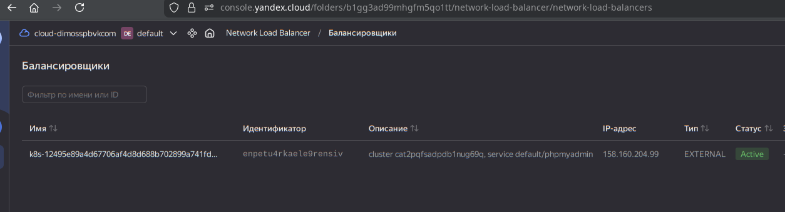
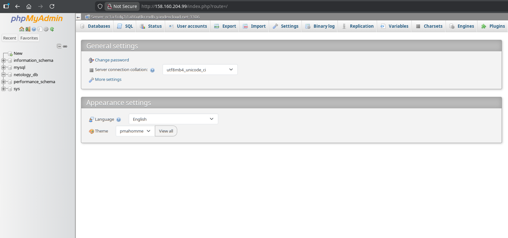

# Домашнее задание к занятию «Кластеры. Ресурсы под управлением облачных провайдеров»

### Цели задания 

1. Организация кластера Kubernetes и кластера баз данных MySQL в отказоустойчивой архитектуре.
2. Размещение в private подсетях кластера БД, а в public — кластера Kubernetes.

---
>## Задание 1. Yandex Cloud
>
>1. Настроить с помощью Terraform кластер баз данных MySQL.
>
 >- Используя настройки VPC из предыдущих домашних заданий, добавить дополнительно подсеть private в разных зонах, чтобы обеспечить отказоустойчивость. 
> - Разместить ноды кластера MySQL в разных подсетях.
 >- Необходимо предусмотреть репликацию с произвольным временем технического обслуживания.
 >- Использовать окружение Prestable, платформу Intel Broadwell с производительностью 50% CPU и размером диска 20 Гб.
> - Задать время начала резервного копирования — 23:59.
> - Включить защиту кластера от непреднамеренного удаления.
> - Создать БД с именем `netology_db`, логином и паролем.
>
>2. Настроить с помощью Terraform кластер Kubernetes.
>
 >- Используя настройки VPC из предыдущих домашних заданий, добавить дополнительно две подсети public в разных зонах, чтобы обеспечить отказоустойчивость.
> - Создать отдельный сервис-аккаунт с необходимыми правами. 
> - Создать региональный мастер Kubernetes с размещением нод в трёх разных подсетях.
 >- Добавить возможность шифрования ключом из KMS, созданным в предыдущем домашнем задании.
> - Создать группу узлов, состояющую из трёх машин с автомасштабированием до шести.
> - Подключиться к кластеру с помощью `kubectl`.
> - *Запустить микросервис phpmyadmin и подключиться к ранее созданной БД.
 >- *Создать сервис-типы Load Balancer и подключиться к phpmyadmin. Предоставить скриншот с публичным адресом и подключением к БД.


--- 
## Решение (полностью, учитывая *)
## Архитектура решения (логическая схема)

    - Здесь я решил разнести workers группы по зонам для полноценной отказоустойчивости, разместив их в приватной сетке с доступом к NAT Gateway. Это усложнит задачу, но позволит мне полнее разобраться в архитектуре.

    VPC
    │
    ├── Private Subnets (ru-central1-a, ru-central1-b)
    │   ├─ MySQL Cluster
    │   │   ├─ Node 1 (private subnet A)
    │   │   ├─ Node 2 (private subnet B)
    │   │   └─ Replication, backup 23:59
    │   └─ k8s Node Groups (3-6 nodes, autoscale)
    │       └─ Pods (overlay network)
    │           └─ phpMyAdmin Pod -> connects to MySQL
    │
    ├── Public Subnets (ru-central1-a, ru-central1-b, ru-central1-d)
    │   └─ Kubernetes Cluster
    │       └─ Master (regional, nodes in 3 subnets)
    │
    ├── NAT Gateway (optional for private subnet updates)
    │
    └── Security Groups
        ├─ mysql - Правила доступа к MySql из SG-K8S только
        ├─ k8s_core - Общие правила для всех узлов Kubernetes
        ├─ k8s_cluster - Правила для мастер-узлов Kubernetes (API Server)
        └─ k8s_nodes - Правила для workers (node group)

## k8s

    - [Следуем документации - Настройка групп безопасности](https://yandex.cloud/ru/docs/managed-kubernetes/operations/connect/security-groups#apply)

## MySQL

- [phpMyAdmin](https://docs.phpmyadmin.net/en/latest/setup.html#installing-using-docker)

## Развертывание и проверка

- **Установим инфраструктуру (сокращенный лог terraform)**
```bash
odv@matebook16s:~/project/MY/Netology-DevOps/CloudProjects/15.4/sol/terraform$ terraform apply

Terraform used the selected providers to generate the following execution plan. Resource actions are indicated with the following symbols:
  + create

Terraform will perform the following actions:

  # local_file.mysqladmin_yaml will be created
  + resource "local_file" "mysqladmin_yaml" {
      + content              = (known after apply)
      + content_base64sha256 = (known after apply)
      + content_base64sha512 = (known after apply)

...

Plan: 29 to add, 0 to change, 0 to destroy.

Do you want to perform these actions?
  Terraform will perform the actions described above.
  Only 'yes' will be accepted to approve.

  Enter a value: yes

yandex_vpc_gateway.nat: Creating...
yandex_vpc_network.main: Creating...
yandex_iam_service_account.k8s: Creating...
yandex_kms_symmetric_key.key: Creating...
yandex_vpc_gateway.nat: Creation complete after 1s [id=enpkq1dv849m3864t52f]
yandex_kms_symmetric_key.key: Creation complete after 1s [id=abja0eachakhl8arsq59]
yandex_vpc_network.main: Creation complete after 3s [id=enpa7dlpsvudcmo3scu0]
yandex_iam_service_account.k8s: Creation complete after 3s [id=aje5692n9cl3urq6sbiu]
yandex_vpc_subnet.public["d"]: Creating...
yandex_vpc_subnet.public["a"]: Creating...
yandex_vpc_subnet.public["b"]: Creating...
yandex_vpc_security_group.k8s_nodes: Creating...
yandex_resourcemanager_folder_iam_member.k8s_roles["editor"]: Creating...
yandex_vpc_route_table.internet: Creating...
yandex_vpc_security_group.k8s_cluster: Creating...
yandex_kms_symmetric_key_iam_binding.kms_binding: Creating...
yandex_resourcemanager_folder_iam_member.k8s_roles["vpc.admin"]: Creating...
yandex_vpc_security_group.k8s_core: Creating...
yandex_vpc_subnet.public["a"]: Creation complete after 1s [id=e9b6d4shrmi0umi830gb]
yandex_resourcemanager_folder_iam_member.k8s_roles["kms.keys.encrypterDecrypter"]: Creating...
yandex_vpc_subnet.public["b"]: Creation complete after 1s [id=e2lt1p9dv9ssv14pl394]
yandex_resourcemanager_folder_iam_member.k8s_roles["load-balancer.admin"]: Creating...
yandex_vpc_subnet.public["d"]: Creation complete after 1s [id=fl8kr13q12vr56e7g0pa]
yandex_resourcemanager_folder_iam_member.k8s_roles["k8s.clusters.agent"]: Creating...
yandex_vpc_route_table.internet: Creation complete after 2s [id=enp1ukq2fi33mn70n4k6]
yandex_vpc_security_group.k8s_nodes: Creation complete after 2s [id=enp5hgg00iv22mlqeca3]
yandex_resourcemanager_folder_iam_member.k8s_roles["logging.writer"]: Creating...
yandex_vpc_subnet.private["b"]: Creating...
yandex_kms_symmetric_key_iam_binding.kms_binding: Creation complete after 3s
yandex_vpc_subnet.private["a"]: Creating...
yandex_vpc_subnet.private["b"]: Creation complete after 1s [id=e2lqahd0mhsqbt4h2vk9]
yandex_vpc_security_group.mysql: Creating...
yandex_resourcemanager_folder_iam_member.k8s_roles["editor"]: Creation complete after 3s
yandex_vpc_subnet.private["a"]: Creation complete after 1s [id=e9bjdboc6h8d7qqsil2a]
yandex_vpc_security_group.k8s_core: Creation complete after 5s [id=enppdif2f9oo9c27n94k]
yandex_resourcemanager_folder_iam_member.k8s_roles["vpc.admin"]: Creation complete after 5s
yandex_vpc_security_group.k8s_cluster: Creation complete after 7s [id=enpmlhgo09rtcetgvk3r]
yandex_resourcemanager_folder_iam_member.k8s_roles["kms.keys.encrypterDecrypter"]: Creation complete after 7s
yandex_vpc_security_group.mysql: Creation complete after 6s [id=enpgmq5ln59etglgeqqr]
yandex_mdb_mysql_cluster.mysql: Creating...
yandex_resourcemanager_folder_iam_member.k8s_roles["load-balancer.admin"]: Creation complete after 9s
yandex_resourcemanager_folder_iam_member.k8s_roles["k8s.clusters.agent"]: Still creating... [00m10s elapsed]
yandex_resourcemanager_folder_iam_member.k8s_roles["logging.writer"]: Still creating... [00m10s elapsed]
yandex_resourcemanager_folder_iam_member.k8s_roles["k8s.clusters.agent"]: Creation complete after 12s
yandex_resourcemanager_folder_iam_member.k8s_roles["logging.writer"]: Creation complete after 13s
time_sleep.wait_iam: Creating...
yandex_mdb_mysql_cluster.mysql: Still creating... [00m10s elapsed]
time_sleep.wait_iam: Still creating... [00m10s elapsed]
yandex_mdb_mysql_cluster.mysql: Still creating... [00m20s elapsed]
time_sleep.wait_iam: Still creating... [00m20s elapsed]
time_sleep.wait_iam: Creation complete after 20s [id=2026-01-02T13:00:34Z]
yandex_kubernetes_cluster.k8s: Creating...
yandex_mdb_mysql_cluster.mysql: Still creating... [00m30s elapsed]
yandex_kubernetes_cluster.k8s: Still creating... [00m10s elapsed]
yandex_mdb_mysql_cluster.mysql: Still creating... [00m40s elapsed]
yandex_kubernetes_cluster.k8s: Still creating... [00m20s elapsed]

...

yandex_kubernetes_cluster.k8s: Still creating... [05m30s elapsed]
yandex_mdb_mysql_cluster.mysql: Still creating... [06m00s elapsed]
yandex_kubernetes_cluster.k8s: Still creating... [05m40s elapsed]
yandex_mdb_mysql_cluster.mysql: Still creating... [06m10s elapsed]
yandex_kubernetes_cluster.k8s: Creation complete after 5m45s [id=cat2pqfsadpdb1nug69q]
yandex_kubernetes_node_group.k8s_nodes_b: Creating...
yandex_kubernetes_node_group.k8s_nodes_a: Creating...
yandex_mdb_mysql_cluster.mysql: Still creating... [06m20s elapsed]
yandex_kubernetes_node_group.k8s_nodes_a: Still creating... [00m10s elapsed]
yandex_kubernetes_node_group.k8s_nodes_b: Still creating... [00m10s elapsed]
yandex_mdb_mysql_cluster.mysql: Still creating... [06m30s elapsed]
yandex_kubernetes_node_group.k8s_nodes_b: Still creating... [00m20s elapsed]
yandex_kubernetes_node_group.k8s_nodes_a: Still creating... [00m20s elapsed]
yandex_mdb_mysql_cluster.mysql: Still creating... [06m40s elapsed]
yandex_kubernetes_node_group.k8s_nodes_a: Still creating... [00m30s elapsed]
yandex_kubernetes_node_group.k8s_nodes_b: Still creating... [00m30s elapsed]
yandex_mdb_mysql_cluster.mysql: Still creating... [06m50s elapsed]
yandex_kubernetes_node_group.k8s_nodes_b: Still creating... [00m40s elapsed]
yandex_kubernetes_node_group.k8s_nodes_a: Still creating... [00m40s elapsed]
yandex_mdb_mysql_cluster.mysql: Still creating... [07m00s elapsed]
yandex_kubernetes_node_group.k8s_nodes_a: Still creating... [00m50s elapsed]
yandex_kubernetes_node_group.k8s_nodes_b: Still creating... [00m50s elapsed]
yandex_mdb_mysql_cluster.mysql: Still creating... [07m10s elapsed]
yandex_kubernetes_node_group.k8s_nodes_b: Still creating... [01m00s elapsed]
yandex_kubernetes_node_group.k8s_nodes_a: Still creating... [01m00s elapsed]
yandex_mdb_mysql_cluster.mysql: Still creating... [07m20s elapsed]
yandex_kubernetes_node_group.k8s_nodes_a: Still creating... [01m10s elapsed]
yandex_kubernetes_node_group.k8s_nodes_b: Still creating... [01m10s elapsed]
yandex_mdb_mysql_cluster.mysql: Still creating... [07m30s elapsed]
yandex_kubernetes_node_group.k8s_nodes_b: Still creating... [01m20s elapsed]
yandex_kubernetes_node_group.k8s_nodes_a: Still creating... [01m20s elapsed]
yandex_mdb_mysql_cluster.mysql: Still creating... [07m40s elapsed]
yandex_kubernetes_node_group.k8s_nodes_a: Still creating... [01m30s elapsed]
yandex_kubernetes_node_group.k8s_nodes_b: Still creating... [01m30s elapsed]
yandex_mdb_mysql_cluster.mysql: Still creating... [07m50s elapsed]
yandex_kubernetes_node_group.k8s_nodes_b: Still creating... [01m40s elapsed]
yandex_kubernetes_node_group.k8s_nodes_a: Still creating... [01m40s elapsed]
yandex_kubernetes_node_group.k8s_nodes_b: Creation complete after 1m49s [id=cat67tuo5itrjadqmhlc]
yandex_mdb_mysql_cluster.mysql: Still creating... [08m00s elapsed]
yandex_kubernetes_node_group.k8s_nodes_a: Still creating... [01m50s elapsed]
yandex_mdb_mysql_cluster.mysql: Still creating... [08m10s elapsed]
yandex_kubernetes_node_group.k8s_nodes_a: Still creating... [02m00s elapsed]
yandex_mdb_mysql_cluster.mysql: Still creating... [08m20s elapsed]
yandex_kubernetes_node_group.k8s_nodes_a: Still creating... [02m10s elapsed]
yandex_kubernetes_node_group.k8s_nodes_a: Creation complete after 2m10s [id=catftjjh6vo7n226e29h]
yandex_mdb_mysql_cluster.mysql: Still creating... [08m30s elapsed]
...
yandex_mdb_mysql_cluster.mysql: Still creating... [11m00s elapsed]
yandex_mdb_mysql_cluster.mysql: Still creating... [11m10s elapsed]
yandex_mdb_mysql_cluster.mysql: Still creating... [11m20s elapsed]
yandex_mdb_mysql_cluster.mysql: Still creating... [11m30s elapsed]
yandex_mdb_mysql_cluster.mysql: Creation complete after 11m31s [id=c9q2duoc77ut5mjdvsjm]
yandex_mdb_mysql_database.db: Creating...
local_file.mysqladmin_yaml: Creating...
local_file.mysqladmin_yaml: Creation complete after 0s [id=d4c990284d86b770bdc7a995df136fc6413ed07a]
yandex_mdb_mysql_database.db: Still creating... [00m10s elapsed]
...
yandex_mdb_mysql_database.db: Still creating... [01m50s elapsed]
yandex_mdb_mysql_database.db: Creation complete after 1m51s [id=c9q2duoc77ut5mjdvsjm:netology_db]
yandex_mdb_mysql_user.my_user: Creating...
yandex_mdb_mysql_user.my_user: Still creating... [00m10s elapsed]
...
yandex_mdb_mysql_user.my_user: Still creating... [01m00s elapsed]
yandex_mdb_mysql_user.my_user: Creation complete after 1m1s [id=c9q2duoc77ut5mjdvsjm:user1]

Apply complete! Resources: 29 added, 0 changed, 0 destroyed.
odv@matebook16s:~/project/MY/Netology-DevOps/CloudProjects/15.4/sol/terraform$ 
```
- **MySql**




- **Подключемся к кластеру k8s через  kubectl**
```bash
odv@matebook16s:~/project/MY/Netology-DevOps/CloudProjects/15.4/sol/k8s-manifests$ yc managed-kubernetes cluster get-credentials --id cat2pqfsadpdb1nug69q --external --force

Context 'yc-k8s' was added as default to kubeconfig '/home/odv/.kube/config'.
Check connection to cluster using 'kubectl cluster-info --kubeconfig /home/odv/.kube/config'.

Note, that authentication depends on 'yc' and its config profile 'default'.
To access clusters using the Kubernetes API, please use Kubernetes Service Account.
odv@matebook16s:~/project/MY/Netology-DevOps/CloudProjects/15.4/sol/k8s-manifests$ kubectl get nodes
NAME                        STATUS   ROLES    AGE     VERSION
cl1oq6vig8ujco2redas-unuc   Ready    <none>   5m36s   v1.32.1
cl1ptaud8ku61gsacosr-irys   Ready    <none>   5m20s   v1.32.1
cl1ptaud8ku61gsacosr-opef   Ready    <none>   5m39s   v1.32.1
odv@matebook16s:~/project/MY/Netology-DevOps/CloudProjects/15.4/sol/k8s-manifests$ 
```
- **Node group - две, разнесены по приватным сетям в разных зонах для отказоустойчивости**



- Установим [микросервис phpmyadmin](sol/k8s-manifests/mysql-admin.yml)

```bash
odv@matebook16s:~/project/MY/Netology-DevOps/CloudProjects/15.4/sol/k8s-manifests$ kubectl apply -f mysqladmin.yml 
deployment.apps/phpmyadmin created
service/phpmyadmin created
odv@matebook16s:~/project/MY/Netology-DevOps/CloudProjects/15.4/sol/k8s-manifests$ kubectl get pods
NAME                          READY   STATUS              RESTARTS   AGE
phpmyadmin-85b7856467-vhblz   0/1     ContainerCreating   0          15s
odv@matebook16s:~/project/MY/Netology-DevOps/CloudProjects/15.4/sol/k8s-manifests$ kubectl get service
NAME         TYPE           CLUSTER-IP     EXTERNAL-IP      PORT(S)        AGE
kubernetes   ClusterIP      10.96.128.1    <none>           443/TCP        24m
phpmyadmin   LoadBalancer   10.96.239.78   158.160.204.99   80:31182/TCP   25s
```

- Подключимся к phpmyadmin по внешнему ip лоадбалансера




Полезные документы:

- [MySQL cluster](https://registry.terraform.io/providers/yandex-cloud/yandex/latest/docs/resources/mdb_mysql_cluster).
- [Создание кластера Kubernetes](https://cloud.yandex.ru/docs/managed-kubernetes/operations/kubernetes-cluster/kubernetes-cluster-create)
- [K8S Cluster](https://registry.terraform.io/providers/yandex-cloud/yandex/latest/docs/resources/kubernetes_cluster).
- [K8S node group](https://registry.terraform.io/providers/yandex-cloud/yandex/latest/docs/resources/kubernetes_node_group).

AWS:

- [Модуль EKS](https://learn.hashicorp.com/tutorials/terraform/eks).


