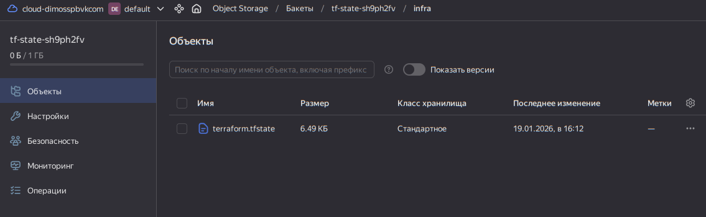

## Дипломный практикум в Yandex.Cloud
### Цели:

- Подготовить облачную инфраструктуру на базе облачного провайдера Яндекс.Облако.
- Запустить и сконфигурировать Kubernetes кластер.
- Установить и настроить систему мониторинга.
- Настроить и автоматизировать сборку тестового приложения с использованием Docker-контейнеров.
- Настроить CI для автоматической сборки и тестирования.
- Настроить CD для автоматического развёртывания приложения.

### Этапы выполнения:
1. [Предварительные требования](#предварительные-требования)
2. [Создание облачной инфраструктуры](#cоздание-облачной-инфраструктуры)

---
# Решение

### Предварительные требования

- Установлены - `terraform, jq, yc cli`
- Пользователь аутентифицирован в yandex cloud `yc init`
- Получен `yc iam create-token` для подготовка ресурсов для backend terraform 

### Создание облачной инфраструктуры

1. На первом этапе выполнена подготовка ресурсов для backend terraform [terraform-bootstrap](infra/terraform-bootstrap). Конфигурация вынесена в отдельный каталог и используется только для начальной инициализации. 
  - Cоздан service account с ограниченными ролями
  - Cгенерирован static access key
  - Подготовлен S3 bucket с версионированием для хранения state
  - Формирование [terraform/backend.tf](infra/terraform/backend.tf) через темплейт
  - Для удобства пересоздаёт service account iam json key файл в защищенном месте ``~/.secret/yc-sa-diplom-bucket-keys`` для дальнейшего использования провайдером и в CI/CD

2. Далее работаем из [terraform](infra/terraform)
  - Произведем инициализацию terraform [terraform/backend.tf](infra/terraform/backend.tf)
  ```bash
  infra/terraform$ terraform init -backend-config=/home/odv/.secret/yc-sa-diplom-bucket-keys
  ```
  
