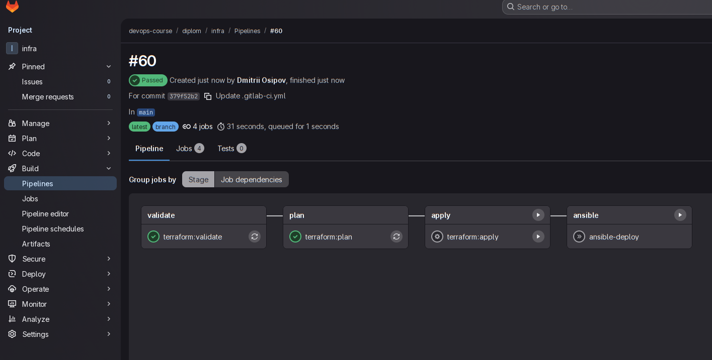
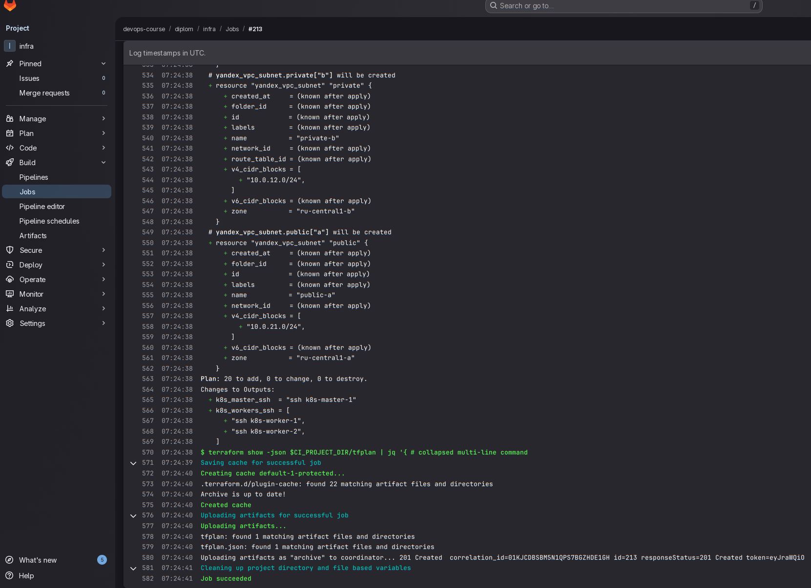
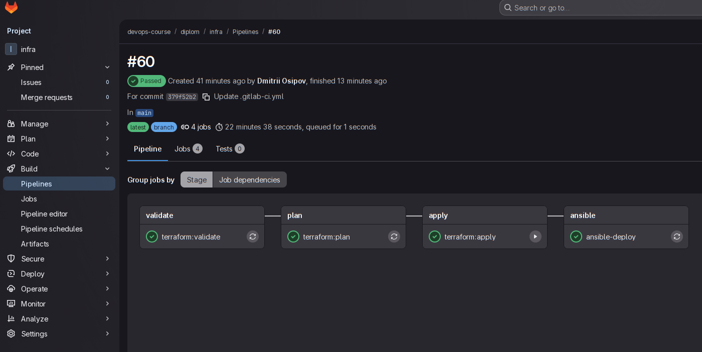

## Дипломный практикум в Yandex.Cloud

[Задание](https://github.com/netology-code/devops-diplom-yandexcloud)

### Цели:

- Подготовить облачную инфраструктуру на базе облачного провайдера Яндекс.Облако.
- Запустить и сконфигурировать Kubernetes кластер.
- Установить и настроить систему мониторинга.
- Настроить и автоматизировать сборку тестового приложения с использованием Docker-контейнеров.
- Настроить CI для автоматической сборки и тестирования.
- Настроить CD для автоматического развёртывания приложения.

---
# Решение

---
### Этапы выполнения:

1. [Предварительные требования](#предварительные-требования)
2. [Создание облачной инфраструктуры](#создание-облачной-инфраструктуры)
3. [Создание Kubernetes кластера](#создание-kubernetes-кластера)
4. [Мониторинг](#мониторинг)
5. [Тестовое приложение](#тестовое-приложение)
6. [Схема сетевого доступа к сервисам](#схема-сетевого-доступа-к-сервисам)
7. [CI/CD](#ci/cd)
8. [Заключение](#заключение)


---
### Предварительные требования

- Все шаги подготовки выполняются с узла управления где установлены - `terraform, ansible, helm, jq, yc cli, direnv, python3-kubernetes` ([direnv](https://direnv.net/) - для авто инициализации переменных окружения проекта .envrc)
- Для работы с kubernetes в ansible установлена kubernetes.core (через proxy в моем случае) ``HTPPS_PROXY=socks5h://172.16.30.1:9090 ansible-galaxy collection install kubernetes.core``
- Пользователь аутентифицирован в yandex cloud `yc init`
- Получен временный yc токен для подготовка ресурсов для backend terraform ``yc iam create-token | tr -d '\r\n' > ~/.secret/ya-token``

---
## Состав репозиториев

[Общий раздел](https://gitlab.osipovdv.ru/devops-course/diplom)

1. README — общее описание проекта и ссылки на репозитории.
2. infra — репозиторий инфраструктуры (Terraform + Ansible + Helm).
  - Terraform — создание ресурсов в Yandex Cloud (сети, VM, registry, NLB и т.п.) и генерация входных данных для Ansible (inventory/vars).
  - Ansible — подготовка узлов и развёртывание Kubernetes-кластера через kubeadm. Установка и настройка инфраструктурных компонентов внутри Kubernetes: Cilium (CNI), Ingress controller, Cert manager, стека мониторинга (kube-prometheus-stack).
  - CI/CD pipeline для развертывания инфраструктуры.
3. app — тестовое приложение.
  - Исходный код
  - Dockerfile для сборки образа
  - CI/CD pipeline для сборки и публикации образа в registry и деплоя приложения в Kubernetes
4. cicd. CI/CD Платформа (на базе on-premise GitLab CE) была вынесена в отдельный репозиторий, так как она независима от конкретной инфраструктуры и приложения и используется для оркестрации процессов управления версиями, сборки, развертывания и доставки.
  - GitLab docker-compose
  - Job Images


--- 
### Создание облачной инфраструктуры

1. На первом этапе выполнена подготовка ресурсов для backend terraform [terraform-bootstrap](https://gitlab.osipovdv.ru/devops-course/diplom/infra/-/tree/main/terraform-bootstrap?ref_type=heads). Конфигурация вынесена в отдельный каталог и используется только для начальной инициализации. 
  - Cоздан service account с ограниченными ролями
  - Cгенерирован static access key
  - Для работы переменными окружения (передача секретов) настроим переменные для terraform, ansible в /infra/.envrc для подключения через direnv
  - Подготовлен S3 bucket с версионированием для хранения state
  - Формирование [terraform/backend.tf](https://gitlab.osipovdv.ru/devops-course/diplom/infra/-/blob/main/terraform-bootstrap/backend.tpl?ref_type=heads) через темплейт
  - Для удобства пересоздаёт service account iam json key файл в защищенном месте ``~/.secret/yc-sa-diplom-bucket-keys`` для дальнейшего использования провайдером и в CI/CD
  - Переменные GitLab CI/CD передаются автоматически с использованием Terraform GitLab provider.
  
2. Учитывая ограниченый бюджет купона на YC и довольно заметный по времени объем работы, требующий работающего кластера k8s я решил выбрать настройку self-managed k8s кластера посредством kubeadm, где я могу более оптимально (более чем в 2 раза дешевле) настроить узлы для кластера. 
 
3. Далее работаем из [infra/terraform](https://gitlab.osipovdv.ru/devops-course/diplom/infra/-/tree/main/terraform?ref_type=heads)
  - Произведем инициализацию terraform
  ```bash
  infra/terraform$ terraform providers lock -net-mirror=https://terraform-mirror.yandexcloud.net -enable-plugin-cache -platform=linux_amd64
  infra/terraform$ terraform init -backend-config="$TF_VAR_yc_sa_backet_key_file" -reconfigure
  ```
  
  - [Данная конфигурация terraform](https://gitlab.com/devops-course1935303/diplom/infra/-/tree/main/terraform?ref_type=heads) это:
    - [VPC, подсети, nat gateway для приватной сети воркеров k8s](https://gitlab.osipovdv.ru/devops-course/diplom/infra/-/blob/main/terraform/main.tf?ref_type=heads)
    - На текущем этапе используем YC NLB без фиксированого ip как минимально достаточное решение балансировки трафика L4 на k8s Ingress Controller. Меняем на ALB при появлении необходимости L7-маршрутизации на уровне YC..
    - DNS A записи для NLB обновляются автоматически через terraform 
    - Важно указать в настройках переменных terraform правильные cidr сетей администрирования
    - [Конфигурация подготавливает инфраструктуру для k8s - security groups, masters nodes, workers nodes, Ansible config, variables & inventory, ssh_config](https://gitlab.osipovdv.ru/devops-course/diplom/infra/-/blob/main/terraform/k8s.tf?ref_type=heads), ssh_config для SSH ProxyJump через k8s мастер к изолированым в приватной подсети воркерам.
    - Команды ``terraform destroy/apply`` могут выполняться повторно без дополнительных ручных действий.

---
### Создание Kubernetes кластера
 
1. По результату применения infra/terraform имеет актуальный инвентори в Ansible с доступом по ssh ко всем хостам
    - Проверка
    ```bash
    infra/ansible$ ansible all -m ping
    localhost | SUCCESS => {
        "changed": false,
        "ping": "pong"
    }
    k8s-master-1 | SUCCESS => {
        "changed": false,
        "ping": "pong"
    }
    k8s-worker-1 | SUCCESS => {
        "changed": false,
        "ping": "pong"
    }
    k8s-worker-2 | SUCCESS => {
        "changed": false,
        "ping": "pong"
    }
    ```

2. [infra/ansible - Ansible раздел с playbooks & roles для развертывания k8s кластера на подготавленой ранее инфраструктуре](https://gitlab.osipovdv.ru/devops-course/diplom/infra/-/tree/main/ansible?ref_type=heads) где
      - infra/ansible/inventory/group_vars - переменные для настройки версий и параметров.
      - Роль control - настраивает хост управления для работы с инфраструктурой (kubectl, helm..)
      - Роль k8s_core - производит все требуемые настройки и установки необходимые для всех k8s nodes (masters, workers)
      - Плейбук playbooks/cluster-init.yml - инициализирует k8s кластер
      - Плейбук playbooks/cni-install.yml - после установки кластера, требуется настроить CNI (flanel, calico, cilium...). В данном проекте я настрою работу CNI через Cilium plugin. В отличие от традиционных плагинов CNI, которые используют iptables для фильтрации и маршрутизации пакетов, Cilium использует eBPF (расширенный фильтр пакетов Беркли), которые работают непосредственно в ядре Linux, обеспечивая значительно лучшую производительность, безопасность и возможности наблюдения, особенно в native режиме. У нас зонирование подсетей и для native потребуется контроль маршрутизации вне кластера - это сложно и не требуется в данном задании, поэтому cilium в tunnel + kube-proxy.
      - Используем Helm — рекомендуемый метод развертывания и сопровождения Cilium в производственных средах.
      - Плейбук playbooks/ingress-controller-install.yml - Установка nginx ingress controller через Helm. Хотя Cilium может выполнять ingress-функции через встроенный Envoy и Gateway API, что является альтернативой классическим ingress-контроллерам, таким как ingress-nginx, но это overhead в данном проекте.
      - Плейбук playbooks/cert-manager-install.yaml - Установка сервиса от компании Jetstack, для автоматического управления TLS-сертификатами через Cert-Manager, что упрощает настройку безопасного HTTPS в кластере.
      - Плейбук playbooks/monitoring-install.yaml - Установка Helm-чартов от сообщества Prometheus, это готовые пакеты мониторинга и алертинга в Kubernetes, включая Prometheus, Alertmanager и связанные компоненты
      - Плейбук playbooks/ingress-routing-install.yaml - Установка ingress правил доступа к monitoring и app-x
      - Плейбук playbooks/k8s-agent-install.yaml - Установка k8s gitlab агента для автоматического доступа к KUBECONFIG в pipeline app-x
      
    - После применения ansible/k8s.yaml (установка всего стека)
    ```bash
    export KUBECONFIG=~/.kube/diplom.conf
    odv@matebook16s:~/project/MY/Netology-DevOps/DIPLOM/infra/terraform$ kubectl get pods -A
    NAMESPACE       NAME                                                       READY   STATUS    RESTARTS   AGE
    cert-manager    cert-manager-7ff7f97d55-x5xfd                              1/1     Running   0          9h
    cert-manager    cert-manager-cainjector-59bb669f8d-dx7wf                   1/1     Running   0          9h
    cert-manager    cert-manager-webhook-59bbd786df-dm78s                      1/1     Running   0          9h
    cilium          cilium-6mflj                                               1/1     Running   0          9h
    cilium          cilium-9vjw2                                               1/1     Running   0          9h
    cilium          cilium-envoy-bf4hb                                         1/1     Running   0          9h
    cilium          cilium-envoy-mjrcx                                         1/1     Running   0          9h
    cilium          cilium-envoy-p726f                                         1/1     Running   0          9h
    cilium          cilium-nhssb                                               1/1     Running   0          9h
    cilium          cilium-operator-64d5799d-9kn5x                             1/1     Running   0          9h
    cilium          cilium-operator-64d5799d-md868                             1/1     Running   0          9h
    cilium          hubble-relay-5f4956f88b-z4jqv                              1/1     Running   0          9h
    cilium          hubble-ui-6445786767-4zgkn                                 2/2     Running   0          9h
    gitlab-agent    gitlab-agent-v2-5d565c868b-clcbl                           1/1     Running   0          61s
    gitlab-agent    gitlab-agent-v2-5d565c868b-h729x                           1/1     Running   0          61s
    ingress-nginx   ingress-nginx-controller-7dfc4c7cd6-w8xks                  1/1     Running   0          9h
    kube-system     coredns-674b8bbfcf-czdw4                                   1/1     Running   0          9h
    kube-system     coredns-674b8bbfcf-pf8db                                   1/1     Running   0          9h
    kube-system     etcd-k8s-master-1                                          1/1     Running   0          9h
    kube-system     kube-apiserver-k8s-master-1                                1/1     Running   0          9h
    kube-system     kube-controller-manager-k8s-master-1                       1/1     Running   0          9h
    kube-system     kube-proxy-g759g                                           1/1     Running   0          9h
    kube-system     kube-proxy-qxpm5                                           1/1     Running   0          9h
    kube-system     kube-proxy-wlkgf                                           1/1     Running   0          9h
    kube-system     kube-scheduler-k8s-master-1                                1/1     Running   0          9h
    monitoring      alertmanager-kube-prometheus-stack-alertmanager-0          2/2     Running   0          9h
    monitoring      kube-prometheus-stack-grafana-6767dff8d-tk7ql              3/3     Running   0          9h
    monitoring      kube-prometheus-stack-kube-state-metrics-774cbcbd5-9bjhm   1/1     Running   0          9h
    monitoring      kube-prometheus-stack-operator-6fdf55d4dd-zl5n8            1/1     Running   0          9h
    monitoring      kube-prometheus-stack-prometheus-node-exporter-6xsjq       1/1     Running   0          9h
    monitoring      kube-prometheus-stack-prometheus-node-exporter-gtzlt       1/1     Running   0          9h
    monitoring      kube-prometheus-stack-prometheus-node-exporter-qhkjv       1/1     Running   0          9h
    monitoring      prometheus-kube-prometheus-stack-prometheus-0              2/2     Running   0          9h
    odv@matebook16s:~/project/MY/Netology-DevOps/DIPLOM/infra/terraform$ kubectl get nodes
    NAME           STATUS   ROLES           AGE   VERSION
    k8s-master-1   Ready    control-plane   9h    v1.33.0
    k8s-worker-1   Ready    <none>          9h    v1.33.0
    k8s-worker-2   Ready    <none>          9h    v1.33.0
    ```

---
### Мониторинг
1. Доступ к Grafana осуществляется через Ingress routing — на уровне subdomain monitoring.
2. [https://monitoring.osipovdv.ru/login](https://monitoring.osipovdv.ru/login)
  - username: audit
  - password: Fl98-Dx_h112-

---
### Тестовое приложение
1. [https://gitlab.osipovdv.ru/devops-course/diplom/app-x](https://gitlab.osipovdv.ru/devops-course/diplom/app-x)


2. Image приложения
  - В качесве Container Registry использется GitLab где он создается автоматически при создании проекта
  - [Образ уже собран и доступен в GitLab Container Registry ](https://gitlab.osipovdv.ru/devops-course/diplom/app-x/container_registry)
  - Воспользуйтесь временным токеном для доступа к Registry:
  ```bash
  docker login registry.gitlab.com -u <your-username> -p <temporary_token>
  docker pull registry.gitlab.com/<your-username>/<project-name>/<image-name>:<tag>
  ```

---


### Схема сетевого доступа к сервисам

    Internet
      |
      | 80/443
      v
    Yandex NLB (443:30338/80:32549) 
      |
      v
    K8S workers nodes target group 
      |  
      v
    ingress-nginx-controller NodePort (30338:80/32549:80) TLS termination 
      |
      |  Ingress rules
      ├── /      → app-x (ClusterIP)
      └── /mon   → grafana (ClusterIP)
      
### CI/CD

- Для организации CI/CD выбрал GitLab как комплексную альтернативу GitHub, Atlantis ... .
- По причине ограничений gitlab.com для РФ (не пройти подтверждения профиля по телефону +7 не доступен, Shared Runners не запускаются) принял решение установлить on-premise GitLab CE + Runner на личной proxmox vm.  
Использование self-hosted CI/CD позволило обеспечить воспроизводимость окружения, контроль сетевых зависимостей и независимость от внешних CI сервисов.
- TLS-шифрование реализовано на пограничном reverse-proxy (pfsense plugin - HAProxy), что обеспечивает единую точку TLS-терминации и упрощает эксплуатацию внутренних сервисов GitLab без необходимости управления сертификатами внутри контейнерной среды.
- [Проект на On-premise GitLab CE](https://gitlab.osipovdv.ru/devops-course/diplom)
- Для обеспечения воспроизводимого CI/CD-окружения и корректной работы terraform, ansible и пр. инструментов с Yandex Cloud был создан собственный job-image с нужными настройками и зависимостями. Используется как для локальной отладки infra/.run.sh так и в основном pipeline gitlab ci/cd.
- Переменные GitLab CI/CD создаются автоматически на этапе bootstrap-terraform с использованием GitLab provider.
- Секреты хранятся в GitLab CI protected variables.

#### CI/CD для инфраструктуры

В pipeline реализован автоматический процесс развертывания инфраструктуры при коммитах в ветку main.
На этапе terraform:plan выполняется инициализация Terraform и расчет плана изменений, при этом создается артефакт tfplan, который сохраняет набор изменений для последующего применения.
Этап terraform:apply выполняется вручную (manual apply) для предотвращения неконтролируемого воздействия на инфраструктуру, при этом используется заранее сгенерированный план.
После применения плана запускается Ansible для создания и настройки k8s кластера и прочих сервисов инфраструктуры.
Такой подход обеспечивает безопасное и повторяемое развертывание, контроль над изменениями и интеграцию инфраструктуры с CI/CD.

- [Pipeline](https://gitlab.osipovdv.ru/devops-course/diplom/infra/-/blob/main/.gitlab-ci.yml?ref_type=heads)
- Скриншоты работы pipeline

-
-
-

#### CI/CD для приложения

Для приложения реализован полный CI/CD цикл с автоматической сборкой Docker образов и деплоем в Kubernetes при изменении кода или создании тега.

#### Заключение

Таким образом, в рамках дипломного проекта реализован полный DevOps-конвейер: от описания инфраструктуры до автоматизированного развертывания облачного приложения в Kubernetes-кластере.
Дополнительно реализован автономный self-hosted CI/CD контур на базе GitLab CE, обеспечивающий полный жизненный цикл инфраструктуры и приложения.

---
### Ссылки на материалы, которые использовались в работе
- [YC](https://yandex.cloud/ru)
- [direnv](https://direnv.net/)
- [terraform](https://developer.hashicorp.com/terraform)
- [Ansible](https://docs.ansible.com/)
- [Helm](https://helm.sh/)
- [k8s](https://kubernetes.io/)
- [Cilium](https://docs.cilium.io/en/stable/gettingstarted/k8s-install-default/)
- [How to Deploy Cilium CNI for eBPF-Powered Kubernetes Networking](https://oneuptime.com/blog/post/2026-01-07-ebpf-cilium-kubernetes-networking/view?utm_source=chatgpt.com)
- [Understanding Cilium’s Network Routing Modes — Native Routing and Encapsulation](https://sigridjin.medium.com/understanding-ciliums-network-routing-modes-native-routing-and-encapsulation-caecb731ca2c)
- [Ansible for Kubernetes](https://docs.ansible.com/projects/ansible/latest/collections/kubernetes/core/index.html#plugins-in-kubernetes-core)
- [Cloud native certificate management](https://cert-manager.io/)
- [Nginx Ingress Controller](https://kubernetes.github.io/ingress-nginx/deploy/)
- [GitLab Docs. Use CI/CD to build your application](https://docs.gitlab.com/topics/build_your_application/)
- [Connecting a Kubernetes cluster with GitLab](https://docs.gitlab.com/user/clusters/agent/)
