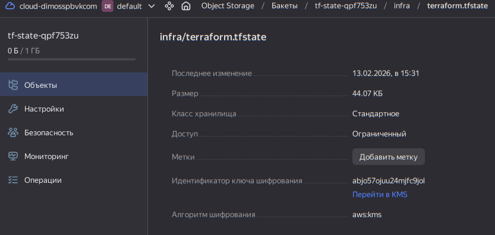

## Дипломный практикум в Yandex.Cloud
### Цели:

- Подготовить облачную инфраструктуру на базе облачного провайдера Яндекс.Облако.
- Запустить и сконфигурировать Kubernetes кластер.
- Установить и настроить систему мониторинга.
- Настроить и автоматизировать сборку тестового приложения с использованием Docker-контейнеров.
- Настроить CI для автоматической сборки и тестирования.
- Настроить CD для автоматического развёртывания приложения.

### Этапы выполнения:
1. [Предварительные требования](#предварительные-требования)
2. [Создание облачной инфраструктуры](#создание-облачной-инфраструктуры)
3. [Создание Kubernetes кластера](#создание-kubernetes-кластера)

6. [Тестовое приложение](#тестовое-приложение)

---
# Решение

### Предварительные требования

- Все шаги подготовки выполняются с узла управления где установлены - `terraform, jq, yc cli, direnv` ([direnv](https://direnv.net/) - для авто инициализации переменных окружения проекта .envrc)
- Пользователь аутентифицирован в yandex cloud `yc init`
- Получен временный yc токен для подготовка ресурсов для backend terraform ``yc iam create-token | tr -d '\r\n' > ~/.secret/ya-token``

## Состав репозиториев

1. README — общее описание проекта и ссылки на репозитории.
2. infra — репозиторий инфраструктуры (Terraform + Ansible + Helm).
  - Terraform — создание ресурсов в Yandex Cloud (сети, VM, registry и т.п.) и генерация входных данных для Ansible (inventory/vars).
  - Ansible — подготовка узлов и развёртывание Kubernetes-кластера через kubeadm.
  - Helm — установка и настройка инфраструктурных компонентов внутри Kubernetes: Cilium (CNI) и стека мониторинга (kube-prometheus-stack).
2. app — тестовое приложение.
  - Исходный код
  - Dockerfile для сборки образа
  - CI/CD pipeline для сборки и публикации образа в registry и деплоя в Kubernetes

### Создание облачной инфраструктуры

1. На первом этапе выполнена подготовка ресурсов для backend terraform [terraform-bootstrap](https://gitlab.com/devops-course1935303/diplom/infra/-/tree/main/terraform-bootstrap?ref_type=heads). Конфигурация вынесена в отдельный каталог и используется только для начальной инициализации. 
  - Cоздан service account с ограниченными ролями
  - Cгенерирован static access key
  - Для работы переменными окружения (передача секретов) настроим переменные для terraform, ansible в /infra/.envrc для подключения через direnv
  - Подготовлен S3 bucket с версионированием для хранения state
  - Формирование [terraform/backend.tf](https://gitlab.com/devops-course1935303/diplom/infra/-/blob/main/terraform/backend.tf?ref_type=heads) через темплейт
  - Для удобства пересоздаёт service account iam json key файл в защищенном месте ``~/.secret/yc-sa-diplom-bucket-keys`` для дальнейшего использования провайдером и в CI/CD
  
2. Учитывая ограниченый бюджет купона на YC и довольно заметный по времени объем работы, требующий работающего кластера k8s я решил выбрать настройку self-managed k8s кластера посредством kubeadm, где я могу более оптимально (более чем в 2 раза дешевле) настроить узлы для кластера. 
 
3. Далее работаем из [infra/terraform](https://gitlab.com/devops-course1935303/diplom/infra/-/tree/main/terraform?ref_type=heads)
  - Произведем инициализацию terraform [terraform/backend.tf](https://gitlab.com/devops-course1935303/diplom/infra/-/blob/main/terraform/backend.tf?ref_type=heads)
  ```bash
  infra/terraform$ terraform init -backend-config="$TF_BACKEND_KEYS_FILE" (-reconfigure)
  ```
  
  - [Данная конфигурация terraform](https://gitlab.com/devops-course1935303/diplom/infra/-/tree/main/terraform?ref_type=heads) это:
    - [VPC, подсети, nat gateway для приватной сети воркеров k8s](https://gitlab.com/devops-course1935303/diplom/infra/-/blob/main/terraform/main.tf?ref_type=heads)
    - [Подготавливает k8s инфраструктуру - security groups, masters nodes, workers nodes, Ansible config & inventory, ssh_config](https://gitlab.com/devops-course1935303/diplom/infra/-/blob/main/terraform/k8s.tf?ref_type=heads), ssh_config для SSH ProxyJump через k8s мастер к изолированым в приватной сети воркерам.
    - Команды ``terraform destroy/apply`` могут выполняться повторно без дополнительных ручных действий.

### Создание Kubernetes кластера
 
1. По результату применения infra/terraform имеет актуальный инвентори в Ansible с доступом по ssh ко всем хостам
    - Проверка
    ```bash
    infra/ansible$ ansible all -m ping
    localhost | SUCCESS => {
        "changed": false,
        "ping": "pong"
    }
    k8s-master-1 | SUCCESS => {
        "changed": false,
        "ping": "pong"
    }
    k8s-worker-1 | SUCCESS => {
        "changed": false,
        "ping": "pong"
    }
    k8s-worker-2 | SUCCESS => {
        "changed": false,
        "ping": "pong"
    }
    ```

    - [infra/ansible - Ansible раздел с playbook & roles для развертывания k8s кластера на подготавленой ранее инфраструктуре](https://gitlab.com/devops-course1935303/diplom/infra/-/tree/main/ansible?ref_type=heads) где
      - Роль control - настраивает хост управления для работы с инфраструктурой (kubectl, helm..)
      - Роль k8s_core - производит все требуемые настройки и установки необходимые для всех k8s nodes (masters, workers)


### Тестовое приложение

#### Image приложения
  - Образ уже собран и доступен в GitLab Container Registry ``registry.gitlab.com/<your-username>/<project-name>/<image-name>:<tag>``
  - Воспользуйтесь временным токеном для доступа к Registry:
  ```bash
  docker login registry.gitlab.com -u <your-username> -p <temporary_token>
  docker pull registry.gitlab.com/<your-username>/<project-name>/<image-name>:<tag>
  ```

### Ссылки на материалы, которые использовались в работе
- [YC](https://yandex.cloud/ru)
- [direnv](https://direnv.net/)
- [terraform](https://developer.hashicorp.com/terraform)
- [Ansible](https://docs.ansible.com/)
- [Helm](https://helm.sh/)
- [k8s](https://kubernetes.io/)
- [Cilium](https://docs.cilium.io/en/stable/gettingstarted/k8s-install-default/)
