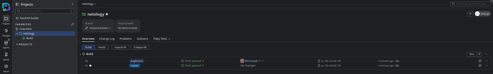
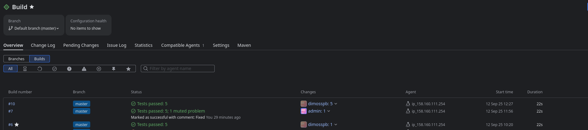

# Домашнее задание к занятию 11 «Teamcity»

## Подготовка к выполнению

1. В Yandex Cloud создайте новый инстанс (4CPU4RAM) на основе образа `jetbrains/teamcity-server`.
2. Дождитесь запуска teamcity, выполните первоначальную настройку.
3. Создайте ещё один инстанс (2CPU4RAM) на основе образа `jetbrains/teamcity-agent`. Пропишите к нему переменную окружения `SERVER_URL: "http://<teamcity_url>:8111"`.
4. Авторизуйте агент.
5. Сделайте fork [репозитория](https://github.com/aragastmatb/example-teamcity).
6. Создайте VM (2CPU4RAM) и запустите [playbook](./infrastructure).
---
- Решение


## Основная часть

1. Создайте новый проект в teamcity на основе fork.
2. Сделайте autodetect конфигурации.
3. Сохраните необходимые шаги, запустите первую сборку master.
---
- Решение


4. Поменяйте условия сборки: если сборка по ветке `master`, то должен происходит `mvn clean deploy`, иначе `mvn clean test`.

---


5. Для deploy будет необходимо загрузить [settings.xml](./teamcity/settings.xml) в набор конфигураций maven у teamcity, предварительно записав туда креды для подключения к nexus.
6. В pom.xml необходимо поменять ссылки на репозиторий и nexus.
7. Запустите сборку по master, убедитесь, что всё прошло успешно и артефакт появился в nexus.
---

```
10:20:15 Finalize build settings
10:20:15 The build is removed from the queue to be prepared for the start
10:20:15 Collecting changes in 1 VCS root
10:20:18 Compute revision for 'https://github.com/DimOsSpb/example-teamcity.git#refs/heads/master'
10:20:18 Starting the build on the agent "ip_158.160.111.254"
10:20:18 Updating tools for build
10:20:18 Clearing temporary directory: /opt/buildagent/temp/buildTmp
10:20:18 Publishing internal artifacts
10:20:19 Using vcs information from agent file: a46ba4989a1da2c1.xml
10:20:19 Checkout directory: /opt/buildagent/work/a46ba4989a1da2c1
10:20:19 Updating sources: auto checkout (on agent)
10:20:21 Step 1/2: Test step (Maven)
10:20:21 Step 2/2: Deploy step (Maven)
10:20:21   Using predefined Maven user settings: settings.xml
10:20:21   Using predefined Maven user settings: settings.xml
10:20:21   Initial M2_HOME not set
10:20:21   Current M2_HOME = /opt/buildagent/tools/maven3_9
10:20:21   PATH = /opt/buildagent/tools/maven3_9/bin:/opt/java/openjdk/bin:/usr/local/sbin:/usr/local/bin:/usr/sbin:/usr/bin:/sbin:/bin
10:20:21   Using watcher: /opt/buildagent/plugins/mavenPlugin/maven-watcher-jdk17/maven-watcher-agent.jar
10:20:21   Using agent local repository at /opt/buildagent/system/jetbrains.maven.runner/maven.repo.local
10:20:21   *** Start reading the project structure ***
10:20:24   Initial MAVEN_OPTS not set
10:20:24   Current MAVEN_OPTS not set
10:20:24   Starting: /opt/java/openjdk/bin/java -Dagent.home.dir=/opt/buildagent -Dagent.name=ip_158.160.111.254 -Dagent.ownPort=9090 -Dagent.work.dir=/opt/buildagent/work -Dbuild.number=6 -Dbuild.vcs.number=8a62dd410abf9642dba1c7b61427e8695f38a918 -Dbuild.vcs.number.1=8a62dd410abf9642dba1c7b61427e8695f38a918 -Dbuild.vcs.number.Netology_HttpsGithubComDimOsSpbExampleTeamcityGitRefsHeadsMaster=8a62dd410abf9642dba1c7b61427e8695f38a918 -Dclassworlds.conf=/opt/buildagent/temp/buildTmp/teamcity.m2.conf -Dcom.jetbrains.maven.watcher.report.file=/opt/buildagent/temp/buildTmp/maven-build-info.xml -Djava.io.tmpdir=/opt/buildagent/temp/buildTmp -Dmaven.home=/opt/buildagent/tools/maven3_9 -Dmaven.multiModuleProjectDirectory=/opt/buildagent/work/a46ba4989a1da2c1 -Dteamcity.agent.cpuBenchmark=453 -Dteamcity.auth.password=******* -Dteamcity.auth.userId=TeamCityBuildId=104 -Dteamcity.build.changedFiles.file=/opt/buildagent/temp/buildTmp/teamcity.changedFiles.txt -Dteamcity.build.checkoutDir=/opt/buildagent/work/a46ba4989a1da2c1 -Dteamcity.build.id=104 -Dteamcity.build.properties.file=/opt/buildagent/temp/buildTmp/teamcity.build.parameters -Dteamcity.build.properties.file.checksum=/opt/buildagent/temp/buildTmp/teamcity.build.parameters.checksum -Dteamcity.build.tempDir=/opt/buildagent/temp/buildTmp -Dteamcity.build.workingDir=/opt/buildagent/work/a46ba4989a1da2c1 -Dteamcity.buildConfName=Build -Dteamcity.buildType.id=Netology_Build -Dteamcity.configuration.properties.file=/opt/buildagent/temp/buildTmp/teamcity.config.parameters -Dteamcity.maven.userSettings.path=/opt/buildagent/temp/buildTmp/maven_settings_14987341315126484091.xml -Dteamcity.maven.watcher.home=/opt/buildagent/plugins/mavenPlugin/maven-watcher-jdk17 -Dteamcity.projectName=netology -Dteamcity.runner.properties.file=/opt/buildagent/temp/buildTmp/teamcity.runner.parameters -Dteamcity.tests.recentlyFailedTests.file=/opt/buildagent/temp/buildTmp/teamcity.testsToRunFirst.txt -Dteamcity.version=2025.07.1 (build 197325) -Dmaven.repo.local=/opt/buildagent/system/jetbrains.maven.runner/maven.repo.local -classpath /opt/buildagent/tools/maven3_9/boot/plexus-classworlds-2.7.0.jar: org.codehaus.plexus.classworlds.launcher.Launcher -f /opt/buildagent/work/a46ba4989a1da2c1/pom.xml -B -s /opt/buildagent/temp/buildTmp/maven_settings_14987341315126484091.xml -Dmaven.test.failure.ignore=true clean deploy
10:20:24   in directory: /opt/buildagent/work/a46ba4989a1da2c1
10:20:26   [INFO] Scanning for projects...
10:20:26   [INFO]
10:20:26   [INFO] -----------------------< org.netology:plaindoll >-----------------------
10:20:26   [INFO] Building plaindoll 0.0.2
10:20:26   [INFO]   from pom.xml
10:20:26   [INFO] --------------------------------[ jar ]---------------------------------
10:20:26   org.netology:plaindoll
10:20:26   Importing data from '/opt/buildagent/work/a46ba4989a1da2c1/target/failsafe-reports/TEST-*.xml' with 'surefire' processor
10:20:26   Importing data from '/opt/buildagent/work/a46ba4989a1da2c1/target/surefire-reports/TEST-*.xml' with 'surefire' processor
10:20:26   Surefire report watcher
10:20:27   [INFO]
10:20:27   [INFO] --- clean:3.2.0:clean (default-clean) @ plaindoll ---
10:20:27   Surefire report watcher
10:20:27   [INFO]
10:20:27   [INFO] --- resources:3.3.1:resources (default-resources) @ plaindoll ---
10:20:27   [WARNING] Using platform encoding (UTF-8 actually) to copy filtered resources, i.e. build is platform dependent!
10:20:27   [INFO] skip non existing resourceDirectory /opt/buildagent/work/a46ba4989a1da2c1/src/main/resources
10:20:27   [INFO]
10:20:27   [INFO] --- compiler:3.11.0:compile (default-compile) @ plaindoll ---
10:20:27   [INFO] Changes detected - recompiling the module! :source
10:20:27   [WARNING] File encoding has not been set, using platform encoding UTF-8, i.e. build is platform dependent!
10:20:27   [INFO] Compiling 2 source files with javac [debug target 1.8] to target/classes
10:20:28   [WARNING] bootstrap class path not set in conjunction with -source 8
10:20:28   [WARNING] source value 8 is obsolete and will be removed in a future release
10:20:28   [WARNING] target value 8 is obsolete and will be removed in a future release
10:20:28   [WARNING] To suppress warnings about obsolete options, use -Xlint:-options.
10:20:28   [INFO]
10:20:28   [INFO] --- resources:3.3.1:testResources (default-testResources) @ plaindoll ---
10:20:28   [WARNING] Using platform encoding (UTF-8 actually) to copy filtered resources, i.e. build is platform dependent!
10:20:28   [INFO] skip non existing resourceDirectory /opt/buildagent/work/a46ba4989a1da2c1/src/test/resources
10:20:28   [INFO]
10:20:28   [INFO] --- compiler:3.11.0:testCompile (default-testCompile) @ plaindoll ---
10:20:28   [INFO] Changes detected - recompiling the module! :dependency
10:20:28   [WARNING] File encoding has not been set, using platform encoding UTF-8, i.e. build is platform dependent!
10:20:28   [INFO] Compiling 1 source file with javac [debug target 1.8] to target/test-classes
10:20:28   [WARNING] bootstrap class path not set in conjunction with -source 8
10:20:28   [WARNING] source value 8 is obsolete and will be removed in a future release
10:20:28   [WARNING] target value 8 is obsolete and will be removed in a future release
10:20:28   [WARNING] To suppress warnings about obsolete options, use -Xlint:-options.
10:20:28   [INFO]
10:20:28   [INFO] --- surefire:3.2.2:test (default-test) @ plaindoll ---
10:20:29   [INFO] Using auto detected provider org.apache.maven.surefire.junit4.JUnit4Provider
10:20:29   [INFO]
10:20:29   [INFO] -------------------------------------------------------
10:20:29   [INFO]  T E S T S
10:20:29   [INFO] -------------------------------------------------------
10:20:29   [INFO] Running plaindoll.WelcomerTest
10:20:29   [INFO] Tests run: 5, Failures: 0, Errors: 0, Skipped: 0, Time elapsed: 0.154 s -- in plaindoll.WelcomerTest
10:20:29   [INFO]
10:20:29   [INFO] Results:
10:20:29   [INFO]
10:20:29   [INFO] Tests run: 5, Failures: 0, Errors: 0, Skipped: 0
10:20:29   [INFO]
10:20:29   [INFO]
10:20:29   [INFO] --- jar:3.3.0:jar (default-jar) @ plaindoll ---
10:20:30   [INFO] Building jar: /opt/buildagent/work/a46ba4989a1da2c1/target/plaindoll-0.0.2.jar
10:20:30   [INFO]
10:20:30   [INFO] --- shade:3.2.4:shade (default) @ plaindoll ---
10:20:30   [INFO] Replacing original artifact with shaded artifact.
10:20:30   [INFO] Replacing /opt/buildagent/work/a46ba4989a1da2c1/target/plaindoll-0.0.2.jar with /opt/buildagent/work/a46ba4989a1da2c1/target/plaindoll-0.0.2-shaded.jar
10:20:30   [INFO]
10:20:30   [INFO] --- install:3.1.1:install (default-install) @ plaindoll ---
10:20:30   [INFO] Installing /opt/buildagent/work/a46ba4989a1da2c1/pom.xml to /opt/buildagent/system/jetbrains.maven.runner/maven.repo.local/org/netology/plaindoll/0.0.2/plaindoll-0.0.2.pom
10:20:30   [INFO] Installing /opt/buildagent/work/a46ba4989a1da2c1/target/plaindoll-0.0.2.jar to /opt/buildagent/system/jetbrains.maven.runner/maven.repo.local/org/netology/plaindoll/0.0.2/plaindoll-0.0.2.jar
10:20:30   [INFO]
10:20:30   [INFO] --- deploy:3.1.1:deploy (default-deploy) @ plaindoll ---
10:20:31   [INFO] Uploading to nexus: http://158.160.45.47:8081/repository/maven-releases/org/netology/plaindoll/0.0.2/plaindoll-0.0.2.pom
10:20:31   [INFO] Uploaded to nexus: http://158.160.45.47:8081/repository/maven-releases/org/netology/plaindoll/0.0.2/plaindoll-0.0.2.pom (1.5 kB at 4.5 kB/s)
10:20:31   [INFO] Uploading to nexus: http://158.160.45.47:8081/repository/maven-releases/org/netology/plaindoll/0.0.2/plaindoll-0.0.2.jar
10:20:31   [INFO] Uploaded to nexus: http://158.160.45.47:8081/repository/maven-releases/org/netology/plaindoll/0.0.2/plaindoll-0.0.2.jar (3.1 kB at 18 kB/s)
10:20:31   [INFO] Downloading from nexus: http://158.160.45.47:8081/repository/maven-releases/org/netology/plaindoll/maven-metadata.xml
10:20:31   [INFO] Uploading to nexus: http://158.160.45.47:8081/repository/maven-releases/org/netology/plaindoll/maven-metadata.xml
10:20:31   [INFO] Uploaded to nexus: http://158.160.45.47:8081/repository/maven-releases/org/netology/plaindoll/maven-metadata.xml (301 B at 1.7 kB/s)
10:20:31   [INFO] ------------------------------------------------------------------------
10:20:31   [INFO] BUILD SUCCESS
10:20:31   [INFO] ------------------------------------------------------------------------
10:20:31   [INFO] Total time:  5.234 s
10:20:31   [INFO] Finished at: 2025-09-12T11:20:31+01:00
10:20:31   [INFO] ------------------------------------------------------------------------
10:20:32   Process exited with code 0
10:20:32   Publishing artifacts
10:20:32   Waiting for 2 service processes to complete
10:20:32   Surefire report watcher
10:20:38 Publishing artifacts
10:20:38 Publishing internal artifacts
10:20:39 Publishing internal artifacts
```


8. Мигрируйте `build configuration` в репозиторий.
---


9. Создайте отдельную ветку `feature/add_reply` в репозитории.
10. Напишите новый метод для класса Welcomer: метод должен возвращать произвольную реплику, содержащую слово `hunter`.
11. Дополните тест для нового метода на поиск слова `hunter` в новой реплике.
12. Сделайте push всех изменений в новую ветку репозитория.
13. Убедитесь, что сборка самостоятельно запустилась, тесты прошли успешно.
---


14. Внесите изменения из произвольной ветки `feature/add_reply` в `master` через `Merge`.
15. Убедитесь, что нет собранного артефакта в сборке по ветке `master`.
16. Настройте конфигурацию так, чтобы она собирала `.jar` в артефакты сборки.
17. Проведите повторную сборку мастера, убедитесь, что сбора прошла успешно и артефакты собраны.
---
- Я изначально зашел вперед и сделал два Buils steps с условиями для теста и сборки по изменению master. И по дальнейшим шагам видно, что изменения в ветке feature/add_reply не запустили сборку - шаг 2. А после Merge в мастер сборка прошла

```
12:27:24   [INFO] --- deploy:3.1.1:deploy (default-deploy) @ plaindoll ---
12:27:25   [INFO] Uploading to nexus: http://158.160.45.47:8081/repository/maven-releases/org/netology/plaindoll/0.0.1/plaindoll-0.0.1.pom
12:27:25   [INFO] Uploaded to nexus: http://158.160.45.47:8081/repository/maven-releases/org/netology/plaindoll/0.0.1/plaindoll-0.0.1.pom (1.5 kB at 9.7 kB/s)
12:27:25   [INFO] Uploading to nexus: http://158.160.45.47:8081/repository/maven-releases/org/netology/plaindoll/0.0.1/plaindoll-0.0.1.jar
12:27:25   [INFO] Uploaded to nexus: http://158.160.45.47:8081/repository/maven-releases/org/netology/plaindoll/0.0.1/plaindoll-0.0.1.jar (3.1 kB at 56 kB/s)
12:27:25   [INFO] Downloading from nexus: http://158.160.45.47:8081/repository/maven-releases/org/netology/plaindoll/maven-metadata.xml
12:27:25   [INFO] Downloaded from nexus: http://158.160.45.47:8081/repository/maven-releases/org/netology/plaindoll/maven-metadata.xml (301 B at 14 kB/s)
12:27:25   [INFO] Uploading to nexus: http://158.160.45.47:8081/repository/maven-releases/org/netology/plaindoll/maven-metadata.xml
12:27:25   [INFO] Uploaded to nexus: http://158.160.45.47:8081/repository/maven-releases/org/netology/plaindoll/maven-metadata.xml (332 B at 4.5 kB/s)
12:27:25   [INFO] ------------------------------------------------------------------------
```

18. Проверьте, что конфигурация в репозитории содержит все настройки конфигурации из teamcity.
19. В ответе пришлите ссылку на репозиторий.

---


---

### Как оформить решение задания

Выполненное домашнее задание пришлите в виде ссылки на .md-файл в вашем репозитории.

---
