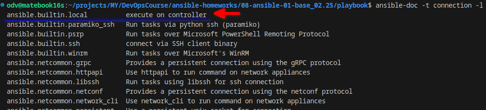

# Домашнее задание к занятию 1 «Введение в Ansible»

## Основная часть

1. Попробуйте запустить playbook на окружении из `test.yml`, зафиксируйте значение, которое имеет факт `some_fact` для указанного хоста при выполнении playbook.

    ```shell
    odv@matebook16s:~/projects/MY/DevOpsCourse/ansible-homeworks/08-ansible-01-base_02.25/playbook$ ansible-playbook site.yml -i inventory/test.yml 

    PLAY [Print os facts] *********************************************************************************************************************************************************************************************************************************

    TASK [Gathering Facts] ********************************************************************************************************************************************************************************************************************************
    ok: [localhost]

    TASK [Print OS] ***************************************************************************************************************************************************************************************************************************************
    ok: [localhost] => {
        "msg": "Debian"
    }

    TASK [Print fact] *************************************************************************************************************************************************************************************************************************************
    ok: [localhost] => {
        "msg": 12
    }

    PLAY RECAP ********************************************************************************************************************************************************************************************************************************************
    localhost                  : ok=3    changed=0    unreachable=0    failed=0    skipped=0    rescued=0    ignored=0 
    ```

2. Найдите файл с переменными (group_vars), в котором задаётся найденное в первом пункте значение, и поменяйте его на `all default fact`.
    ```shell
    odv@matebook16s:~/projects/MY/DevOpsCourse/ansible-homeworks/08-ansible-01-base_02.25/playbook$ ansible-playbook site.yml -i inventory/test.yml 

    PLAY [Print os facts] *********************************************************************************************************************************************************************************************************************************

    TASK [Gathering Facts] ********************************************************************************************************************************************************************************************************************************
    ok: [localhost]

    TASK [Print OS] ***************************************************************************************************************************************************************************************************************************************
    ok: [localhost] => {
        "msg": "Debian"
    }

    TASK [Print fact] *************************************************************************************************************************************************************************************************************************************
    ok: [localhost] => {
        "msg": "all default fact"
    }

    PLAY RECAP ********************************************************************************************************************************************************************************************************************************************
    localhost                  : ok=3    changed=0    unreachable=0    failed=0    skipped=0    rescued=0    ignored=0
    ```
3. Воспользуйтесь подготовленным (используется `docker`) или создайте собственное окружение для проведения дальнейших испытаний.

    - ubuntu:latest не содержит python - это приводит к ошибке ansible, ему на хостах нужен python.  
    Соберем в образ python [через](src/Dockerfile) - docker build -t ubuntu-python .

    ```shell
    odv@matebook16s:~/projects/MY/DevOpsCourse/ansible-homeworks/08-ansible-01-base_02.25/playbook$ docker ps -a
    CONTAINER ID   IMAGE            COMMAND       CREATED         STATUS         PORTS     NAMES
    8fac5bdf156b   centos:centos7   "/bin/bash"   5 minutes ago   Up 5 minutes             centos7
    dfcef955c7e6   ubuntu-python    "/bin/bash"   8 minutes ago   Up 8 minutes             ubuntu
    ```

4. Проведите запуск playbook на окружении из `prod.yml`. Зафиксируйте полученные значения `some_fact` для каждого из `managed host`.

    ```shell
    odv@matebook16s:~/projects/MY/DevOpsCourse/ansible-homeworks/08-ansible-01-base_02.25/playbook$ ansible-playbook site.yml -i inventory/prod.yml

    PLAY [Print os facts] *********************************************************************************************************************************************************************************************************************************

    TASK [Gathering Facts] ********************************************************************************************************************************************************************************************************************************
    ok: [ubuntu]
    ok: [centos7]

    TASK [Print OS] ***************************************************************************************************************************************************************************************************************************************
    ok: [centos7] => {
        "msg": "CentOS"
    }
    ok: [ubuntu] => {
        "msg": "Ubuntu"
    }

    TASK [Print fact] *************************************************************************************************************************************************************************************************************************************
    ok: [centos7] => {
        "msg": "el"
    }
    ok: [ubuntu] => {
        "msg": "deb"
    }

    PLAY RECAP ********************************************************************************************************************************************************************************************************************************************
    centos7                    : ok=3    changed=0    unreachable=0    failed=0    skipped=0    rescued=0    ignored=0   
    ubuntu                     : ok=3    changed=0    unreachable=0    failed=0    skipped=0    rescued=0    ignored=0  
    ```

5. Добавьте факты в `group_vars` каждой из групп хостов так, чтобы для `some_fact` получились значения: для `deb` — `deb default fact`, для `el` — `el default fact`.
6.  Повторите запуск playbook на окружении `prod.yml`. Убедитесь, что выдаются корректные значения для всех хостов.

    ```shell
    odv@matebook16s:~/projects/MY/DevOpsCourse/ansible-homeworks/08-ansible-01-base_02.25/playbook$ ansible-playbook site.yml -i inventory/prod.yml

    PLAY [Print os facts] *********************************************************************************************************************************************************************************************************************************

    TASK [Gathering Facts] ********************************************************************************************************************************************************************************************************************************
    ok: [ubuntu]
    ok: [centos7]

    TASK [Print OS] ***************************************************************************************************************************************************************************************************************************************
    ok: [centos7] => {
        "msg": "CentOS"
    }
    ok: [ubuntu] => {
        "msg": "Ubuntu"
    }

    TASK [Print fact] *************************************************************************************************************************************************************************************************************************************
    ok: [centos7] => {
        "msg": "el default fact"
    }
    ok: [ubuntu] => {
        "msg": "deb default fact"
    }

    PLAY RECAP ********************************************************************************************************************************************************************************************************************************************
    centos7                    : ok=3    changed=0    unreachable=0    failed=0    skipped=0    rescued=0    ignored=0   
    ubuntu                     : ok=3    changed=0    unreachable=0    failed=0    skipped=0    rescued=0    ignored=0
    ```

7. При помощи `ansible-vault` зашифруйте факты в `group_vars/deb` и `group_vars/el` с паролем `netology`.

    ```shell
    odv@matebook16s:~/projects/MY/DevOpsCourse/ansible-homeworks/08-ansible-01-base_02.25/playbook$ ansible-vault encrypt group_vars/deb/examp.yml 
    New Vault password: 
    Confirm New Vault password: 
    Encryption successful
    odv@matebook16s:~/projects/MY/DevOpsCourse/ansible-homeworks/08-ansible-01-base_02.25/playbook$ ansible-vault encrypt group_vars/el/examp.yml 
    New Vault password: 
    Confirm New Vault password: 
    Encryption successful
    ```

8. Запустите playbook на окружении `prod.yml`. При запуске `ansible` должен запросить у вас пароль. Убедитесь в работоспособности.

    ```shell
    odv@matebook16s:~/projects/MY/DevOpsCourse/ansible-homeworks/08-ansible-01-base_02.25/playbook$ ansible-playbook site.yml -i inventory/prod.yml --ask-vault-pass
    Vault password: 

    PLAY [Print os facts] *********************************************************************************************************************************************************************************************************************************

    TASK [Gathering Facts] ********************************************************************************************************************************************************************************************************************************
    ok: [ubuntu]
    ok: [centos7]

    TASK [Print OS] ***************************************************************************************************************************************************************************************************************************************
    ok: [centos7] => {
        "msg": "CentOS"
    }
    ok: [ubuntu] => {
        "msg": "Ubuntu"
    }

    TASK [Print fact] *************************************************************************************************************************************************************************************************************************************
    ok: [centos7] => {
        "msg": "el default fact"
    }
    ok: [ubuntu] => {
        "msg": "deb default fact"
    }

    PLAY RECAP ********************************************************************************************************************************************************************************************************************************************
    centos7                    : ok=3    changed=0    unreachable=0    failed=0    skipped=0    rescued=0    ignored=0   
    ubuntu                     : ok=3    changed=0    unreachable=0    failed=0    skipped=0    rescued=0    ignored=0
    ```

9. Посмотрите при помощи `ansible-doc` список плагинов для подключения. Выберите подходящий для работы на `control node`.

    

10. В `prod.yml` добавьте новую группу хостов с именем  `local`, в ней разместите localhost с необходимым типом подключения.
11. Запустите playbook на окружении `prod.yml`. При запуске `ansible` должен запросить у вас пароль. Убедитесь, что факты `some_fact` для каждого из хостов определены из верных `group_vars`.

    ```shell
    odv@matebook16s:~/projects/MY/DevOpsCourse/ansible-homeworks/08-ansible-01-base_02.25/playbook$ ansible-playbook site.yml -i inventory/prod.yml --ask-vault-pass
    Vault password: 

    PLAY [Print os facts] *********************************************************************************************************************************************************************************************************************************

    TASK [Gathering Facts] ********************************************************************************************************************************************************************************************************************************
    ok: [my-local]
    ok: [ubuntu]
    ok: [centos7]

    TASK [Print OS] ***************************************************************************************************************************************************************************************************************************************
    ok: [centos7] => {
        "msg": "CentOS"
    }
    ok: [ubuntu] => {
        "msg": "Ubuntu"
    }
    ok: [my-local] => {
        "msg": "Debian"
    }

    TASK [Print fact] *************************************************************************************************************************************************************************************************************************************
    ok: [centos7] => {
        "msg": "el default fact"
    }
    ok: [ubuntu] => {
        "msg": "deb default fact"
    }
    ok: [my-local] => {
        "msg": "all default fact"
    }

    PLAY RECAP ********************************************************************************************************************************************************************************************************************************************
    centos7                    : ok=3    changed=0    unreachable=0    failed=0    skipped=0    rescued=0    ignored=0   
    my-local                   : ok=3    changed=0    unreachable=0    failed=0    skipped=0    rescued=0    ignored=0   
    ubuntu                     : ok=3    changed=0    unreachable=0    failed=0    skipped=0    rescued=0    ignored=0
    ```

## Необязательная часть

1. При помощи `ansible-vault` расшифруйте все зашифрованные файлы с переменными.

    ```shell
    odv@matebook16s:~/projects/MY/DevOpsCourse/ansible-homeworks/08-ansible-01-base_02.25/playbook$ ansible-vault decrypt group_vars/deb/examp.yml group_vars/el/examp.yml 
    Vault password: 
    Decryption successful
    ```

2. Зашифруйте отдельное значение `PaSSw0rd` для переменной `some_fact` паролем `netology`. Добавьте полученное значение в `group_vars/all/exmp.yml`.

    ```shell
    odv@matebook16s:~/projects/MY/DevOpsCourse/ansible-homeworks/08-ansible-01-base_02.25/playbook$ ansible-vault encrypt_string
    New Vault password: 
    Confirm New Vault password: 
    Reading plaintext input from stdin. (ctrl-d to end input, twice if your content does not already have a newline)
    PaSSw0rd
    Encryption successful
    !vault |
            $ANSIBLE_VAULT;1.1;AES256
            33663564326434336131303533666138643661383738333138646661316631363832356632333539
            3864666531303833343564356439666462333431316133610a643830383539363538303865666464
            30346435333563666631663662613438656266333164383535613636346636313136343836366633
            3864633937636432300a663935346237306164623864366433343761636439613035623666643136
            3433
    ```

3. Запустите `playbook`, убедитесь, что для нужных хостов применился новый `fact`.
    
    ```shell
    odv@matebook16s:~/projects/MY/DevOpsCourse/ansible-homeworks/08-ansible-01-base_02.25/playbook$ ansible-playbook site.yml -i inventory/prod.yml --ask-vault-pass
    Vault password: 

    PLAY [Print os facts] *********************************************************************************************************************************************************************************************************************************

    TASK [Gathering Facts] ********************************************************************************************************************************************************************************************************************************
    ok: [ubuntu]
    ok: [my-local]
    ok: [centos7]

    TASK [Print OS] ***************************************************************************************************************************************************************************************************************************************
    ok: [centos7] => {
        "msg": "CentOS"
    }
    ok: [ubuntu] => {
        "msg": "Ubuntu"
    }
    ok: [my-local] => {
        "msg": "Debian"
    }

    TASK [Print fact] *************************************************************************************************************************************************************************************************************************************
    ok: [centos7] => {
        "msg": "el default fact"
    }
    ok: [ubuntu] => {
        "msg": "deb default fact"
    }
    ok: [my-local] => {
        "msg": "PaSSw0rd"
    }

    PLAY RECAP ********************************************************************************************************************************************************************************************************************************************
    centos7                    : ok=3    changed=0    unreachable=0    failed=0    skipped=0    rescued=0    ignored=0   
    my-local                   : ok=3    changed=0    unreachable=0    failed=0    skipped=0    rescued=0    ignored=0   
    ubuntu                     : ok=3    changed=0    unreachable=0    failed=0    skipped=0    rescued=0    ignored=0
    ```
4. Добавьте новую группу хостов `fedora`, самостоятельно придумайте для неё переменную. В качестве образа можно использовать [этот вариант](https://hub.docker.com/r/pycontribs/fedora).

    - [fedora in groupe](playbook/inventory/prod.yml), [variable](playbook/group_vars/fed/examp.yml)

5. Напишите скрипт на bash: автоматизируйте поднятие необходимых контейнеров, запуск ansible-playbook и остановку контейнеров.

    - [Скрипт](src/automate.sh). 

    ```shell
    odv@matebook16s:~/projects/MY/DevOpsCourse/ansible-homeworks/08-ansible-01-base_02.25/playbook$ ../src/automate.sh 
    Vault password: 

    PLAY [Print os facts] *********************************************************************************************************************************************************************************************************************************

    TASK [Gathering Facts] ********************************************************************************************************************************************************************************************************************************
    ok: [ubuntu]
    ok: [my-local]
    ok: [fedora]
    ok: [centos7]

    TASK [Print OS] ***************************************************************************************************************************************************************************************************************************************
    ok: [centos7] => {
        "msg": "CentOS"
    }
    ok: [ubuntu] => {
        "msg": "Ubuntu"
    }
    ok: [fedora] => {
        "msg": "Fedora"
    }
    ok: [my-local] => {
        "msg": "Debian"
    }

    TASK [Print fact] *************************************************************************************************************************************************************************************************************************************
    ok: [centos7] => {
        "msg": "el default fact"
    }
    ok: [ubuntu] => {
        "msg": "deb default fact"
    }
    ok: [fedora] => {
        "msg": "fedora default fact"
    }
    ok: [my-local] => {
        "msg": "PaSSw0rd"
    }

    PLAY RECAP ********************************************************************************************************************************************************************************************************************************************
    centos7                    : ok=3    changed=0    unreachable=0    failed=0    skipped=0    rescued=0    ignored=0   
    fedora                     : ok=3    changed=0    unreachable=0    failed=0    skipped=0    rescued=0    ignored=0   
    my-local                   : ok=3    changed=0    unreachable=0    failed=0    skipped=0    rescued=0    ignored=0   
    ubuntu                     : ok=3    changed=0    unreachable=0    failed=0    skipped=0    rescued=0    ignored=0
    ```

