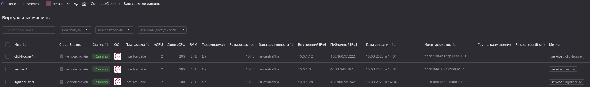
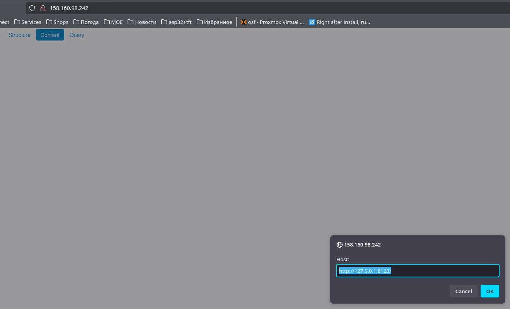
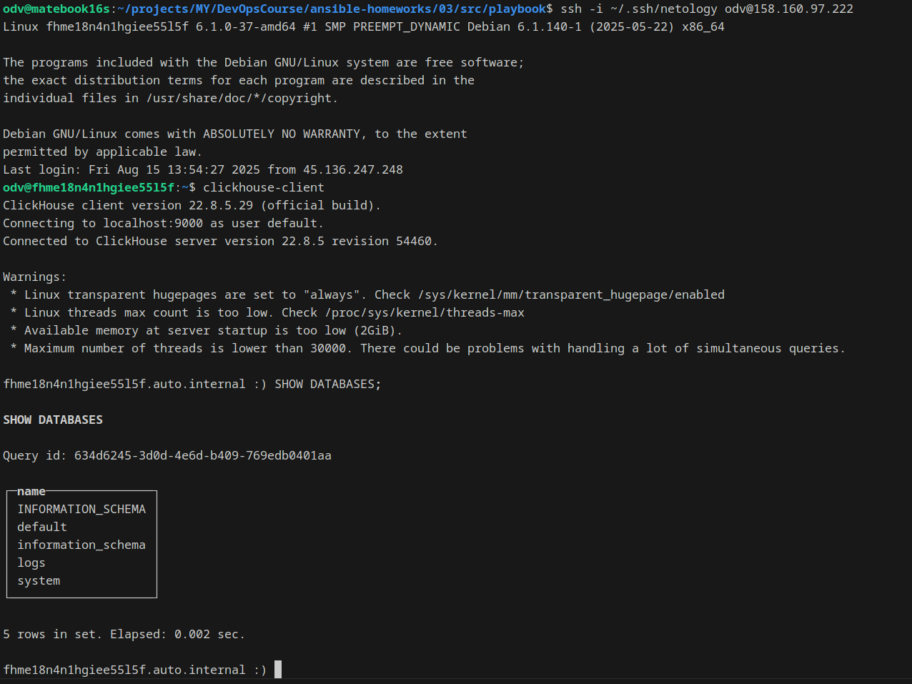
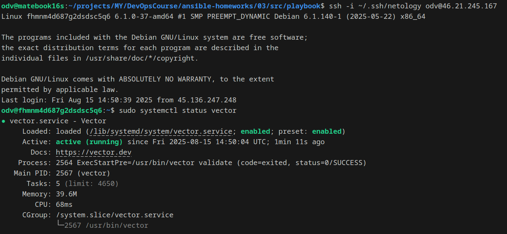

# Домашнее задание к занятию 3 «Использование Ansible»

## Подготовка к выполнению

1. Подготовьте в Yandex Cloud три хоста: для `clickhouse`, для `vector` и для `lighthouse`.

- Добавил в [Развертывание через terraform в Yandex Cloud три хоста с подготовкой inventory/prod.yml куда уже прилетает структура и данные по хостам](src/tf/) 



## Основная часть

1. Допишите playbook: нужно сделать ещё один play, который устанавливает и настраивает LightHouse.
2. При создании tasks рекомендую использовать модули: `get_url`, `template`, `yum`, `apt`.
3. Tasks должны: скачать статику LightHouse, установить Nginx или любой другой веб-сервер, настроить его конфиг для открытия LightHouse, запустить веб-сервер.
4. Подготовьте свой inventory-файл `prod.yml`.
5. Запустите `ansible-lint site.yml` и исправьте ошибки, если они есть.
6. Попробуйте запустить playbook на этом окружении с флагом `--check`.
7. Запустите playbook на `prod.yml` окружении с флагом `--diff`. Убедитесь, что изменения на системе произведены.
8. Повторно запустите playbook с флагом `--diff` и убедитесь, что playbook идемпотентен.
9. Подготовьте README.md-файл по своему playbook. В нём должно быть описано: что делает playbook, какие у него есть параметры и теги.
10. Готовый playbook выложите в свой репозиторий, поставьте тег `08-ansible-03-yandex` на фиксирующий коммит, в ответ предоставьте ссылку на него.


Как результат:

    ```shell
    odv@matebook16s:~/projects/MY/DevOpsCourse/ansible-homeworks/03/src/playbook$ ansible-playbook -i inventory/prod.yml site.yml

    PLAY [Install Clickhouse] **************************************************************************************************************************************************************************

    TASK [Gathering Facts] *****************************************************************************************************************************************************************************
    ok: [clickhouse-1]

    TASK [Get clickhouse distrib] **********************************************************************************************************************************************************************
    ok: [clickhouse-1] => (item=clickhouse-common-static)
    ok: [clickhouse-1] => (item=clickhouse-client)
    ok: [clickhouse-1] => (item=clickhouse-server)

    TASK [Install clickhouse packages manually] ********************************************************************************************************************************************************
    ok: [clickhouse-1] => (item=clickhouse-common-static)
    ok: [clickhouse-1] => (item=clickhouse-client)
    ok: [clickhouse-1] => (item=clickhouse-server)

    TASK [Flush handlers] ******************************************************************************************************************************************************************************

    TASK [Wait for ClickHouse ready] *******************************************************************************************************************************************************************
    ok: [clickhouse-1]

    TASK [Create database] *****************************************************************************************************************************************************************************
    changed: [clickhouse-1]

    PLAY [Install Vector] ******************************************************************************************************************************************************************************

    TASK [Gathering Facts] *****************************************************************************************************************************************************************************
    ok: [vector-1]

    TASK [Download Vector package] *********************************************************************************************************************************************************************
    ok: [vector-1]

    TASK [Install vector packages manually] ************************************************************************************************************************************************************
    ok: [vector-1]

    TASK [Vector config from template] *****************************************************************************************************************************************************************
    ok: [vector-1]

    TASK [Flush handlers] ******************************************************************************************************************************************************************************

    PLAY [Install nginx] *******************************************************************************************************************************************************************************

    TASK [Gathering Facts] *****************************************************************************************************************************************************************************
    ok: [lighthouse-1]

    TASK [Install nginx] *******************************************************************************************************************************************************************************
    ok: [lighthouse-1]

    TASK [Create nginx config] *************************************************************************************************************************************************************************
    ok: [lighthouse-1]

    PLAY [Install lighthouse] **************************************************************************************************************************************************************************

    TASK [Gathering Facts] *****************************************************************************************************************************************************************************
    ok: [lighthouse-1]

    TASK [Install git] *********************************************************************************************************************************************************************************
    changed: [lighthouse-1]

    TASK [Clone Lighthouse repo] ***********************************************************************************************************************************************************************
    changed: [lighthouse-1]

    TASK [Set permissions] *****************************************************************************************************************************************************************************
    changed: [lighthouse-1]

    TASK [Enable lighthouse_nginx_conf] ****************************************************************************************************************************************************************
    changed: [lighthouse-1]

    TASK [Remove default config] ***********************************************************************************************************************************************************************
    changed: [lighthouse-1]

    TASK [Restart Nginx] *******************************************************************************************************************************************************************************
    changed: [lighthouse-1]

    PLAY RECAP *****************************************************************************************************************************************************************************************
    clickhouse-1               : ok=5    changed=1    unreachable=0    failed=0    skipped=0    rescued=0    ignored=0   
    lighthouse-1               : ok=10   changed=6    unreachable=0    failed=0    skipped=0    rescued=0    ignored=0   
    vector-1                   : ok=4    changed=0    unreachable=0    failed=0    skipped=0    rescued=0    ignored=0
    ```






