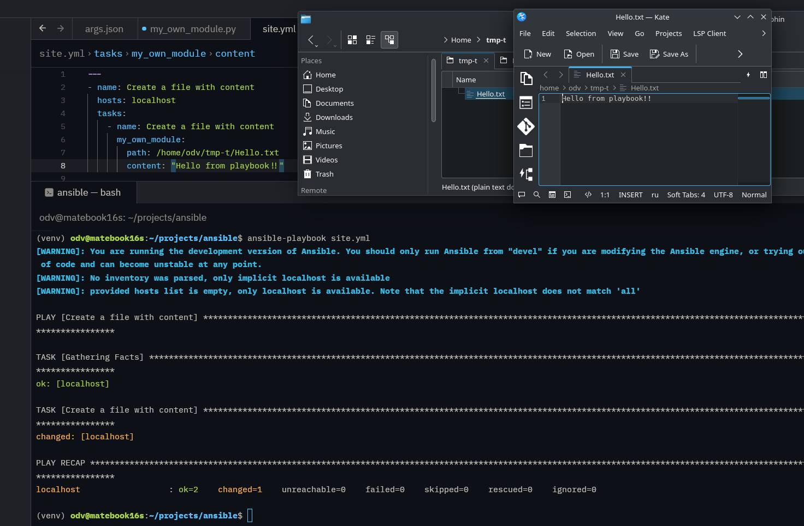
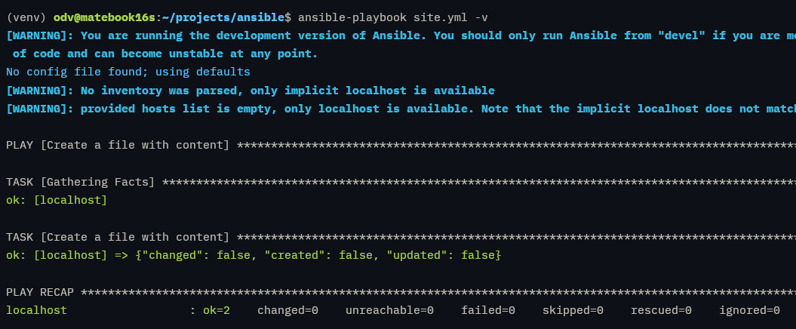

# Домашнее задание к занятию 6 «Создание собственных модулей»

# Решение

**Шаг 3.** Заполните файл в соответствии с требованиями Ansible так, чтобы он выполнял основную задачу: module должен создавать текстовый файл на удалённом хосте по пути, определённом в параметре `path`, с содержимым, определённым в параметре `content`.
**Шаг 4.** Проверьте module на исполняемость локально.

```shell
(venv) odv@matebook16s:~/projects/ansible$ python -m ansible.modules.my_own_module args.json

{"changed": true, "created": true, "updated": false, "invocation": {"module_args": {"path": "/home/odv/tmp-t/Hello.txt", "content": "Hello ansible!!"}}}
```

- Тестирование:

```shell
(venv) odv@matebook16s:~/projects/ansible$ ansible-test sanity my_own_module --python 3.12
WARNING: The validate-modules sanity test cannot compare against the base commit because it was not detected.
WARNING: Skipping tests disabled by default without --allow-disabled: package-data
Running sanity test "action-plugin-docs"
...
Running sanity test "yamllint"
WARNING: Reviewing previous 2 warning(s):
WARNING: The validate-modules sanity test cannot compare against the base commit because it was not detected.
WARNING: Skipping tests disabled by default without --allow-disabled: package-data
```

**Шаг 5.** Напишите single task playbook и используйте module в нём.



**Шаг 6.** Проверьте через playbook на идемпотентность.



**Шаг 7.** Выйдите из виртуального окружения.
**Шаг 8.** Инициализируйте новую collection: `ansible-galaxy collection init my_own_namespace.yandex_cloud_elk`.
**Шаг 9.** В эту collection перенесите свой module в соответствующую директорию.
**Шаг 10.** Single task playbook преобразуйте в single task role и перенесите в collection. У role должны быть default всех параметров module.
**Шаг 11.** Создайте playbook для использования этой role.
**Шаг 12.** Заполните всю документацию по collection, выложите в свой репозиторий, поставьте тег `1.0.0` на этот коммит.
**Шаг 13.** Создайте .tar.gz этой collection: `ansible-galaxy collection build` в корневой директории collection.
**Шаг 14.** Создайте ещё одну директорию любого наименования, перенесите туда single task playbook и архив c collection.
**Шаг 15.** Установите collection из локального архива: `ansible-galaxy collection install <archivename>.tar.gz`.
**Шаг 16.** Запустите playbook, убедитесь, что он работает.

```shell
odv@matebook16s:~/projects/MY/DevOpsCourse/ansible-homeworks/06$ ansible-playbook site.yml -v
No config file found; using defaults
[WARNING]: No inventory was parsed, only implicit localhost is available
[WARNING]: provided hosts list is empty, only localhost is available. Note that the implicit localhost does not match 'all'

PLAY [My Own Role Playbook] *************************************************************************************************************************************************************************************

TASK [Gathering Facts] ******************************************************************************************************************************************************************************************
ok: [localhost]

TASK [dimosspb_devopscourse.training.my_own_role : Create a file with content] **********************************************************************************************************************************
ok: [localhost] => {"changed": false, "created": false, "updated": false}

PLAY RECAP ******************************************************************************************************************************************************************************************************
localhost                  : ok=2    changed=0    unreachable=0    failed=0    skipped=0    rescued=0    ignored=0
```

**Шаг 17.** В ответ необходимо прислать ссылки на collection и tar.gz архив, а также скриншоты выполнения пунктов 4, 6, 15 и 16.

- [Collection](https://github.com/DimOsSpb/my_own_collection/tree/1.0.0?tab=readme-ov-file)
- [tar.gz](https://raw.githubusercontent.com/DimOsSpb/my_own_collection/1.0.0/dimosspb_devopscourse-training-1.0.0.tar.gz)

## Необязательная часть
## **Решение:**

1. Реализуйте свой модуль для создания хостов в Yandex Cloud.
2. Модуль может и должен иметь зависимость от `yc`, основной функционал: создание ВМ с нужным сайзингом на основе нужной ОС. Дополнительные модули по созданию кластеров ClickHouse, MySQL и прочего реализовывать не надо, достаточно простейшего создания ВМ.
---

- *Модуль может и должен иметь зависимость от `yc`* - Да - это понятное требование, но использовать [Yandex CloudPython SDK](https://yandex.cloud/ru/docs/functions/lang/python/)  — это более нативно, переносимо и соответствует подходу Ansible к облакам. Тем более уже работал в подобном ключе с yc - [Скрипт где используется вызов yc для создания виртуальной машины](https://github.com/DimOsSpb/Netology-DevOps/blob/main/homeworks/05-virt-05-docker-swarm/src/bash/make_swarm.sh). Т.е. буду использовать Yandex CloudPython SDK - это сложнее, но одновременно интереснее и безопаснее, чем использовать yc CLI.

- Настройка среды ansible:
  - Перейдем катаалог ansible sdk и активируем venv (. venv/bin/activate && . hacking/env-setup.) из начала задания.
  - Установим yandexcloud sdk (`pip install yandexcloud`)
  - Первое - это отладить аутентификацию и получение информации о ресурсах облака. Следуем [Yandex.Cloud SDK (Python)](https://github.com/yandex-cloud/python-sdk).
  - Далее работа с api sdk по взаимодействию с Compute Cloud resources для создания ВМ.
  - Важно для anible для идемпотентности в Ansible - сначала нужно получить существующую или нет! ВМ (List или Get). Сравнить желаемые параметры (cores, memory, labels, metadata и т.д.) с фактическими. Если отличаются — вызвать соответствующий update метод. Если совпадают — ничего не делать. Но есть существенно осложняющий логику работы модуля момент - не все поля можно менять «на горячую», некоторые требуют остановки или пересоздания ВМ.
    - Можно менять без остановки
      - name
      - description
      - (labels)
      - metadata
      - service_accounts
      - сервисные аккаунты
    - Требуют остановки ВМ (будет ошибка, если она работает):
      - resources_spec (cores, memory)
      - boot_disk
      - network_settings
    - Вообще нельзя обновить у существующей машины:
      - zone_id (переместить ВМ между зонами невозможно → только создать новую)
  Т.о

- Первый результат:
```
(venv) odv@matebook16s:~/projects/ansible$ python -m ansible.modules.yc args.json
/home/odv/projects/ansible/lib/ansible/modules/yc.py:150: DeprecationWarning: Call to deprecated class RetryInterceptor. (Instead of this class use retry_policy field when building the SDK) -- Deprecated since version 0.335.0.
  interceptor = RetryInterceptor(max_retry_count=5, retriable_codes=[grpc.StatusCode.UNAVAILABLE])

{"changed": false, "created": false, "updated": false, "instances": [{"id": "fhm37tvb00j4jhlb82de", "name": "clickhouse-1", "status": 4, "zone": "ru-central1-a", "resources": {"cores": 2, "memory": 2147483648}}, {"id": "fhmnm4d687g2dsdsc5q6", "name": "vector-1", "status": 4, "zone": "ru-central1-a", "resources": {"cores": 2, "memory": 4294967296}}, {"id": "fhmruec43r0ooo8mr4nn", "name": "lighthouse-1", "status": 4, "zone": "ru-central1-a", "resources": {"cores": 2, "memory": 2147483648}}], "invocation": {"module_args": {"service_key_file": "/home/odv/.secret/ya-tf-sa.json", "folder_id": "b1gg3ad99mhgfm5qo1tt", "cores": 2, "memory": 2, "core_fraction": 20, "preemptible": true, "nat_enabled": true, "serial_port_enable": 1, "token": null}}}
```

---
3. Модуль может формировать динамическое inventory, но эта часть не является обязательной, достаточно, чтобы он делал хосты с указанной спецификацией в YAML.
---
- Мы получили доступ к API Yandex Cloud и получили информацию о виртуальных машинах в этом фолдере.
- Далее работа с входными параметрами - требование к inventory. В задании было замечание, что модуль может формировать динамическое inventory - эта часть не является обязательной. Но это то, что предполагает на входе соотвествующие параметры, не одна виртуальная машина, а несколько.
- Важно еще что мы ждем на выходе. 1 - идепотентность, 2 - инфраструктура для дальнейшего использования. В идеале inveventory для дальнейшего использования или ошибка. Т.е три варианта - изменение, нет изменений, ошибка.
- Т.О. формируем входные параметры для отладки пока в args.json.
- FIELDS_SPEC - описательная структура входных параметров
- Для отладки в args.json прописать "_ansible_check_mode": true, что позволяет проверить, как модуль будет работать без изменения реальной инфраструктуры.
---

4. Протестируйте модуль на идемпотентность, исполнимость. При успехе добавьте этот модуль в свою коллекцию.

- Результаты тестирования модуля для создания 2-х экземпляров вм. И повторный запуск проверки идемпотентности:

```shell
odv@matebook16s:~/projects/MY/DevOpsCourse/ansible-homeworks/06$ ansible-playbook site.yml dimosspb_devopscourse.training.yc
[WARNING]: No inventory was parsed, only implicit localhost is available
[WARNING]: provided hosts list is empty, only localhost is available. Note that the implicit localhost does not match 'all'

PLAY [Managing virtual machines in yandex cloud] ***********************************************************************************************************************************************************************************

TASK [Gathering Facts] *************************************************************************************************************************************************************************************************************
ok: [localhost]

TASK [Create or update VMs in Yandex Cloud] ****************************************************************************************************************************************************************************************
changed: [localhost]

PLAY RECAP *************************************************************************************************************************************************************************************************************************
localhost                  : ok=2    changed=1    unreachable=0    failed=0    skipped=0    rescued=0    ignored=0

odv@matebook16s:~/projects/MY/DevOpsCourse/ansible-homeworks/06$ ansible-playbook site.yml dimosspb_devopscourse.training.yc
[WARNING]: No inventory was parsed, only implicit localhost is available
[WARNING]: provided hosts list is empty, only localhost is available. Note that the implicit localhost does not match 'all'

PLAY [Managing virtual machines in yandex cloud] ***********************************************************************************************************************************************************************************

TASK [Gathering Facts] *************************************************************************************************************************************************************************************************************
ok: [localhost]

TASK [Create or update VMs in Yandex Cloud] ****************************************************************************************************************************************************************************************
ok: [localhost]

PLAY RECAP *************************************************************************************************************************************************************************************************************************
localhost                  : ok=2    changed=0    unreachable=0    failed=0    skipped=0    rescued=0    ignored=0

odv@matebook16s:~/projects/MY/DevOpsCourse/ansible-homeworks/06$
```

- [Ansible Collection - Yandex Cloud module included](https://github.com/DimOsSpb/my_own_collection/tree/1.1.1)
- [my_own_collection/plugins/modules/yc.py](https://github.com/DimOsSpb/my_own_collection/blob/1.1.1/plugins/modules/yc.py)

- **Полноценно выполнить задание по пунктам ниже - оверлоад по времени.**

---
---
5. Измените playbook так, чтобы он умел создавать инфраструктуру под inventory, а после устанавливал весь ваш стек Observability на нужные хосты и настраивал его.
6. В итоге ваша коллекция обязательно должна содержать: clickhouse-role (если есть своя), lighthouse-role, vector-role, два модуля: my_own_module и модуль управления Yandex Cloud хостами и playbook, который демонстрирует создание Observability стека.
