# [Домашнее задание к занятию 4 «Оркестрация группой Docker контейнеров на примере Docker Compose»](https://github.com/netology-code/virtd-homeworks/tree/shvirtd-1/05-virt-03-docker-intro)

# Решения:
---

# Задача 1: 

- Установим docker и docker compose plugin на свою linux рабочую станцию или ВМ. Выполнив ряд комманд, внесем себя в группу docker и проверим, что все установилось успешно:

        sudo apt update
        sudo apt install ca-certificates curl
        sudo install -m 0755 -d /etc/apt/keyrings
        sudo curl -fsSL https://download.docker.com/linux/debian/gpg -o /etc/apt/keyrings/docker.asc
        sudo chmod a+r /etc/apt/keyrings/docker.asc
        echo "deb [arch=$(dpkg --print-architecture) signed-by=/etc/apt/keyrings/docker.asc] https://download.docker.com/linux/debian $(. /etc/os-release && echo "$VERSION_CODENAME") stable" | sudo tee /etc/apt/sources.list.d/docker.list > /dev/null
        sudo apt-get update
        sudo apt-get install -y --no-install-recommends docker-ce docker-ce-cli containerd.io docker-buildx-plugin docker-compose-plugin

        
        sudo usermod -aG docker odv
        newgrp docker

        docker version && docker compose version

        Client: Docker Engine - Community
        Version:           28.3.1
        API version:       1.51
        Go version:        go1.24.4
        Git commit:        38b7060
        Built:             Wed Jul  2 20:57:06 2025
        OS/Arch:           linux/amd64
        Context:           default

        Server: Docker Engine - Community
        Engine:
        Version:          28.3.1
        API version:      1.51 (minimum version 1.24)
        Go version:       go1.24.4
        Git commit:       5beb93d
        Built:            Wed Jul  2 20:57:06 2025
        OS/Arch:          linux/amd64
        Experimental:     false
        containerd:
        Version:          1.7.27
        GitCommit:        05044ec0a9a75232cad458027ca83437aae3f4da
        runc:
        Version:          1.2.5
        GitCommit:        v1.2.5-0-g59923ef
        docker-init:
        Version:          0.19.0
        GitCommit:        de40ad0
        
        Docker Compose version v2.38.1

- Зарегистрируемся и создадим публичный репозиторий с именем "custom-nginx" на https://hub.docker.com

    

- Cкачаем docker образ nginx:1.21.1

        $ docker pull nginx:1.21.1

        1.21.1: Pulling from library/nginx
        a330b6cecb98: Pull complete 
        5ef80e6f29b5: Pull complete 
        f699b0db74e3: Pull complete 
        0f701a34c55e: Pull complete 
        3229dce7b89c: Pull complete 
        ddb78cb2d047: Pull complete 
        Digest: sha256:a05b0cdd4fc1be3b224ba9662ebdf98fe44c09c0c9215b45f84344c12867002e
        Status: Downloaded newer image for nginx:1.21.1
        docker.io/library/nginx:1.21.1

        $ docker images

        REPOSITORY   TAG       IMAGE ID       CREATED       SIZE
        nginx        1.21.1    822b7ec2aaf2   3 years ago   133MB

- Создадим Dockerfile и реализуем в нем замену дефолтной индекс-страницы(/usr/share/nginx/html/index.html), на файл index.html с содержимым из задания:

    1. Получим оригинальный /usr/share/nginx/html/index.html из контейнера nginx в локальный каталог урока.

            $ docker cp nginx-custom:/usr/share/nginx/html/index.html ./src
            Successfully copied 2.56kB to /home/odv/projects/MY/DevOpsCourse/homeworks/05-virt-03-docker-intro/src
    
    2. Изменим index.html согласно заданию.

        [Модифицированный .src/index.html](src/index.html)
    
    3. [Создадим .src/Dockerfile](src/dockerfile)

    4. Соберем новый образ

            $ docker build -f src/dockerfile -t dimosspb/custom-nginx:0.0.1 .
    
    5. Отправим на DoskerHub

            $ docker push dimosspb/custom-nginx:0.0.1
            
            The push refers to repository [docker.io/dimosspb/custom-nginx]
            49f76c563af5: Pushed 
            9b3066fca5bb: Pushed 
            d47e4d19ddec: Mounted from library/nginx 
            8e58314e4a4f: Mounted from library/nginx 
            ed94af62a494: Mounted from library/nginx 
            875b5b50454b: Mounted from library/nginx 
            63b5f2c0d071: Mounted from library/nginx 
            d000633a5681: Mounted from library/nginx 
            0.0.1: digest: sha256:48a342fb04010d717db64c3f2a7767e51a781303a96601a8da88419e480c5e13 size: 1984

- [Ссылка на результат на DockerHub](https://hub.docker.com/repository/docker/dimosspb/custom-nginx/general)

    
---

# Задача 2

- Запустим образ custom-nginx:1.0.0 командой docker run в соответвии с требованиями:

    имя контейнера "ФИО-custom-nginx-t2"  
    контейнер работает в фоне  
    контейнер опубликован на порту хост системы 127.0.0.1:8080

    

- Не удаляя, переименуем контейнер в "custom-nginx-t2", запустим и выполним проверки из задания:
        
    
     

    Соберите и отправьте созданный образ в свой dockerhub-репозитории c tag 1.0.0 (ТОЛЬКО ЕСЛИ ЕСТЬ ДОСТУП).
    Предоставьте ответ в виде ссылки на https://hub.docker.com/<username_repo>/custom-nginx/general .
---

# Задача 3

- **1. Подключение к стандартному потоку ввода/вывода/ошибок контейнера "custom-nginx-t2"**

    - Docker attach -  обеспечивает подключение к стандартным потокам ввода (stdin), вывода (stdout) и ошибок (stderr) основного процесса контейнера.

    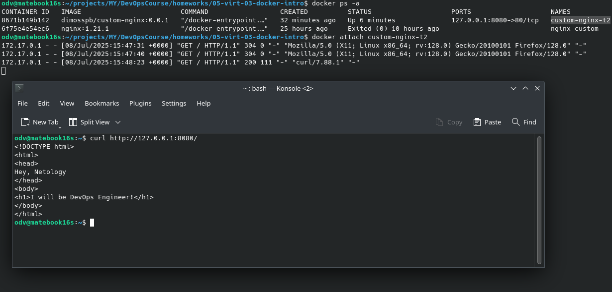

    - Docker логирует все что выводит контейнер в STDOUT/STDERR и этот вывод доступен через docker log (-f непрерывная передача логов)

    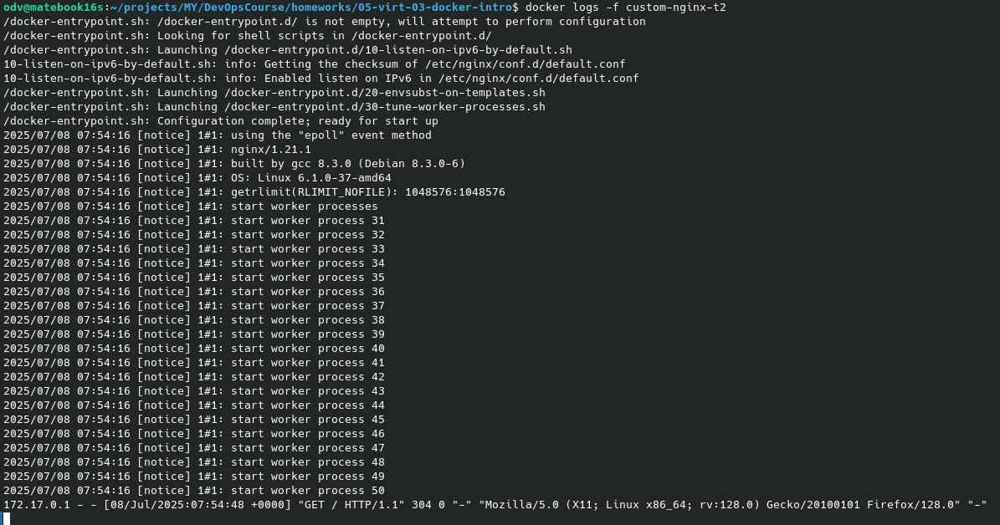

- **2,3. Подключимся к контейнеру и нажмем комбинацию Ctrl-C. Выполним docker ps -a - почему контейнер остановился?**

    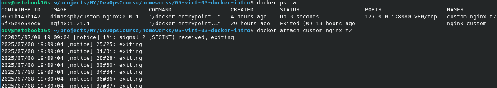

    --

    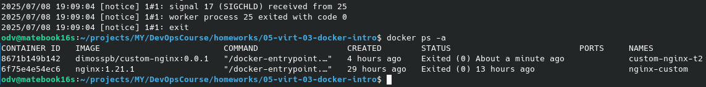

    >**При нажатии Ctrl+C в основном процессе контейнера, к которому пы подсоединились по docker attach, процесс получает сигнал прерывания - это приводик к завершению основного процесса котнейнера и соответственно останавливается и сам контейнер.**

- **4. Перезапуститим контейнер (docker restart...)**

    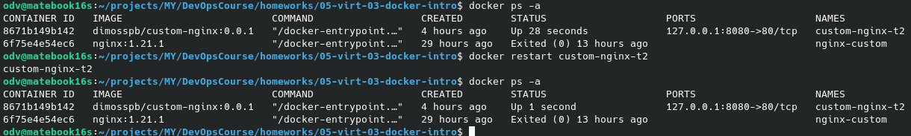

- **5,6. Зайдем в интерактивный терминал контейнера "custom-nginx-t2" с оболочкой bash.**  
 Для этого выполним "docker exec -it custom-nginx-t2 /bin/bash", где -i (--interactive) -t - псевдотерминал. **Установим nano**: 

    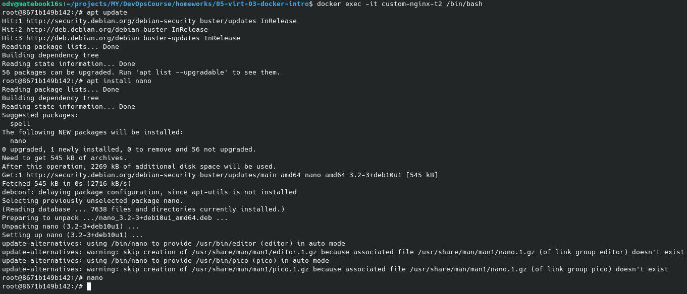

- **7-10. Отредактируем файл "/etc/nginx/conf.d/default.conf", заменив порт "listen 80" на "listen 81". Далее по заданию выполним ряд команд и видим что curl не выдает ожидаемое содержание.**

    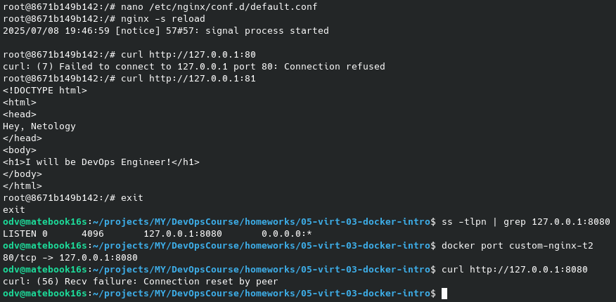

    >**Причина в том, что внутри контейнера, сервис nginx, после изменения конфигурации, где мы изменили порт прослушивания сервисом с 80 на 81 и применили изменения, перешел на прослушивание порта 81. Но с точки зрения docker порт остался тот, который был установлен при создании контейнера т.е. 80. По этому проброс 8080->80 не достигает цели.**

- **11. ДОПОЛНИТЕЛЬНО**

     Самостоятельно исправим конфигурацию контейнера, используя доступные источники в интернете. Не изменяем конфигурацию nginx и не удаляем контейнер.

    **ВАРИАНТ 1** - По [ссылке](https://www.baeldung.com/ops/assign-port-docker-container#1-stop-docker-container-and-docker-service) из задания (3-й вариант - без удаления контейнера), предлагается остановить контейнер, остановить сервис docker, и подправить конфигурационные файлы нашего контейнера в каталоге  /var/lib/docker/containers/1d88e0cc5dedb0ffac02ed1b29e386d332a4461c450edd7640f148c3875260c3/ где 1d88e0cc5dedb0ffac02ed1b29e386d332a4461c450edd7640f148c3875260c3 - полный ID нашего custom-nginx-t2 контейнера

        root@matebook16s:/var/lib/docker/containers/1d88e0cc5dedb0ffac02ed1b29e386d332a4461c450edd7640f148c3875260c3# nano hostconfig.json 
        root@matebook16s:/var/lib/docker/containers/1d88e0cc5dedb0ffac02ed1b29e386d332a4461c450edd7640f148c3875260c3# nano config.v2.json 

    >оменяем в этих файлах соответственно PortBindings для hostconfig.json и ExposedPorts для config.v2.json значение 80/tcp на 81/tcp. Стартанем docker сервис и наш custom-nginx-t2 контейнер и проверим - **Все работает**:

    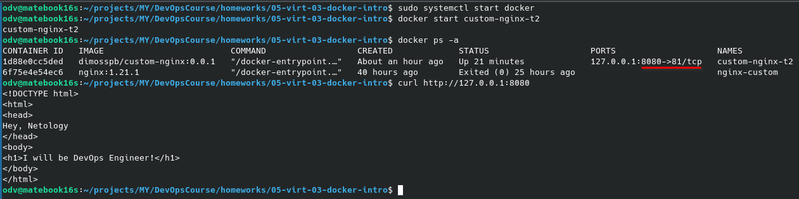

    **ВАРИАНТ 2** - Нужно создать новый nginx контейнер который будет использовать сеть нашего контейнера и проксировать локальный трафик с порта 80 на порт 81 нашего контейнера (ID - 8671b149b142):

        docker run -d --network container:8671b149b142 --name nginx-reverse-proxy  nginx  

        ## Поменяем в прокси контейнере конфигурацию nginx, где поменяем соотв-е строки на: 

            server {
                listen 80;
                location / {
                    proxy_pass http://8671b149b142:81;
                }
            } 

        ## Затем

            nginx -s reload
            Ctrl+D

    Проверим - **Ok**:  

    
   
- **12. Чтобы удалить запущенный контейнер без его остановки**, используем команду удаления с ключем -f (force): 

    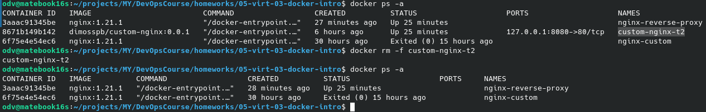  
---
# Задача 4

- Запустим первый контейнер из образа centos c любым тегом в фоновом режиме, подключив папку текущий рабочий каталог $(pwd) на хостовой машине в /data контейнера, используя ключ -v.  

    На [DockerHub - centos/tags](https://hub.docker.com/_/centos/tags) вариант centos:centos8 меня устраивает, загрузим его:

    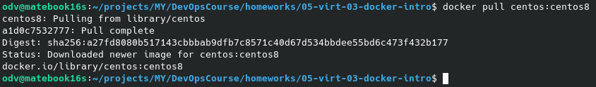

    Запустим контейнер с рабочей папкой в /data контейнера :  
        
        $ docker run -d -it -v $(pwd):/data --name centos centos:centos8 /bin/bash

    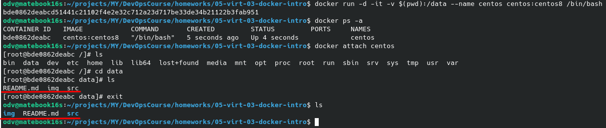

- Запустим второй контейнер из образа debian в фоновом режиме, подключив текущий рабочий каталог $(pwd) в /data контейнера, по аналогии:

    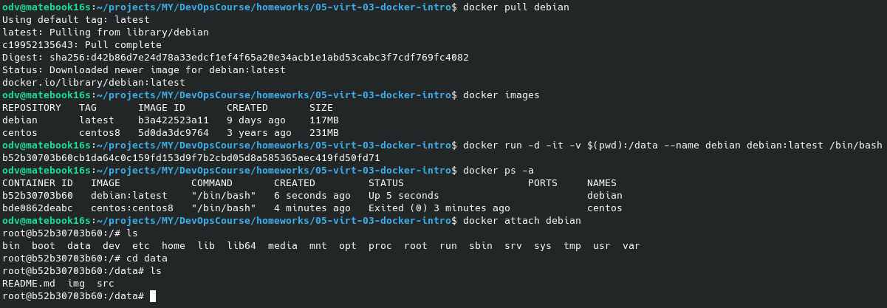

- Подключимся к первому контейнеру с помощью docker exec и создайте текстовый файл любого содержания в /data.

    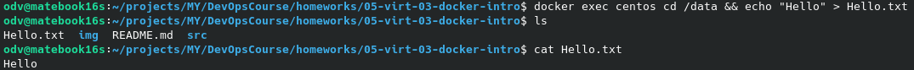

- Добавим ещё один файл в текущий каталог $(pwd) на хостовой машине.

        odv@matebook16s:~/projects/MY/DevOpsCourse/homeworks/05-virt-03-docker-intro$ echo "Local Hello" > LocalHello.txt

- Подключимся во второй контейнер и отобразим листинг и содержание файлов в /data контейнера.

    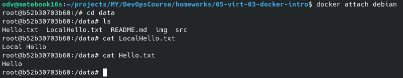

