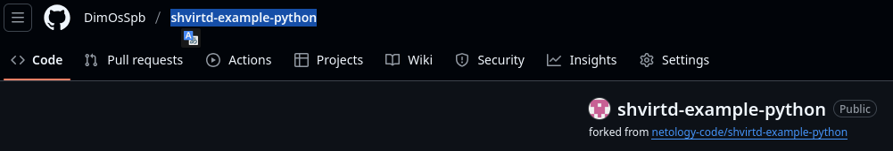

# [Домашнее задание к занятию 5. «Практическое применение Docker»](https://github.com/netology-code/virtd-homeworks/tree/shvirtd-1/05-virt-04-docker-in-practice)


### Схема виртуального стенда [по ссылке](https://github.com/netology-code/shvirtd-example-python/blob/main/schema.pdf)


## Задача 0
      odv@matebook16s:~/projects/MY/DevOpsCourse/homeworks/05-virt-04-docker-in-practice$ docker-compose --version
      bash: docker-compose: command not found
      odv@matebook16s:~/projects/MY/DevOpsCourse/homeworks/05-virt-04-docker-in-practice$ docker compose version
      Docker Compose version v2.38.1


## Задача 1
1. Сделаем в своем GitHub пространстве fork [репозитория](https://github.com/netology-code/shvirtd-example-python).  

   [DimOsSpb/shvirtd-example-python](https://github.com/DimOsSpb/shvirtd-example-python)  

   

   Добавлю этот форк как git submodule в основной проект.
   ```console         
   git submodule add https://github.com/DimOsSpb/shvirtd-example-python.git submodules/shvirtd-example-python
   ```

2. Сборка и проверка проекта, согласно заданию:

   - Dockerfile.python:
      ```console
      FROM python:3.12-slim

      # Укажем рабочий каталог
      WORKDIR /app
      # Скопируем нужные (отфильтруем через .dockerignore лишнее) файлы проекта в /app контейнера
      COPY . .
      # Установим в контейнер зависимости для этого проекта (fastapi,uvicorn,mysql-connector-python)
      RUN pip install --no-cache-dir -r requirements.txt

      # Запускаем приложение с помощью uvicorn, делая его доступным по сети
      CMD ["uvicorn", "main:app", "--host", "0.0.0.0", "--port", "5000"] 
      ```
   - .dockerignore
      ```console
      *.pdf
      .env
      Dockerfile*
      README*
      venv/
      build/
      *.log

      ```

   - Соберем образ:

      

   - Протестируем корректность сборки
      ```console
      odv@matebook16s:~/projects/MY/DevOpsCourse/submodules/shvirtd-example-python$ docker run -d --name my-app -p 127.0.0.1:8080:5000 my-app-image:latest 
      cbec18873dc987b5493ea732e3d326be04dcb09b278d0009be0bcdcc8cd04e3a

      odv@matebook16s:~/projects/MY/DevOpsCourse/submodules/shvirtd-example-python$ docker ps
      CONTAINER ID   IMAGE                 COMMAND                  CREATED         STATUS         PORTS                      NAMES
      cbec18873dc9   my-app-image:latest   "uvicorn main:app --…"   5 seconds ago   Up 4 seconds   127.0.0.1:8080->5000/tcp   my-app

      odv@matebook16s:~/projects/MY/DevOpsCourse/submodules/shvirtd-example-python$ docker exec -it my-app /bin/bash
      root@cbec18873dc9:/app# ls
      LICENSE  __pycache__  haproxy  main.py  nginx  proxy.yaml  requirements.txt 
      exit

      odv@matebook16s:~/projects/MY/DevOpsCourse/submodules/shvirtd-example-python$ curl http://localhost:8080
      {"error":"Ошибка при работе с базой данных: 2003 (HY000): Can't connect to MySQL server on '127.0.0.1:3306' (111)"}
      ```
        
      >- Сборка работает правильно, .dockerignore отработал (см. вывод ls).  
      >- Сервис контейнера отвечает на нужном порту, ошибка вызване отсутствием sql сервера - это правильно. Здесь мы его не ставили.

3. Запустим web-приложение без использования docker, с помощью venv. (Mysql БД в docker run).

   ```console
   (venv) odv@matebook16s:~/projects/MY/DevOpsCourse/submodules/shvirtd-example-python$ docker run --name mysql -p 127.0.0.1:3306:3306 -e MYSQL_ROOT_PASSWORD=very_strong -e MYSQL_USER=app -e MYSQL_PASSWORD=very_strong -d mysql:latest
   c163761e576eeda00aa8992de4de39db049c8573f53c785621d4510b8304b8c7
   (venv) odv@matebook16s:~/projects/MY/DevOpsCourse/submodules/shvirtd-example-python$ docker exec -it mysql mysql -u root -p
   Enter password: 
   Welcome to the MySQL monitor.  Commands end with ; or \g.
   Your MySQL connection id is 9
   Server version: 9.3.0 MySQL Community Server - GPL

   Copyright (c) 2000, 2025, Oracle and/or its affiliates.

   Oracle is a registered trademark of Oracle Corporation and/or its
   affiliates. Other names may be trademarks of their respective
   owners.

   Type 'help;' or '\h' for help. Type '\c' to clear the current input statement.

   mysql> SELECT User, Host FROM mysql.user WHERE User = 'app';
   +------+------+
   | User | Host |
   +------+------+
   | app  | %    |
   +------+------+
   1 row in set (0.002 sec)

   mysql> CREATE DATABASE example;
   Query OK, 1 row affected (0.010 sec)

   mysql> GRANT ALL PRIVILEGES ON example.* TO 'app'@'%';
   Query OK, 0 rows affected (0.009 sec)

   mysql> FLUSH PRIVILEGES;
   Query OK, 0 rows affected, 1 warning (0.008 sec)

   mysql> exit
   Bye
   (venv) odv@matebook16s:~/projects/MY/DevOpsCourse/submodules/shvirtd-example-python$ uvicorn main:app --host 0.0.0.0 --port 5000 --reload
   INFO:     Will watch for changes in these directories: ['/home/odv/projects/MY/DevOpsCourse/submodules/shvirtd-example-python']
   INFO:     Uvicorn running on http://0.0.0.0:5000 (Press CTRL+C to quit)
   INFO:     Started reloader process [406376] using WatchFiles
   INFO:     Started server process [406378]
   INFO:     Waiting for application startup.
   Приложение запускается...
   Соединение с БД установлено и таблица 'requests' готова к работе.
   INFO:     Application startup complete.
   INFO:     127.0.0.1:37262 - "GET / HTTP/1.1" 200 OK
   ```

   В другой консоли:

   ```console
   odv@matebook16s:~$ curl http://localhost:5000
   "TIME: 2025-07-18 18:51:35, IP: похоже, что вы направляете запрос в неверный порт(например curl http://127.0.0.1:5000). Правильное выполнение задания - отправить запрос в порт 8090."odv@matebook16s:~$
   ```

4. Добавим управление названием таблицы через ENV переменную.

   ```console
   (venv) odv@matebook16s:~/projects/MY/DevOpsCourse/submodules/shvirtd-example-python$ export DB_NAME='my_table_name'
   (venv) odv@matebook16s:~/projects/MY/DevOpsCourse/submodules/shvirtd-example-python$ docker exec -it mysql mysql -u root -p
   Enter password: 
   Welcome to the MySQL monitor.  Commands end with ; or \g.
   Your MySQL connection id is 12
   Server version: 9.3.0 MySQL Community Server - GPL

   Copyright (c) 2000, 2025, Oracle and/or its affiliates.

   Oracle is a registered trademark of Oracle Corporation and/or its
   affiliates. Other names may be trademarks of their respective
   owners.

   Type 'help;' or '\h' for help. Type '\c' to clear the current input statement.

   mysql> DROP TABLE example;
   Query OK, 1 row affected (0.024 sec)

   mysql> CREATE DATABASE my_table_name;
   Query OK, 1 row affected (0.012 sec)

   mysql> GRANT ALL PRIVILEGES ON my_table_name.* TO 'app'@'%';
   Query OK, 0 rows affected (0.067 sec)

   mysql> FLUSH PRIVILEGES;
   Query OK, 0 rows affected, 1 warning (0.009 sec)

   mysql> exit
   Bye
   (venv) odv@matebook16s:~/projects/MY/DevOpsCourse/submodules/shvirtd-example-python$ uvicorn main:app --host 0.0.0.0 --port 5000 --reload
   INFO:     Will watch for changes in these directories: ['/home/odv/projects/MY/DevOpsCourse/submodules/shvirtd-example-python']
   INFO:     Uvicorn running on http://0.0.0.0:5000 (Press CTRL+C to quit)
   INFO:     Started reloader process [407316] using WatchFiles
   INFO:     Started server process [407318]
   INFO:     Waiting for application startup.
   Приложение запускается...
   Соединение с БД установлено и таблица 'requests' готова к работе.
   INFO:     Application startup complete.
   INFO:     127.0.0.1:38348 - "GET / HTTP/1.1" 200 OK

   ```

---
### ВНИМАНИЕ!
!!! В процессе последующего выполнения ДЗ НЕ изменяйте содержимое файлов в fork-репозитории! Ваша задача ДОБАВИТЬ 5 файлов: ```Dockerfile.python```, ```compose.yaml```, ```.gitignore```, ```.dockerignore```,```bash-скрипт```. Если вам понадобилось внести иные изменения в проект - вы что-то делаете неверно!
---

## Задача 2 (*)
1. Создайм в yandex cloud container registry с именем "test":

   ```console
   odv@matebook16s:~/projects/MY/DevOpsCourse$ yc container registry create --name test
   done (1s)
   id: crp7qgp61fajvdodm5hk
   folder_id: b1gg3ad99mhgfm5qo1tt
   name: test
   status: ACTIVE
   created_at: "2025-07-18T14:58:48.753Z"
   ```

2. Настройте аутентификацию вашего локального docker в yandex container registry.
3. Соберите и залейте в него образ с python приложением из задания №1.
4. Просканируйте образ на уязвимости.
5. В качестве ответа приложите отчет сканирования.

## Задача 3
1. Изучите файл "proxy.yaml"
2. Создайте в репозитории с проектом файл ```compose.yaml```. С помощью директивы "include" подключите к нему файл "proxy.yaml".
3. Опишите в файле ```compose.yaml``` следующие сервисы: 

- ```web```. Образ приложения должен ИЛИ собираться при запуске compose из файла ```Dockerfile.python``` ИЛИ скачиваться из yandex cloud container registry(из задание №2 со *). Контейнер должен работать в bridge-сети с названием ```backend``` и иметь фиксированный ipv4-адрес ```172.20.0.5```. Сервис должен всегда перезапускаться в случае ошибок.
Передайте необходимые ENV-переменные для подключения к Mysql базе данных по сетевому имени сервиса ```web``` 

- ```db```. image=mysql:8. Контейнер должен работать в bridge-сети с названием ```backend``` и иметь фиксированный ipv4-адрес ```172.20.0.10```. Явно перезапуск сервиса в случае ошибок. Передайте необходимые ENV-переменные для создания: пароля root пользователя, создания базы данных, пользователя и пароля для web-приложения.Обязательно используйте уже существующий .env file для назначения секретных ENV-переменных!

2. Запустите проект локально с помощью docker compose , добейтесь его стабильной работы: команда ```curl -L http://127.0.0.1:8090``` должна возвращать в качестве ответа время и локальный IP-адрес. Если сервисы не стартуют воспользуйтесь командами: ```docker ps -a ``` и ```docker logs <container_name>``` . Если вместо IP-адреса вы получаете информационную ошибку --убедитесь, что вы шлете запрос на порт ```8090```, а не 5000.

5. Подключитесь к БД mysql с помощью команды ```docker exec -ti <имя_контейнера> mysql -uroot -p<пароль root-пользователя>```(обратите внимание что между ключем -u и логином root нет пробела. это важно!!! тоже самое с паролем) . Введите последовательно команды (не забываем в конце символ ; ): ```show databases; use <имя вашей базы данных(по-умолчанию example)>; show tables; SELECT * from requests LIMIT 10;```.

6. Остановите проект. В качестве ответа приложите скриншот sql-запроса.

## Задача 4
1. Запустите в Yandex Cloud ВМ (вам хватит 2 Гб Ram).
2. Подключитесь к Вм по ssh и установите docker.
3. Напишите bash-скрипт, который скачает ваш fork-репозиторий в каталог /opt и запустит проект целиком.
4. Зайдите на сайт проверки http подключений, например(или аналогичный): ```https://check-host.net/check-http``` и запустите проверку вашего сервиса ```http://<внешний_IP-адрес_вашей_ВМ>:8090```. Таким образом трафик будет направлен в ingress-proxy. Трафик должен пройти через цепочки: Пользователь → Internet → Nginx → HAProxy → FastAPI(запись в БД) → HAProxy → Nginx → Internet → Пользователь
5. (Необязательная часть) Дополнительно настройте remote ssh context к вашему серверу. Отобразите список контекстов и результат удаленного выполнения ```docker ps -a```
6. Повторите SQL-запрос на сервере и приложите скриншот и ссылку на fork.

## Задача 5 (*)
1. Напишите и задеплойте на вашу облачную ВМ bash скрипт, который произведет резервное копирование БД mysql в директорию "/opt/backup" с помощью запуска в сети "backend" контейнера из образа ```schnitzler/mysqldump``` при помощи ```docker run ...``` команды. Подсказка: "документация образа."
2. Протестируйте ручной запуск
3. Настройте выполнение скрипта раз в 1 минуту через cron, crontab или systemctl timer. Придумайте способ не светить логин/пароль в git!!
4. Предоставьте скрипт, cron-task и скриншот с несколькими резервными копиями в "/opt/backup"

## Задача 6
Скачайте docker образ ```hashicorp/terraform:latest``` и скопируйте бинарный файл ```/bin/terraform``` на свою локальную машину, используя dive и docker save.
Предоставьте скриншоты  действий .

## Задача 6.1
Добейтесь аналогичного результата, используя docker cp.  
Предоставьте скриншоты  действий .

## Задача 6.2 (**)
Предложите способ извлечь файл из контейнера, используя только команду docker build и любой Dockerfile.  
Предоставьте скриншоты  действий .

## Задача 7 (***)
Запустите ваше python-приложение с помощью runC, не используя docker или containerd.  
Предоставьте скриншоты  действий .
