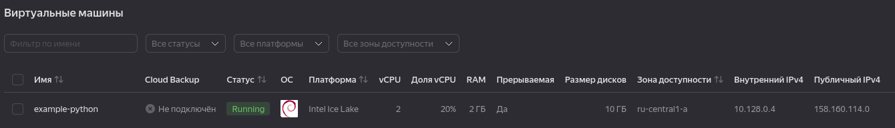
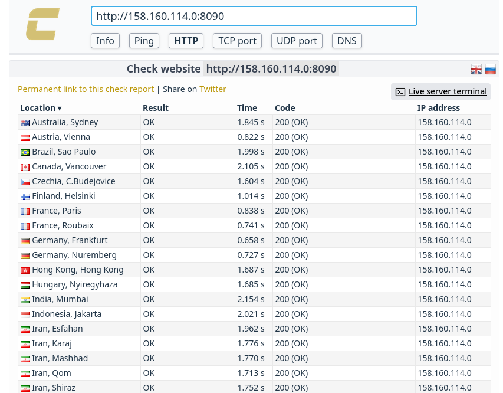
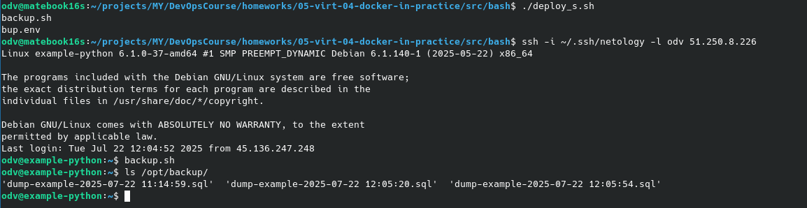
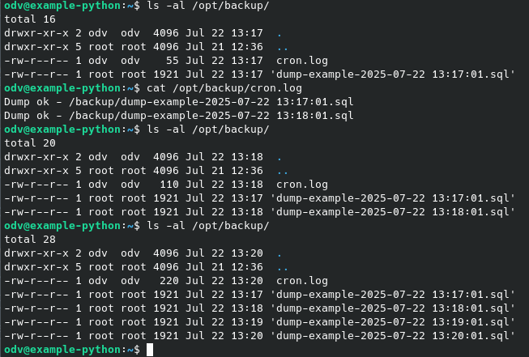
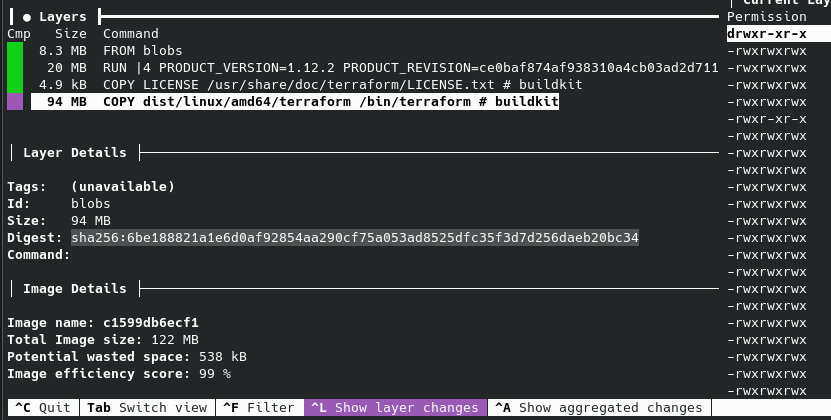
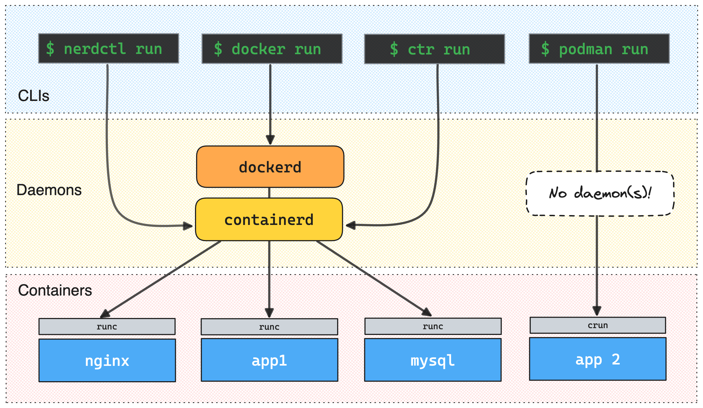

# [Домашнее задание к занятию 5. «Практическое применение Docker»](https://github.com/netology-code/virtd-homeworks/tree/shvirtd-1/05-virt-04-docker-in-practice)


### Схема виртуального стенда [по ссылке](https://github.com/netology-code/shvirtd-example-python/blob/main/schema.pdf)


## Задача 0
      odv@matebook16s:~/projects/MY/DevOpsCourse/homeworks/05-virt-04-docker-in-practice$ docker-compose --version
      bash: docker-compose: command not found
      odv@matebook16s:~/projects/MY/DevOpsCourse/homeworks/05-virt-04-docker-in-practice$ docker compose version
      Docker Compose version v2.38.1


## Задача 1
1. Сделаем в своем GitHub пространстве fork [репозитория](https://github.com/netology-code/shvirtd-example-python).  

   [DimOsSpb/shvirtd-example-python](https://github.com/DimOsSpb/shvirtd-example-python)  

   

   Добавлю этот форк как git submodule в основной проект.
   ```console         
   git submodule add https://github.com/DimOsSpb/shvirtd-example-python.git submodules/shvirtd-example-python
   ```

2. Сборка и проверка проекта, согласно заданию:

   - Dockerfile.python:
      ```console
      FROM python:3.12-slim

      # Укажем рабочий каталог
      WORKDIR /app
      # Скопируем нужные (отфильтруем через .dockerignore лишнее) файлы проекта в /app контейнера
      COPY . .
      # Установим в контейнер зависимости для этого проекта (fastapi,uvicorn,mysql-connector-python)
      RUN pip install --no-cache-dir -r requirements.txt

      # Запускаем приложение с помощью uvicorn, делая его доступным по сети
      CMD ["uvicorn", "main:app", "--host", "0.0.0.0", "--port", "5000"] 
      ```
   - .dockerignore
      ```console
      *.pdf
      .env
      Dockerfile*
      README*
      venv/
      build/
      *.log

      ```

   - Соберем образ:

      

   - Протестируем корректность сборки
      ```console
      odv@matebook16s:~/projects/MY/DevOpsCourse/submodules/shvirtd-example-python$ docker run -d --name my-app -p 127.0.0.1:8080:5000 my-app-image:latest 
      cbec18873dc987b5493ea732e3d326be04dcb09b278d0009be0bcdcc8cd04e3a

      odv@matebook16s:~/projects/MY/DevOpsCourse/submodules/shvirtd-example-python$ docker ps
      CONTAINER ID   IMAGE                 COMMAND                  CREATED         STATUS         PORTS                      NAMES
      cbec18873dc9   my-app-image:latest   "uvicorn main:app --…"   5 seconds ago   Up 4 seconds   127.0.0.1:8080->5000/tcp   my-app

      odv@matebook16s:~/projects/MY/DevOpsCourse/submodules/shvirtd-example-python$ docker exec -it my-app /bin/bash
      root@cbec18873dc9:/app# ls
      LICENSE  __pycache__  haproxy  main.py  nginx  proxy.yaml  requirements.txt 
      exit

      odv@matebook16s:~/projects/MY/DevOpsCourse/submodules/shvirtd-example-python$ curl http://localhost:8080
      {"error":"Ошибка при работе с базой данных: 2003 (HY000): Can't connect to MySQL server on '127.0.0.1:3306' (111)"}
      ```
        
      >- Сборка работает правильно, .dockerignore отработал (см. вывод ls).  
      >- Сервис контейнера отвечает на нужном порту, ошибка вызване отсутствием sql сервера - это правильно. Здесь мы его не ставили.

3. Запустим web-приложение без использования docker, с помощью venv. (Mysql БД в docker run).

   ```console
   odv@matebook16s:~/projects/MY/DevOpsCourse/submodules/shvirtd-example-python$ python3 -m venv venv
   odv@matebook16s:~/projects/MY/DevOpsCourse/submodules/shvirtd-example-python$ source venv/bin/activate  # в Windows: venv\Scripts\activate
   (venv) odv@matebook16s:~/projects/MY/DevOpsCourse/submodules/shvirtd-example-python$ pip install -r requirements.txt
   .....
   .....

   (venv) odv@matebook16s:~/projects/MY/DevOpsCourse/submodules/shvirtd-example-python$ docker run --name mysql -p 127.0.0.1:3306:3306 -e MYSQL_ROOT_PASSWORD=very_strong -e MYSQL_USER=app -e MYSQL_PASSWORD=very_strong -d mysql:latest
   c163761e576eeda00aa8992de4de39db049c8573f53c785621d4510b8304b8c7
   (venv) odv@matebook16s:~/projects/MY/DevOpsCourse/submodules/shvirtd-example-python$ docker exec -it mysql mysql -uroot -p
   Enter password: 
   Welcome to the MySQL monitor.  Commands end with ; or \g.
   Your MySQL connection id is 9
   Server version: 9.3.0 MySQL Community Server - GPL

   Copyright (c) 2000, 2025, Oracle and/or its affiliates.

   Oracle is a registered trademark of Oracle Corporation and/or its
   affiliates. Other names may be trademarks of their respective
   owners.

   Type 'help;' or '\h' for help. Type '\c' to clear the current input statement.

   mysql> SELECT User, Host FROM mysql.user WHERE User = 'app';
   +------+------+
   | User | Host |
   +------+------+
   | app  | %    |
   +------+------+
   1 row in set (0.002 sec)

   mysql> CREATE DATABASE example;
   Query OK, 1 row affected (0.010 sec)

   mysql> GRANT ALL PRIVILEGES ON example.* TO 'app'@'%';
   Query OK, 0 rows affected (0.009 sec)

   mysql> FLUSH PRIVILEGES;
   Query OK, 0 rows affected, 1 warning (0.008 sec)

   mysql> exit
   Bye
   (venv) odv@matebook16s:~/projects/MY/DevOpsCourse/submodules/shvirtd-example-python$ uvicorn main:app --host 0.0.0.0 --port 5000 --reload
   INFO:     Will watch for changes in these directories: ['/home/odv/projects/MY/DevOpsCourse/submodules/shvirtd-example-python']
   INFO:     Uvicorn running on http://0.0.0.0:5000 (Press CTRL+C to quit)
   INFO:     Started reloader process [406376] using WatchFiles
   INFO:     Started server process [406378]
   INFO:     Waiting for application startup.
   Приложение запускается...
   Соединение с БД установлено и таблица 'requests' готова к работе.
   INFO:     Application startup complete.
   INFO:     127.0.0.1:37262 - "GET / HTTP/1.1" 200 OK
   ```

   В другой консоли:

   ```console
   odv@matebook16s:~$ curl http://localhost:5000
   "TIME: 2025-07-18 18:51:35, IP: похоже, что вы направляете запрос в неверный порт(например curl http://127.0.0.1:5000). Правильное выполнение задания - отправить запрос в порт 8090."odv@matebook16s:~$
   ```

4. Добавим управление названием таблицы через ENV переменную.

   ```console
   (venv) odv@matebook16s:~/projects/MY/DevOpsCourse/submodules/shvirtd-example-python$ export DB_NAME='my_table_name'
   (venv) odv@matebook16s:~/projects/MY/DevOpsCourse/submodules/shvirtd-example-python$ docker exec -it mysql mysql -u root -p
   Enter password: 
   Welcome to the MySQL monitor.  Commands end with ; or \g.
   Your MySQL connection id is 12
   Server version: 9.3.0 MySQL Community Server - GPL

   Copyright (c) 2000, 2025, Oracle and/or its affiliates.

   Oracle is a registered trademark of Oracle Corporation and/or its
   affiliates. Other names may be trademarks of their respective
   owners.

   Type 'help;' or '\h' for help. Type '\c' to clear the current input statement.

   mysql> DROP TABLE example;
   Query OK, 1 row affected (0.024 sec)

   mysql> CREATE DATABASE my_table_name;
   Query OK, 1 row affected (0.012 sec)

   mysql> GRANT ALL PRIVILEGES ON my_table_name.* TO 'app'@'%';
   Query OK, 0 rows affected (0.067 sec)

   mysql> FLUSH PRIVILEGES;
   Query OK, 0 rows affected, 1 warning (0.009 sec)

   mysql> exit
   Bye
   (venv) odv@matebook16s:~/projects/MY/DevOpsCourse/submodules/shvirtd-example-python$ uvicorn main:app --host 0.0.0.0 --port 5000 --reload
   INFO:     Will watch for changes in these directories: ['/home/odv/projects/MY/DevOpsCourse/submodules/shvirtd-example-python']
   INFO:     Uvicorn running on http://0.0.0.0:5000 (Press CTRL+C to quit)
   INFO:     Started reloader process [407316] using WatchFiles
   INFO:     Started server process [407318]
   INFO:     Waiting for application startup.
   Приложение запускается...
   Соединение с БД установлено и таблица 'requests' готова к работе.
   INFO:     Application startup complete.
   INFO:     127.0.0.1:38348 - "GET / HTTP/1.1" 200 OK

   ```

   Код main.py менять не стал:

   ```code
   Соединение с БД установлено и таблица 'requests' готова к работе.
   ```
---
## Задача 2 (*)
1. Создадим в yandex cloud container registry с именем "test":

   ```console
   odv@matebook16s:~/projects/MY/DevOpsCourse$ yc container registry create --name test
   done (1s)
   id: crp7qgp61fajvdodm5hk
   folder_id: b1gg3ad99mhgfm5qo1tt
   name: test
   status: ACTIVE
   created_at: "2025-07-18T14:58:48.753Z"
   ```

2. Настроим аутентификацию локального docker в yandex container registry.

   Получить OAuth-токен для работы с Yandex Cloud можно с помощью запроса к сервису Яндекс OAuth [Из  документации](https://yandex.cloud/ru/docs/iam/concepts/authorization/oauth-token). И добавим его для cr.yandex
   ```console
   docker login cr.yandex --username oauth --password-stdin
   XXXXXXXXXXXXXXXXXXXXXXXXXXXXXXXXXXXXXXXXXXXXXXXXXXXXXXXXXX Ctrl+D
   Login Succeeded
   ```
3. Соберем и зальем в него образ с python приложением из задания №1.
     

   Переименуем образ, добавив путь к registry Yandex Cloud и отправим его docker push ...:  

   ```console
   odv@matebook16s:~/projects/MY/DevOpsCourse/submodules/shvirtd-example-python$ docker tag shvirtd-example-python:v1 cr.yandex/crp7qgp61fajvdodm5hk/shvirtd-example-python:v1
   odv@matebook16s:~/projects/MY/DevOpsCourse/submodules/shvirtd-example-python$ docker images
   REPOSITORY                                              TAG       IMAGE ID       CREATED         SIZE
   cr.yandex/crp7qgp61fajvdodm5hk/shvirtd-example-python   v1        fe55abb5e3d7   9 minutes ago   281MB
   shvirtd-example-python                                  v1        fe55abb5e3d7   9 minutes ago   281MB
   my-app-image                                            latest    20d732e24d4e   25 hours ago    281MB
   127.0.0.1:5000/custom-nginx                             latest    f725a3599251   11 days ago     133MB
   dimosspb/custom-nginx                                   0.0.1     f725a3599251   11 days ago     133MB
   localhost:5000/custom-nginx                             latest    f725a3599251   11 days ago     133MB
   portainer/portainer-ce                                  latest    71de3839351a   2 weeks ago     268MB
   debian                                                  latest    b3a422523a11   2 weeks ago     117MB
   mysql                                                   latest    850100bac3be   3 months ago    859MB
   registry                                                2         26b2eb03618e   21 months ago   25.4MB
   centos                                                  centos8   5d0da3dc9764   3 years ago     231MB
   odv@matebook16s:~/projects/MY/DevOpsCourse/submodules/shvirtd-example-python$ docker push cr.yandex/crp7qgp61fajvdodm5hk/shvirtd-example-python:v1
   The push refers to repository [cr.yandex/crp7qgp61fajvdodm5hk/shvirtd-example-python]
   23bb8c6ee488: Pushed 
   846379fd3334: Pushed 
   662d9e6a90ef: Pushed 
   f3821a5f6014: Pushed 
   02d89fea34bd: Pushed 
   095c688b01c2: Pushed 
   1bb35e8b4de1: Pushed 
   v1: digest: sha256:4d38d35ba5f2869b957cf826a1a0a5df078f2254cb84b3bef460573ce708a06d size: 1785

   ```
   

4. Просканируем образ на уязвимости.

   

5. [Отчет сканирования](doc/vulnerabilities.csv)

## Задача 3

   - Запустим проект локально с помощью docker compose, создав ```compose.yaml``` где выполним все условия задачи (решив проблему готовности db принимать запросы от web через healthcheck):

      ```yaml
      version: "3.8"
      include:
         - proxy.yaml
      services:
      web:
         image: cr.yandex/crp7qgp61fajvdodm5hk/shvirtd-example-python:v1
         networks:
            backend:
            ipv4_address: 172.20.0.5
         restart: always
         environment:
            DB_HOST: db
            DB_USER: ${MYSQL_USER}
            DB_PASSWORD: ${MYSQL_PASSWORD}
            DB_NAME: example

         depends_on:
            db:
            condition: service_healthy
      db:
         image: mysql:8
         networks:
            backend:
            ipv4_address: 172.20.0.10
         restart: always
         env_file:
            - .env
         environment:
            MYSQL_DATABASE: example
         healthcheck:
            test: ["CMD", "mysqladmin", "ping", "-h", "localhost", "-u", "root", "-p${MYSQL_ROOT_PASSWORD}"]
            interval: 10s
            timeout: 5s
            retries: 5
            start_period: 30s
      ```

      ```console
      odv@matebook16s:~/projects/MY/DevOpsCourse/submodules/shvirtd-example-python$ docker compose up -d
      WARN[0000] /home/odv/projects/MY/DevOpsCourse/submodules/shvirtd-example-python/proxy.yaml: the attribute `version` is obsolete, it will be ignored, please remove it to avoid potential confusion 
      WARN[0000] /home/odv/projects/MY/DevOpsCourse/submodules/shvirtd-example-python/compose.yaml: the attribute `version` is obsolete, it will be ignored, please remove it to avoid potential confusion 
      [+] Running 5/5
      ✔ Network shvirtd-example-python_backend            Created                                                                                                                                                           0.1s 
      ✔ Container shvirtd-example-python-reverse-proxy-1  Started                                                                                                                                                           0.5s 
      ✔ Container shvirtd-example-python-ingress-proxy-1  Started                                                                                                                                                           0.4s 
      ✔ Container shvirtd-example-python-db-1             Healthy                                                                                                                                                          16.0s 
      ✔ Container shvirtd-example-python-web-1            Started                                                                                                                                                          16.0s 
      odv@matebook16s:~/projects/MY/DevOpsCourse/submodules/shvirtd-example-python$ curl -L http://127.0.0.1:8090
      "TIME: 2025-07-21 06:20:17, IP: 127.0.0.1"
      
      odv@matebook16s:~/projects/MY/DevOpsCourse/submodules/shvirtd-example-python$ docker ps
      CONTAINER ID   IMAGE                                                      COMMAND                  CREATED          STATUS                    PORTS                      NAMES
      70a6d176f906   cr.yandex/crp7qgp61fajvdodm5hk/shvirtd-example-python:v1   "uvicorn main:app --…"   45 seconds ago   Up 29 seconds                                        shvirtd-example-python-web-1
      1adf98c11b00   haproxy:2.4                                                "docker-entrypoint.s…"   46 seconds ago   Up 45 seconds             127.0.0.1:8080->8080/tcp   shvirtd-example-python-reverse-proxy-1
      a48d35aaf0af   mysql:8                                                    "docker-entrypoint.s…"   46 seconds ago   Up 45 seconds (healthy)   3306/tcp, 33060/tcp        shvirtd-example-python-db-1
      fb723848a973   nginx:1.21.1                                               "/docker-entrypoint.…"   46 seconds ago   Up 45 seconds                                        shvirtd-example-python-ingress-proxy-1
      odv@matebook16s:~/projects/MY/DevOpsCourse/submodules/shvirtd-example-python$ docker logs 70a6d176f906
      INFO:     Started server process [1]
      INFO:     Waiting for application startup.
      INFO:     Application startup complete.
      INFO:     Uvicorn running on http://0.0.0.0:5000 (Press CTRL+C to quit)
      Приложение запускается...
      Соединение с БД установлено и таблица 'requests' готова к работе.
      INFO:     172.20.0.2:37870 - "GET / HTTP/1.0" 200 OK
      ```

      - Подключимся к БД mysql и введем команды из задания...  
      В конце остановим проект
      
      
---

## Задача 4
   - 1-2. Запустим в Yandex Cloud ВМ, по ssh установим docker:

      
      ```console
      odv@example-python:~$ docker version && docker compose version
      Client: Docker Engine - Community
      Version:           28.3.2
      API version:       1.51
      Go version:        go1.24.5
      Git commit:        578ccf6
      Built:             Wed Jul  9 16:13:55 2025
      OS/Arch:           linux/amd64
      Context:           default

      Server: Docker Engine - Community
      Engine:
      Version:          28.3.2
      API version:      1.51 (minimum version 1.24)
      Go version:       go1.24.5
      Git commit:       e77ff99
      Built:            Wed Jul  9 16:13:55 2025
      OS/Arch:          linux/amd64
      Experimental:     false
      containerd:
      Version:          1.7.27
      GitCommit:        05044ec0a9a75232cad458027ca83437aae3f4da
      runc:
      Version:          1.2.5
      GitCommit:        v1.2.5-0-g59923ef
      docker-init:
      Version:          0.19.0
      GitCommit:        de40ad0
      Docker Compose version v2.38.2
      ```
   - 3. Напишим bash-скрипт [./make_yc_app.sh](https://github.com/DimOsSpb/shvirtd-example-python/blob/main/make_yc_app.sh), который скачает fork-репозиторий в каталог вм /opt и запустит проект целиком:
      ```bash
      #!/bin/bash

      VM_IP=158.160.114.0
      VM_USER=odv
      REPO_URL=https://github.com/DimOsSpb/shvirtd-example-python.git
      APP_DIR=/opt/app_example

      ssh -i ~/.ssh/netology -o StrictHostKeyChecking=accept-new -o ConnectTimeout=10 $USER@$VM_IP \
         "sudo mkdir -p $APP_DIR && \
         sudo chown \$USER:\$USER $APP_DIR && \
         cd $APP_DIR && \
         git clone $REPO_URL .
         docker compose up -d"
      ```
      - 
      ```console
      odv@matebook16s:~/projects/MY/DevOpsCourse/submodules/shvirtd-example-python$ ./make_yc_app.sh
      Cloning into '.'...
      time="2025-07-21T09:46:23Z" level=warning msg="/opt/app_example/proxy.yaml: the attribute `version` is obsolete, it will be ignored, please remove it to avoid potential confusion"
      time="2025-07-21T09:46:23Z" level=warning msg="/opt/app_example/compose.yaml: the attribute `version` is obsolete, it will be ignored, please remove it to avoid potential confusion"
      Container app_example-db-1  Creating
      Container app_example-ingress-proxy-1  Creating
      Container app_example-reverse-proxy-1  Creating
      Container app_example-db-1  Created
      Container app_example-web-1  Creating
      Container app_example-ingress-proxy-1  Created
      Container app_example-reverse-proxy-1  Created
      Container app_example-web-1  Created
      Container app_example-ingress-proxy-1  Starting
      Container app_example-db-1  Starting
      Container app_example-reverse-proxy-1  Starting
      Container app_example-ingress-proxy-1  Started
      Container app_example-reverse-proxy-1  Started
      Container app_example-db-1  Started
      Container app_example-db-1  Waiting
      Container app_example-db-1  Healthy
      Container app_example-web-1  Starting
      Container app_example-web-1  Started
      odv@matebook16s:~/projects/MY/DevOpsCourse/submodules/shvirtd-example-python$ docker context list
      NAME      DESCRIPTION                               DOCKER ENDPOINT               ERROR
      default   Current DOCKER_HOST based configuration   unix:///var/run/docker.sock   
      yc-vm *                                             ssh://158.160.114.0           
      odv@matebook16s:~/projects/MY/DevOpsCourse/submodules/shvirtd-example-python$ docker context use yc-vm
      yc-vm
      Current context is now "yc-vm"
      odv@matebook16s:~/projects/MY/DevOpsCourse/submodules/shvirtd-example-python$ docker ps
      CONTAINER ID   IMAGE             COMMAND                  CREATED              STATUS                        PORTS                      NAMES
      02eea3d0cf99   app_example-web   "uvicorn main:app --…"   About a minute ago   Up About a minute                                        app_example-web-1
      2a0748c6462c   haproxy:2.4       "docker-entrypoint.s…"   About a minute ago   Up About a minute             127.0.0.1:8080->8080/tcp   app_example-reverse-proxy-1
      adecf8b3f31d   mysql:8           "docker-entrypoint.s…"   About a minute ago   Up About a minute (healthy)   3306/tcp, 33060/tcp        app_example-db-1
      4726e7c7d6de   nginx:1.21.1      "/docker-entrypoint.…"   About a minute ago   Up About a minute                                        app_example-ingress-proxy-1
      odv@matebook16s:~/projects/MY/DevOpsCourse/submodules/shvirtd-example-python$ curl -L http://158.160.114.0:8090
      "TIME: 2025-07-21 09:48:29, IP: 45.136.247.248"odv@matebook16s:~/projects/MY/DevOpsCourse/submodules/shvirtd-example-python$ 
      odv@matebook16s:~/projects/MY/DevOpsCourse/submodules/shvirtd-example-python$ curl -L http://158.160.114.0:8090
      "TIME: 2025-07-21 09:48:39, IP: 45.136.247.248"   
      ```
   - 4. Проверка сервиса на [check-host.net](https://check-host.net):

      

   - 5. Дополнительно настроим remote ssh context к этому серверу. И отобразим список контекстов и результат удаленного выполнения ```docker ps -a```  

      - Docker CLI не позволяет явно передать SSH-ключ в docker context create, поэтому добавим Публичный IPv4 этой ВМ в ~/.shh/config на машине разработки
         ```yaml
         ...
         ########################################
         Host  158.160.114.0 # NGY_APP
            HostName 158.160.114.0
            Port 22
            User odv
            IdentityFile /home/odv/.ssh/netology
         ...
         ```
      - Работа с контекстом docker:
         ```console
         odv@matebook16s:~/projects/MY/DevOpsCourse/submodules/shvirtd-example-python$ docker context create yc-vm --docker "host=ssh://158.160.114.0"
         yc-vm
         Successfully created context "yc-vm"

         odv@matebook16s:~/projects/MY/DevOpsCourse/submodules/shvirtd-example-python$ docker context use yc-vm
         yc-vm
         Current context is now "yc-vm"
         
         odv@matebook16s:~/projects/MY/DevOpsCourse/submodules/shvirtd-example-python$ docker ps -a
         CONTAINER ID   IMAGE             COMMAND                  CREATED          STATUS                    PORTS                      NAMES
         df3c20128da1   app_example-web   "uvicorn main:app --…"   30 minutes ago   Up 30 minutes                                        app_example-web-1
         99bc206963b6   nginx:1.21.1      "/docker-entrypoint.…"   32 minutes ago   Up 30 minutes                                        app_example-ingress-proxy-1
         761d68da2cb9   haproxy:2.4       "docker-entrypoint.s…"   32 minutes ago   Up 30 minutes             127.0.0.1:8080->8080/tcp   app_example-reverse-proxy-1
         740b55061134   mysql:8           "docker-entrypoint.s…"   32 minutes ago   Up 30 minutes (healthy)   3306/tcp, 33060/tcp        app_example-db-1

         odv@matebook16s:~/projects/MY/DevOpsCourse/submodules/shvirtd-example-python$ docker context list
         NAME      DESCRIPTION                               DOCKER ENDPOINT               ERROR
         default   Current DOCKER_HOST based configuration   unix:///var/run/docker.sock   
         yc-vm *                                             ssh://158.160.114.0
         ```

   - 6. Повторим SQL-запрос на сервере и [ссылка на fork](https://github.com/DimOsSpb/shvirtd-example-python)  

      ```console
      odv@example-python:~$ docker exec -it adecf8b3f31d mysql -uroot -pYtReWq4321
      mysql: [Warning] Using a password on the command line interface can be insecure.
      Welcome to the MySQL monitor.  Commands end with ; or \g.
      Your MySQL connection id is 201
      Server version: 8.4.5 MySQL Community Server - GPL

      Copyright (c) 2000, 2025, Oracle and/or its affiliates.

      Oracle is a registered trademark of Oracle Corporation and/or its
      affiliates. Other names may be trademarks of their respective
      owners.

      Type 'help;' or '\h' for help. Type '\c' to clear the current input statement.

      mysql> show databases; use example; show tables; SELECT * from requests LIMIT 10;
      +--------------------+
      | Database           |
      +--------------------+
      | example            |
      | information_schema |
      | mysql              |
      | performance_schema |
      | sys                |
      +--------------------+
      5 rows in set (0.01 sec)

      Reading table information for completion of table and column names
      You can turn off this feature to get a quicker startup with -A

      Database changed
      +-------------------+
      | Tables_in_example |
      +-------------------+
      | requests          |
      +-------------------+
      1 row in set (0.00 sec)

      +----+---------------------+-----------------+
      | id | request_date        | request_ip      |
      +----+---------------------+-----------------+
      |  1 | 2025-07-21 09:48:29 | 45.136.247.248  |
      |  2 | 2025-07-21 09:48:39 | 45.136.247.248  |
      |  3 | 2025-07-21 09:54:32 | 195.211.27.85   |
      |  4 | 2025-07-21 09:54:32 | 185.37.147.117  |
      |  5 | 2025-07-21 09:54:32 | 185.19.33.131   |
      |  6 | 2025-07-21 09:54:32 | 167.235.135.184 |
      |  7 | 2025-07-21 09:54:32 | 195.154.114.92  |
      |  8 | 2025-07-21 09:54:32 | 185.224.3.111   |
      |  9 | 2025-07-21 09:54:32 | 185.209.161.145 |
      | 10 | 2025-07-21 09:54:32 | 88.119.179.10   |
      +----+---------------------+-----------------+
      10 rows in set (0.00 sec)
      ```
## Задача 5 (*)
   - 1. -2. Создать и задеплойть на облачную ВМ bash скрипт, который произведет резервное копирование БД mysql в директорию "/opt/backup" с помощью запуска в сети "backend" контейнера из образа ```schnitzler/mysqldump``` при помощи ```docker run ...``` команды.

      - В процессе реализации задания столкнулся с проблемой совместимости  schnitzler/mysqldump и mysql:8 из нашего проекта. schnitzler/mysqldump использует версию MariaDB, а сервер MySQL (контейнер mysql:8) работает с новой схемой аутентификации caching_sha2_password, которую старый клиент mysqldump не поддерживает, а в mysql:8 он отключен и мой скрипт выдает ошибку (по ее анализу и пришел к выводу и решению проблемы):
      ```console
      $ backup.sh
      
      mysqldump: Got error: 1045: "Plugin caching_sha2_password could not be loaded: Error loading shared library /usr/lib/mariadb/plugin/caching_sha2_password.so: No such file or directory" when trying to connect

      mysql> SHOW PLUGINS;
      +----------------------------------+----------+--------------------+---------+---------+
      | Name                             | Status   | Type               | Library | License |
      +----------------------------------+----------+--------------------+---------+---------+
      ...
      | mysql_native_password            | DISABLED | AUTHENTICATION     | NULL    | GPL     |
      ...
      ```

      Для решения этой проблемы я решил изменить [/etc/my.cnf](src/bash/my.cnf) контейнера добавив после ```[mysqld]``` строчку ```default_authentication_plugin=mysql_native_password```. Для этого в каталоге проекта 
      ```console
      docker exec -it app_example-db-1 cat /etc/my.cnf > my.cnf
      ```
      Изменил его и добавил подмену в [compouse.yaml](src/bash/compose.yaml):
      ```yaml
      db:
         image: mysql:8.0
         volumes:
            - ./my.cnf:/etc/my.cnf
      ```

      - Кроме того пользователь app не имел привелегий на dump. Пришлось добавить (может лишнего, разбираться не стал)
      ```console

      mysql> GRANT SELECT, LOCK TABLES, SHOW VIEW, TRIGGER, PROCESS, EVENT ON *.* TO 'app'@'%';
      Query OK, 0 rows affected (0.067 sec)
      mysql> FLUSH PRIVILEGES;
      ```
      После этого проверим работу скрипта:

      - Установка с пк разработки на вм через скрипт [deploy_s.sh](src/bash/deploy_s.sh). Он скопирует секреты и сам скрипт.
      - Пдключаемся ssh -i ~/.ssh/netology -l odv 51.250.8.226 (Адрес не постоянный - крайне не удобно)
      - Рестарт проекта из каталога /opt/app_example ```docker compose down && docker compose up -d```
      - Запустим [backup.sh](src/bash/backup.sh) (из любого места)

      


   - 3. Настройть выполнение скрипта раз в 1 минуту через cron, crontab или systemctl timer. Придумайте способ не светить логин/пароль в git!!

      - ```crontab -e```
      ```vi
      * * * * * /usr/local/bin/backup.sh >> /opt/backup/cron.log 2>&1

      ```
      - [bub.env](src/bash/bup.env) одержит секреты и внесён в .gitignore, копируется в ~/.secret/. При запусеке backup.sh считывается через source.

      - [backup.sh](src/bash/backup.sh)

      


## Задача 6
Скачайте docker образ ```hashicorp/terraform:latest``` и скопируйте бинарный файл ```/bin/terraform``` на свою локальную машину, используя dive и docker save.

   
   - У меня docker pull hashicorp/terraform:latest не прошел, а на вм yandex cloud образ залился - работаем на вм яндекс облака.
   ```console
   odv@example-python:~$ docker image ls
   REPOSITORY             TAG       IMAGE ID       CREATED        SIZE
   ...
   hashicorp/terraform    latest    c1599db6ecf1   5 weeks ago    122MB
   ```
   - Dive не часть docker - ставим и проверяем:
   ```console
   odv@matebook16s:~/Downloads$ dive -v
   dive 0.13.1

   odv@example-python:~$ docker image ls
   REPOSITORY             TAG       IMAGE ID       CREATED        SIZE
   app_example-web        latest    8aa9bebfdc2b   31 hours ago   281MB
   alpine                 latest    9234e8fb04c4   7 days ago     8.31MB
   hashicorp/terraform    latest    c1599db6ecf1   5 weeks ago    122MB
   haproxy                2.4       74a5507bf6aa   7 weeks ago    99.3MB
   mysql                  8         a0f6c7786c75   3 months ago   777MB
   mysql                  8.0       7d4e34ccfad4   3 months ago   772MB
   schnitzler/mysqldump   latest    261c154662e6   2 years ago    85.7MB
   nginx                  1.21.1    822b7ec2aaf2   3 years ago    133MB
   odv@example-python:~$ dive c1599db6ecf1

   ```
   

   Здесь нам интересно только хеш последнего слоя с terraform ```6be188821a1e6d0af92854aa290cf75a053ad8525dfc35f3d7d256daeb20bc34```. 
   ```console
   odv@example-python:~$ docker save -o output.tar hashicorp/terraform:latest
   ```
   Так мы выгрузим образ в архив и этот хеш - это tar архив нужного слоя в архиве output.tar. Достанем содержимое: 
   ```console

   odv@example-python:~$ mkdir tmp
   odv@example-python:~$ tar -xf output.tar --directory tmp
   odv@example-python:~$ cd tmp/
   odv@example-python:~/tmp$ ls
   blobs  index.json  manifest.json  oci-layout  repositories
   odv@example-python:~/tmp$ cd blobs/
   odv@example-python:~/tmp/blobs$ ls
   sha256
   odv@example-python:~/tmp/blobs$ cd sha256/
   odv@example-python:~/tmp/blobs/sha256$ ls
   47ed961de29c95a314f2b3caaceeccc0bc6b3d73a1816e8edcc4ac4184891906  b63aad8953bd83530d0e79bee9f25d73ee838ba920b060b615e7a6ec22edaba7  d700b0943404f1c187f8133fbedcda51601eb79a365dc400c761a0ffa2ff81b3
   6bb76c4390d16c34eb26fa6e5f13f650dbac732c2dd1add8b3771b5c62df11f4  bb6da240fa71df38447f6bdbccd1f1701b0aa3c542093b6b5c46546f21d07d59  fd2758d7a50e2b78d275ee7d1c218489f2439084449d895fa17eede6c61ab2c4
   6be188821a1e6d0af92854aa290cf75a053ad8525dfc35f3d7d256daeb20bc34  c1599db6ecf1c491613c4c25cc94a6effadd98d81dccae0a9b1c3117060660e6
   7542b0549b23acbc53d744262467168da738a6c56800405e50163c1a6fbe73d0  d21c43a3466f67bc6e807f617aebd1d8be84e89c5eb7cc85fe93a3f53575ed3d
   odv@example-python:~/tmp/blobs/sha256$ mkdir tmp
   odv@example-python:~/tmp/blobs/sha256$ tar -xf 6be188821a1e6d0af92854aa290cf75a053ad8525dfc35f3d7d256daeb20bc34 --directory tmp
   odv@example-python:~/tmp/blobs/sha256$ cd tmp
   odv@example-python:~/tmp/blobs/sha256/tmp$ ls
   bin
   odv@example-python:~/tmp/blobs/sha256/tmp$ cd bin
   odv@example-python:~/tmp/blobs/sha256/tmp/bin$ ls
   terraform

   odv@example-python:~/tmp/blobs/sha256/tmp/bin$ sudo cp terraform /bin/terraform
   odv@example-python:~/tmp/blobs/sha256/tmp/bin$ cd ~
   odv@example-python:~$ ls
   cd  clone  dive_0.13.1_linux_amd64.deb  git  https:  output.tar  sudo  tmp
   odv@example-python:~$ rm -Rf tmp
   odv@example-python:~$ rm -Rf output.tar 
   odv@example-python:~$ rm -Rf dive_0.13.1_linux_amd64.deb 
   odv@example-python:~$ ls
   cd  clone  git  https:  sudo
   odv@example-python:~$ terraform -v
   Terraform v1.12.2
   on linux_amd64
   odv@example-python:~$ 

   ```   
   **Terraform v1.12.2
   on linux_amd64**


## Задача 6.1

   - Аналогичный результат, используя docker cp.

   ```console
   odv@example-python:~$ docker run hashicorp/terraform:latest /bin/terraform -v
   Terraform v1.12.2
   on linux_amd64
   odv@example-python:~$ docker ps -a
   CONTAINER ID   IMAGE                        COMMAND                  CREATED          STATUS                       PORTS                      NAMES
   ae3eee97b68e   hashicorp/terraform:latest   "/bin/terraform /bin…"   11 seconds ago   Exited (0) 10 seconds ago                               happy_allen
   ...

   odv@example-python:~$ sudo docker cp ae3eee97b68e:/bin/terraform /bin/terraform
   Successfully copied 93.6MB to /bin/terraform
   odv@example-python:~$ 

   ```

## Задача 6.2

   - Cпособ извлечь файл из контейнера, используя только команду docker build и любой Dockerfile.  
   ```console
   odv@example-python:~$ echo "FROM hashicorp/terraform:latest AS ter
   FROM scratch
   COPY --from=ter /bin/terraform /" > Dockerfile
   odv@example-python:~$ nano Dockerfile 
   odv@example-python:~$ docker build -o ./output .
   [+] Building 1.9s (6/6) FINISHED                                                                                                                                                                                                                                                                             docker:default
   => [internal] load build definition from Dockerfile                                                                                                                                                                                                                                                                   0.0s
   => => transferring dockerfile: 122B                                                                                                                                                                                                                                                                                   0.0s
   => [internal] load metadata for docker.io/hashicorp/terraform:latest                                                                                                                                                                                                                                                  0.0s
   => [internal] load .dockerignore                                                                                                                                                                                                                                                                                      0.0s
   => => transferring context: 2B                                                                                                                                                                                                                                                                                        0.0s
   => CACHED [ter 1/1] FROM docker.io/hashicorp/terraform:latest                                                                                                                                                                                                                                                         0.0s
   => [stage-1 1/1] COPY --from=ter /bin/terraform /                                                                                                                                                                                                                                                                     1.3s
   => exporting to client directory                                                                                                                                                                                                                                                                                      0.4s
   => => copying files 93.62MB                                                                                                                                                                                                                                                                                           0.4s
   odv@example-python:~$ cd output/
   odv@example-python:~/output$ ls
   terraform
   ```
   Сдесь из образа тераформ копируем в пустой образ в корень. А при сборке -o экспортирует файлы из конечного образа в наш каталог

## Задача 7 (***)
   - Запустить наше python-приложение с помощью runC, не используя docker или containerd.  

   **RunC - это инструмент CLI, runtime для создания и запуска контейнеров в соответствии со спецификацией [OCI(Open Container Initiative)](https://opencontainers.org/), прям самый низкий уровень абстракции от Linux cgroups и namespaces, ответственный за создание, конфигурацию и управление изолированными процессами..**  
   
   ---
   Именно по этому мне потребуется выполнить работу которую за нас делает docker compose, container-d. Тут мы сразу должны решить вопрос зависимости от OSI spec.
   
   ---
   
   [How the Docker stack works](https://www.tutorialworks.com/difference-docker-containerd-runc-crio-oci/)    
   
   [Create and Start a Container Manually With runc](https://labs.iximiuz.com/challenges/start-container-with-runc)  
   [Digging Into Runtimes – runc](https://blog.quarkslab.com/digging-into-runtimes-runc.html)

      
   1. Учитывая повторяемость и количество сервисов, буду разворачивать приложения через скрипт [MakeRunCApp.sh](runc/MakeRunCApp.sh), запускать через [StartRunCApp.sh](runc/StartRunCApp.sh).

   2. Подготовка окружения для RunC - нужно cоздать для каждого сервиса:

      Для каждого сервиса (app, db, nginx, haproxy) создадим свой каталог в котором создадим каталог rootfs и конфиг для контейнера с OCI-совместимым описанием (config.json).
      Для этого создаем временный контейнер и экспортируем из него суммарную фс в наш rootfs:
      ```console
      docker create --name "tmp-$serv" "$c_id"
      docker export "tmp-$serv" | sudo tar -C rootfs -xf -
      docker rm "tmp-$serv" > /dev/null
      sudo chown $USER:$USER rootfs
      runc spec

      ``` 
   3. Внесем модификации в config.json для каждого сервиса в соответствии из compose.yaml

      - process.args <- CMD, ENDPOINT
      - process.env <- Из .env приложения
      - process.terminal = false (для запуска в фоне -d)
         Для работы в фоне, потребуется socket для --console-socket иначе runc не может создать TTY (вот нашел как это сделать)
         ```console
         mkdir -p /tmp/console
         rm -f /tmp/console/console.sock
         socat -d -d UNIX-LISTEN:/tmp/console/console.sock,fork STDOUT &
         # Запускать так:
         sudo runc run -d --console-socket /tmp/console/console.sock container-name
         ```
      - noNewPrivileges = false  (надо для nginx)
      - root.readonly = false (разрешим запись)
      - namespaces -> { "type": "network" } - Удалить для network_mode: host
      - capabilities. во всех добавить: 
			- CAP_CHOWN (по умолчанию, runc контейнеры ограничены в правах, и не имеют разрешения на chown, для nginx надо) 
			- CAP_SETUID,CAP_SETGID (nginx запускает воркеры с попыткой сменить группу на GID 101)
		- mount (сдесь добавим точки монтирования)

      И т.д. - В процессе запуска изучаем вывод на ошибки и устраняем их настройкой конфига - Неблагодарное занятие).
   
   4. Network - runc этим не занимается и нам для создания общей сети для этих контейнеров потребуется:
      
      - Cоздать bridge - backend на нашем хосте запуска runc
      - Создать для каждого контейнера veth - сетевую пару для каждого контейнера для соединения через него bridge и network namespace контейнера.
      - Один конец veth назначить bridge (backend), другой передать в контейнер
      - Через nsenter или hook в конфиге для контейнера, назначим имя интерфейса и настройки ip.

      Сделаю это в скрипте запуска приложения иначе слишком сложно и неудобно [StartRunCApp.sh](runc/StartRunCApp.sh). 
   
   3. Перенесем скрипт запуска ожидание полного старта mysql из conpose.yaml healthcheck.

   **Для выполнения этой задачи достаточно запустить наше python-приложение с помощью runC, не используя docker или containerd.**

   Пункт 3 и 4 делать не буду - это долго, может потом. 
   В текущем варианте для db я инициализировал и донастроил mysql на доступ с 127.0.0.1. Для app тоже все отладил. Запустим оба контейнера с сетью в режиме хоста:

   ```console
   odv@matebook16s:~/projects/MY/DevOpsCourse/homeworks/05-virt-04-docker-in-practice/runc/db$ sudo runc run -d --console-socket /tmp/console/console.sock db
   odv@matebook16s:~/projects/MY/DevOpsCourse/homeworks/05-virt-04-docker-in-practice/runc/db$ sudo runc list
   ID          PID         STATUS      BUNDLE                                                                               CREATED                          OWNER
   db          77261       running     /home/odv/projects/MY/DevOpsCourse/homeworks/05-virt-04-docker-in-practice/runc/db   2025-07-24T14:10:13.629413042Z   root
   odv@matebook16s:~/projects/MY/DevOpsCourse/homeworks/05-virt-04-docker-in-practice/runc/db$ cd ..
   odv@matebook16s:~/projects/MY/DevOpsCourse/homeworks/05-virt-04-docker-in-practice/runc$ cd app
   odv@matebook16s:~/projects/MY/DevOpsCourse/homeworks/05-virt-04-docker-in-practice/runc/app$ sudo runc run -d --console-socket /tmp/console/console.sock app
   odv@matebook16s:~/projects/MY/DevOpsCourse/homeworks/05-virt-04-docker-in-practice/runc/app$ sudo runc list
   ID          PID         STATUS      BUNDLE                                                                                CREATED                          OWNER
   app         77745       running     /home/odv/projects/MY/DevOpsCourse/homeworks/05-virt-04-docker-in-practice/runc/app   2025-07-24T14:10:36.017388765Z   root
   db          77261       running     /home/odv/projects/MY/DevOpsCourse/homeworks/05-virt-04-docker-in-practice/runc/db    2025-07-24T14:10:13.629413042Z   root
   odv@matebook16s:~/projects/MY/DevOpsCourse/homeworks/05-virt-04-docker-in-practice/runc/app$ curl http://localhost:5000 
   "TIME: 2025-07-24 14:11:19, IP: похоже, что вы направляете запрос в неверный порт(например curl http://127.0.0.1:5000). Правильное выполнение задания - отправить запрос в порт 8090."
   odv@matebook16s:~/projects/MY/DevOpsCourse/homeworks/05-virt-04-docker-in-practice/runc/app$ curl http://localhost:5000 
   "TIME: 2025-07-24 14:11:59, IP: похоже, что вы направляете запрос в неверный порт(например curl http://127.0.0.1:5000). Правильное выполнение задания - отправить запрос в порт 8090."
   odv@matebook16s:~/projects/MY/DevOpsCourse/homeworks/05-virt-04-docker-in-practice/runc/app$ sudo runc exec -t db sh
   sh-5.1# mysql
   Welcome to the MySQL monitor.  Commands end with ; or \g.
   Your MySQL connection id is 11
   Server version: 8.4.5 MySQL Community Server - GPL

   Copyright (c) 2000, 2025, Oracle and/or its affiliates.

   Oracle is a registered trademark of Oracle Corporation and/or its
   affiliates. Other names may be trademarks of their respective
   owners.

   Type 'help;' or '\h' for help. Type '\c' to clear the current input statement.

   mysql> use example; show tables; SELECT * from requests;                         
   Reading table information for completion of table and column names
   You can turn off this feature to get a quicker startup with -A

   Database changed
   +-------------------+
   | Tables_in_example |
   +-------------------+
   | requests          |
   +-------------------+
   1 row in set (0.00 sec)

   +----+---------------------+------------+
   | id | request_date        | request_ip |
   +----+---------------------+------------+
   |  1 | 2025-07-24 14:11:19 | NULL       |
   |  2 | 2025-07-24 14:11:59 | NULL       |
   +----+---------------------+------------+
   2 rows in set (0.00 sec)

   mysql> ^D

   odv@matebook16s:~/projects/MY/DevOpsCourse/homeworks/05-virt-04-docker-in-practice/runc/app$ sudo runc kill db KILL
   odv@matebook16s:~/projects/MY/DevOpsCourse/homeworks/05-virt-04-docker-in-practice/runc/app$ sudo runc kill app KILL
   odv@matebook16s:~/projects/MY/DevOpsCourse/homeworks/05-virt-04-docker-in-practice/runc/app$ sudo runc list
   ID          PID         STATUS      BUNDLE                                                                                CREATED                          OWNER
   app         0           stopped     /home/odv/projects/MY/DevOpsCourse/homeworks/05-virt-04-docker-in-practice/runc/app   2025-07-24T14:10:36.017388765Z   root
   db          0           stopped     /home/odv/projects/MY/DevOpsCourse/homeworks/05-virt-04-docker-in-practice/runc/db    2025-07-24T14:10:13.629413042Z   root
   odv@matebook16s:~/projects/MY/DevOpsCourse/homeworks/05-virt-04-docker-in-practice/runc/app$ sudo runc delete app
   odv@matebook16s:~/projects/MY/DevOpsCourse/homeworks/05-virt-04-docker-in-practice/runc/app$ sudo runc delete db
   odv@matebook16s:~/projects/MY/DevOpsCourse/homeworks/05-virt-04-docker-in-practice/runc/app$ sudo runc list
   ID          PID         STATUS      BUNDLE      CREATED     OWNER

   ```

   >**Т.е. приложение работает, хоть и ругается, что не через прокси. Думаю для понимания работы runc достаточно.***

#### Материалы для изучения и решения задачи №7
- [Open Container Initiative](https://opencontainers.org/)
- [RunC](https://github.com/opencontainers/runc)
- [Open Container Initiative Runtime Specification](https://github.com/opencontainers/runtime-spec#open-container-initiative-runtime-specification)
- [Create and Start a Container Manually With runc](https://labs.iximiuz.com/challenges/start-container-with-runc)  
- [Digging Into Runtimes – runc](https://blog.quarkslab.com/digging-into-runtimes-runc.html)