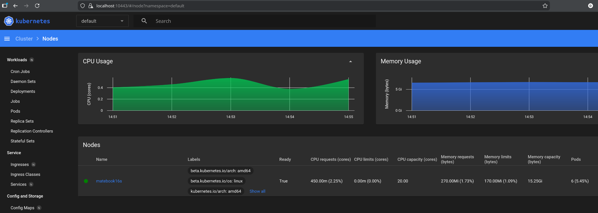

# Домашнее задание к занятию «Kubernetes. Причины появления. Команда kubectl»

### Цель задания

Для экспериментов и валидации ваших решений вам нужно подготовить тестовую среду для работы с Kubernetes. Оптимальное решение — развернуть на рабочей машине или на отдельной виртуальной машине MicroK8S.

### Решение Задания 1. Установка MicroK8S

1. Установить MicroK8S на локальную машину или на удалённую виртуальную машину.
```
odv@matebook16s:~$ microk8s status --wait-ready
microk8s is running
high-availability: no
  datastore master nodes: 127.0.0.1:19001
  datastore standby nodes: none
addons:
  enabled:
    dns                  # (core) CoreDNS
    ha-cluster           # (core) Configure high availability on the current node
    helm                 # (core) Helm - the package manager for Kubernetes
    helm3                # (core) Helm 3 - the package manager for Kubernetes
  disabled:
    cert-manager         # (core) Cloud native certificate management
    cis-hardening        # (core) Apply CIS K8s hardening
    community            # (core) The community addons repository
    dashboard            # (core) The Kubernetes dashboard
    gpu                  # (core) Alias to nvidia add-on
    host-access          # (core) Allow Pods connecting to Host services smoothly
    hostpath-storage     # (core) Storage class; allocates storage from host directory
    ingress              # (core) Ingress controller for external access
    kube-ovn             # (core) An advanced network fabric for Kubernetes
    mayastor             # (core) OpenEBS MayaStor
    metallb              # (core) Loadbalancer for your Kubernetes cluster
    metrics-server       # (core) K8s Metrics Server for API access to service metrics
    minio                # (core) MinIO object storage
    nvidia               # (core) NVIDIA hardware (GPU and network) support
    observability        # (core) A lightweight observability stack for logs, traces and metrics
    prometheus           # (core) Prometheus operator for monitoring and logging
    rbac                 # (core) Role-Based Access Control for authorisation
    registry             # (core) Private image registry exposed on localhost:32000
    rook-ceph            # (core) Distributed Ceph storage using Rook
    storage              # (core) Alias to hostpath-storage add-on, deprecated
```
2. Установить dashboard.

- Выполним - `microk8s enable dashboard`
```
odv@matebook16s:~$ microk8s status --wait-ready
microk8s is running
high-availability: no
datastore master nodes: 127.0.0.1:19001
datastore standby nodes: none
addons:
enabled:
    dashboard            # (core) The Kubernetes dashboard
```
- Получим (скопируем) временный токен на вход в дашбоард локально
```
microk8s kubectl create token default
```
- Для входа в дашбоард локально запустим прокси
```
odv@mmicrok8s kubectl proxy kubectl proxy
Starting to serve on 127.0.0.1:8001

```
- Зайдем по скопированному токену


3. Сгенерировать сертификат для подключения к внешнему ip-адресу.

В K8s есть два канала внешнего подключения и в рамках задания можно сгенерировать сертификат для:

- K8s API, чтобы kubectl мог подключаться по https://ext-ip:16443
- K8s Dashboard (порт 443 внутри пода) — web UI

Оба требуют корректных сертификатов, если доступ осуществляется по внешнему IP, но создаются по разному.  
Из инструкции к заданию, логично предположить, что речь идет о API - следуя инструкции:

- Получим внешний ip хоста с microk8s, например через ```curl ifconfig.me``` для реального внешнего адреса, но в моем случае я буду использовать lan адрес хоста с microk8s, он тоже является внешним для сети m8s, так мне проще проверить работу с api и нет необходимости настройки firewall в моей сети...

- Пропишем его в 
- обновиm сертификаты `sudo microk8s refresh-certs --cert server.crt` ! не - front-proxy-client.crt. Для доступа к ip согласно докам.
- И что важно - нужно добавить строчки в /var/snap/microk8s/current/args/kube-apiserver, чтобы он слушал кроме 127.0.0.1, что по умолчанию!
```
--bind-address=0.0.0.0
--advertise-address=172.16.30.101
```
- Рестарт microk8s `sudo snap restart microk8s`
- Проверка:
```
odv@matebook16s:~/project/MY/Netology-DevOps/kuber-homeworks/1-k8s$ curl -k https://172.16.30.101:16443/version
{
"kind": "Status",
"apiVersion": "v1",
"metadata": {},
"status": "Failure",
"message": "Unauthorized",
"reason": "Unauthorized",
"code": 401
}
```
------

### Решение Задания 2. Установка и настройка локального kubectl
1. Установить на локальную машину kubectl.

- Выполним кстановку и настройку по инструкции к заданию п.4 - проверка:
```
odv@matebook16s:~/project/MY/Netology-DevOps/kuber-homeworks/1-k8s$ kubectl version
Client Version: v1.34.2
Kustomize Version: v5.7.1
The connection to the server localhost:8080 was refused - did you specify the right host or port?
```

2. Настроить локально подключение к кластеру.

```
odv@matebook16s:~/project/MY/Netology-DevOps/kuber-homeworks/1-k8s$ microk8s config > ~/.kube/config
odv@matebook16s:~/project/MY/Netology-DevOps/kuber-homeworks/1-k8s$ kubectl get nodes
NAME          STATUS   ROLES    AGE   VERSION
matebook16s   Ready    <none>   41m   v1.32.9
```
3. Подключиться к дашборду с помощью port-forward.

```
odv@matebook16s:~/project/MY/Netology-DevOps/kuber-homeworks/1-k8s$ kubectl port-forward -n kube-system service/kubernetes-dashboard 10443:443
Forwarding from 127.0.0.1:10443 -> 8443
Forwarding from [::1]:10443 -> 8443
```



