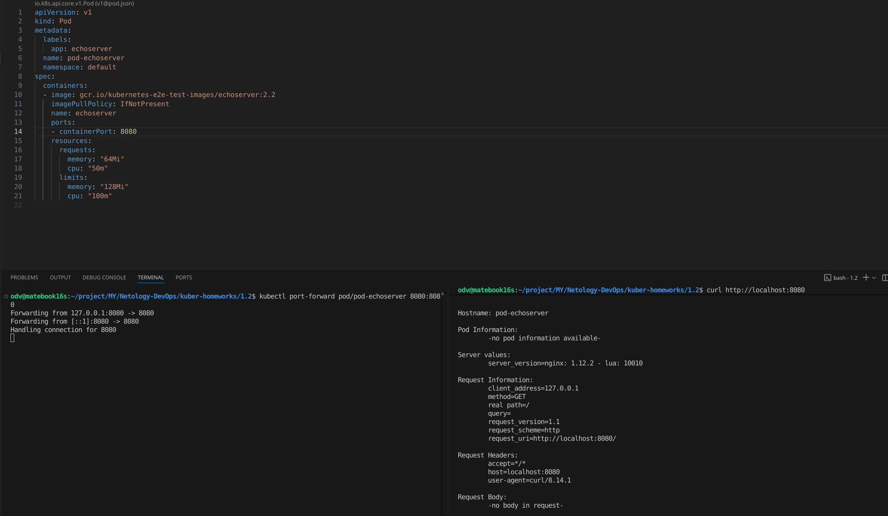
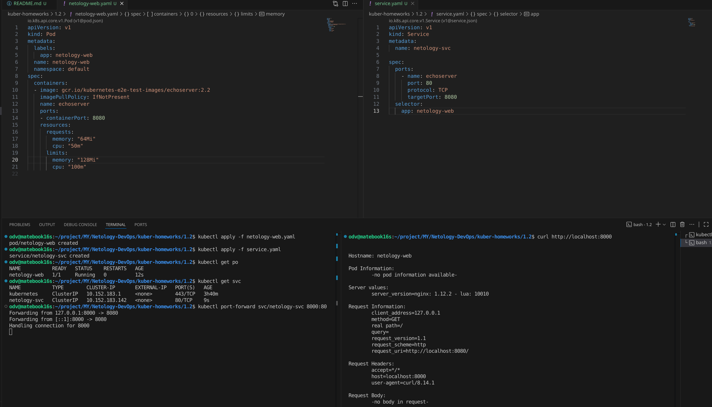

# Решение домашнего задания к занятию «Базовые объекты K8S»

### Цель задания

В тестовой среде для работы с Kubernetes, установленной в предыдущем ДЗ, необходимо развернуть Pod с приложением и подключиться к нему со своего локального компьютера. 

### Решение задания 1. Создать Pod с именем hello-world

>1. Создать манифест (yaml-конфигурацию) Pod.
>2. Использовать image - gcr.io/kubernetes-e2e-test-images/echoserver:2.2.
>3. Подключиться локально к Pod с помощью `kubectl port-forward` и вывести значение (curl или в браузере).

- Запустим pod по [pod.yaml](pod.yaml) и пробросим порт для доступа к контейнеру

```
odv@matebook16s:~/project/MY/Netology-DevOps/kuber-homeworks/1.2$ kubectl apply -f pod.yaml
pod/pod-echoserver created
odv@matebook16s:~/project/MY/Netology-DevOps/kuber-homeworks/1.2$ kubectl port-forward pod/pod-echoserver 8080:8080
Forwarding from 127.0.0.1:8080 -> 8080
Forwarding from [::1]:8080 -> 8080
Handling connection for 8080
```

- В другом терминале сделаем запрос

```
odv@matebook16s:~/project/MY/Netology-DevOps/kuber-homeworks/1.2$ curl http://localhost:8080


Hostname: pod-echoserver

Pod Information:
        -no pod information available-

Server values:
        server_version=nginx: 1.12.2 - lua: 10010

Request Information:
        client_address=127.0.0.1
        method=GET
        real path=/
        query=
        request_version=1.1
        request_scheme=http
        request_uri=http://localhost:8080/

Request Headers:
        accept=*/*  
        host=localhost:8080  
        user-agent=curl/8.14.1  

Request Body:
        -no body in request-
```


------

### Решение задания 2. Создать Service и подключить его к Pod

>1. Создать Pod с именем netology-web.
>2. Использовать image — gcr.io/kubernetes-e2e-test-images/echoserver:2.2.
>3. Создать Service с именем netology-svc и подключить к netology-web.
>4. Подключиться локально к Service с помощью `kubectl port-forward` и вывести значение (curl или в браузере).

- [pod netology-web](netology-web.yaml), [service netology-svc](service.yaml)



