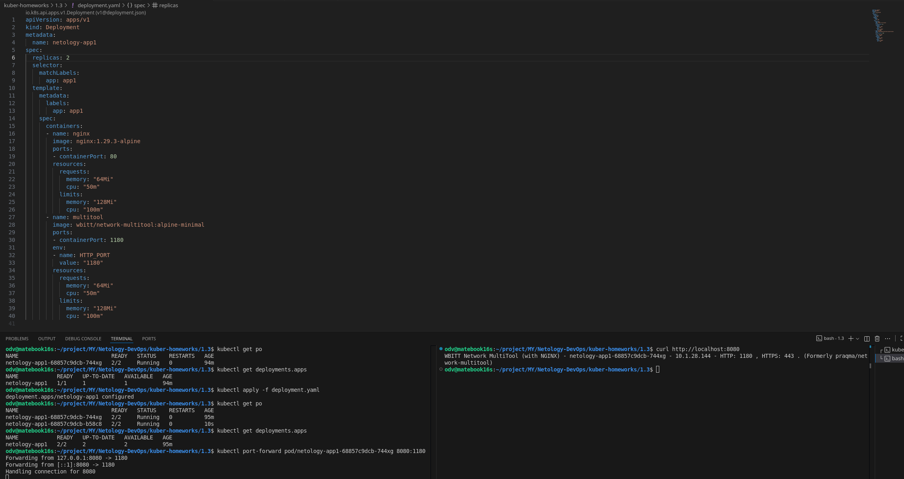
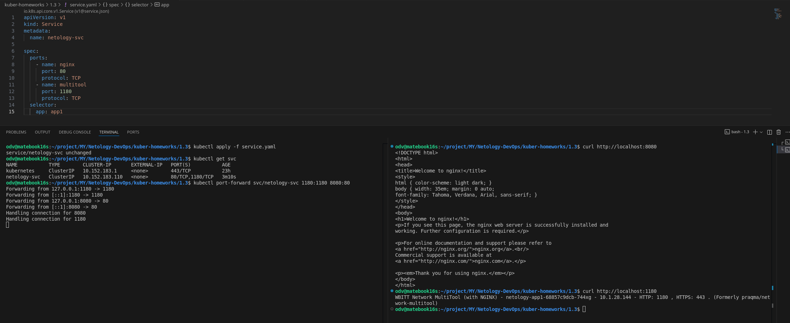
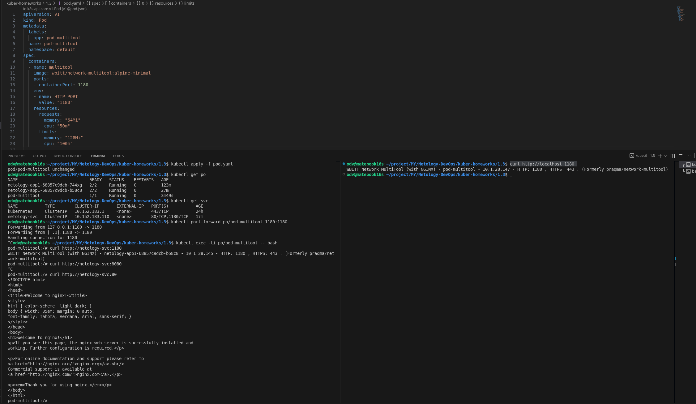
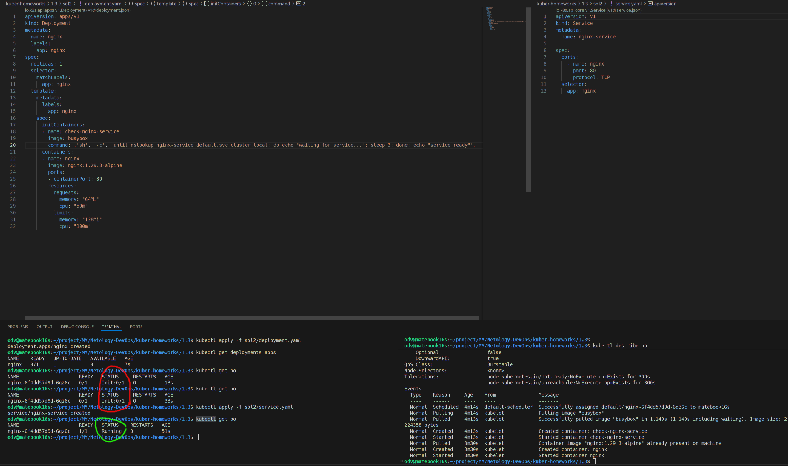

# Домашнее задание к занятию «Запуск приложений в K8S»

### Цель задания

В тестовой среде для работы с Kubernetes, установленной в предыдущем ДЗ, необходимо развернуть Deployment с приложением, состоящим из нескольких контейнеров, и масштабировать его.

----

### Решение задания 1. Создать Deployment и обеспечить доступ к репликам приложения из другого Pod

>1. Создать Deployment приложения, состоящего из двух контейнеров — nginx и multitool. Решить возникшую ошибку.
>2. После запуска увеличить количество реплик работающего приложения до 2.
>3. Продемонстрировать количество подов до и после масштабирования.
>4. Создать Service, который обеспечит доступ до реплик приложений из п.1.
>5. Создать отдельный Pod с приложением multitool и убедиться с помощью `curl`, что из пода есть доступ до приложений из п.1.

------

- Сразу поменял порт в манифесте для multitool с 80 на 1180, т.к. nginx на 80.
- [1-3. Deployment манифест](sol1/deployment.yaml)

- [4. Service манифест](sol1/service.yaml)

- [5. Pod манифест](sol1/pod.yaml)

---

### Решение задания 2. Создать Deployment и обеспечить старт основного контейнера при выполнении условий

>1. Создать Deployment приложения nginx и обеспечить старт контейнера только после того, как будет запущен сервис этого приложения.
>2. Убедиться, что nginx не стартует. В качестве Init-контейнера взять busybox.
>3. Создать и запустить Service. Убедиться, что Init запустился.
>4. Продемонстрировать состояние пода до и после запуска сервиса.

------

- Долго разбирался с nslookup в busybox - работает для данного случая только по полному доменному имени. Иначе ищет по всем search из /etc/resolv.conf и в результате всегда выходит с ошибкой (1)
- [Deployment манифест](sol2/deployment.yaml), [Service манифест](sol2/service.yaml)

