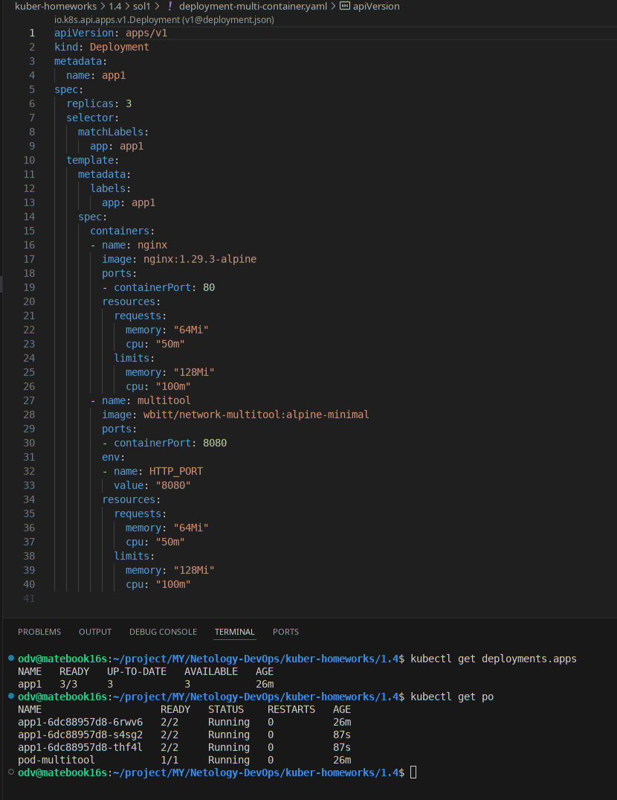
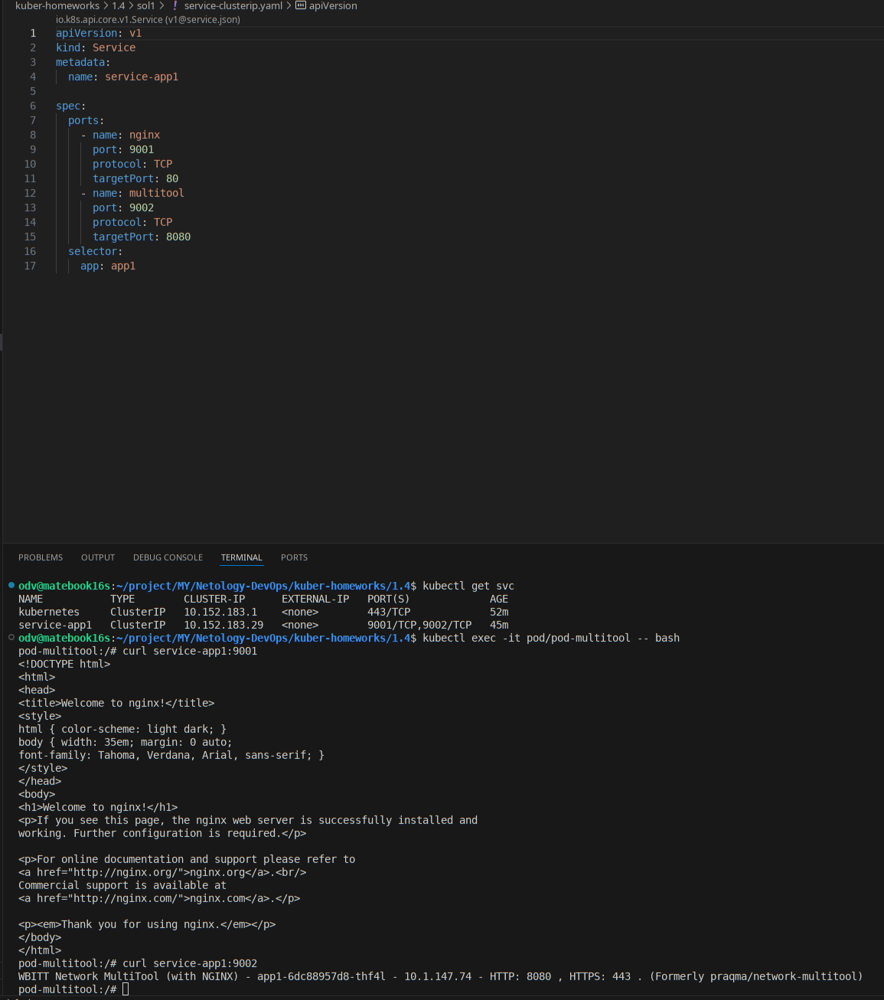
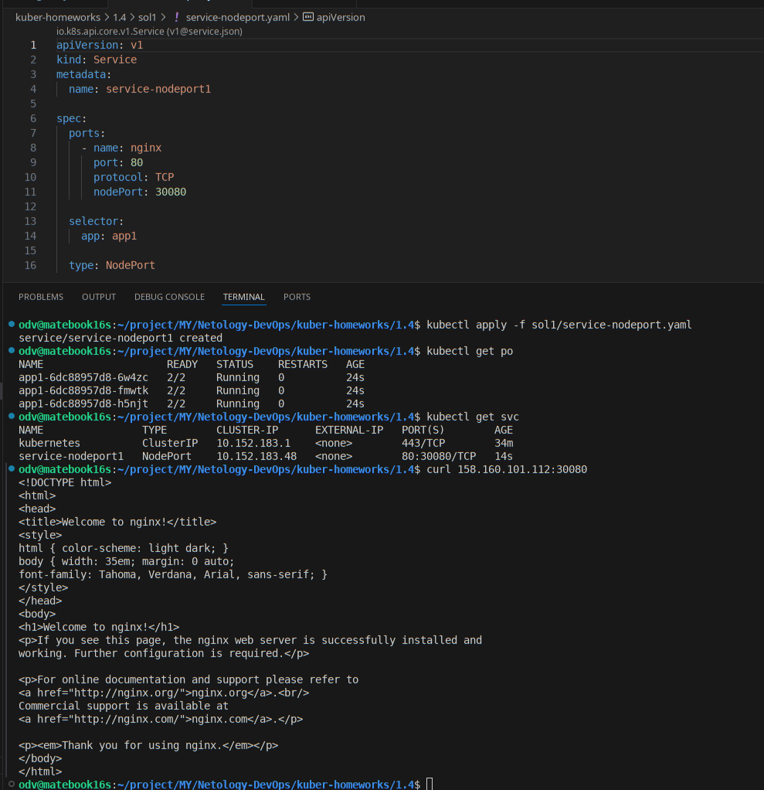
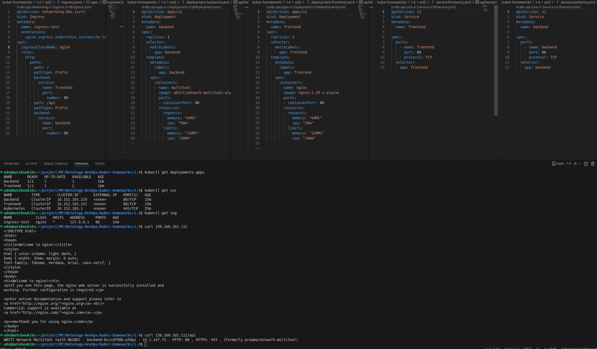

# Домашнее задание к занятию «Сетевое взаимодействие в Kubernetes»

### Цель задания

Научиться настраивать доступ к приложениям в Kubernetes:
- Внутри кластера через **Service** (ClusterIP, NodePort).
- Снаружи кластера через **Ingress**.

------

>## ** Задание> 1: Настройка Service (ClusterIP и NodePort)**
>### **Задача**
>Развернуть приложение из двух контейнеров (`nginx` и `multitool`) и обеспечить доступ к ним:
>- Внутри кластера через **ClusterIP**.
>- Снаружи через **NodePort**.
>### **Шаги выполнения**
>1. **Создать Deployment** с двумя контейнерами:
>   - `nginx` (порт `80`).
>   - `multitool` (порт `8080`).
>   - Количество реплик: `3`.
>2. **Создать Service типа ClusterIP**, который:
>   - Открывает `nginx` на порту `9001`.
>   - Открывает `multitool` на порту `9002`.
>3. **Проверить доступность** изнутри кластера:
>```bash
> kubectl run test-pod --image=wbitt/network-multitool --rm -it -- sh
> curl <service-name>:9001 # Проверить nginx
> curl <service-name>:9002 # Проверить multitool
>```
>4. **Создать Service типа NodePort** для доступа к `nginx` снаружи.
>5. **Проверить доступ** с локального компьютера:
>```bash
> curl <node-ip>:<node-port>
>   ```
>
>### **Что сдать на проверку**
>- Манифесты:
>  - `deployment-multi-container.yaml`
>  - `service-clusterip.yaml`
>  - `service-nodeport.yaml`
>- Скриншоты проверки доступа (`curl` или браузер).

---

## - РЕШЕНИЕ - Задания 1

- [На этот раз, для доступа к сервисам по внешним ip, развернул microk8s в облаке YC. Настроил доступ и сертификат и добавил в конфиг cubectl данные для управления](infra/README.md)

- [1. Манифест deployment-multi-container.yaml](sol1/deployment-multi-container.yaml)
  

- [2. Манифест service-clusterip.yaml](sol1/service-clusterip.yaml)
- (3) Скриншот с проверкой clusterip
  

- [4. Манифест service-nodeport.yaml](sol1/service-nodeport.yaml)
- (5) Скриншот с проверкой nodeport
  
---

>## **Задание 2: Настройка Ingress**
>### **Задача**
>Развернуть два приложения (`frontend` и `backend`) и обеспечить доступ к ним через **Ingress** по разным путям.
>
>### **Шаги выполнения**
>1. **Развернуть два Deployment**:
>   - `frontend` (образ `nginx`).
>   - `backend` (образ `wbitt/network-multitool`).
>2. **Создать Service** для каждого приложения.
>3. **Включить Ingress-контроллер**:
>```bash
> microk8s enable ingress
>   ```
>4. **Создать Ingress**, который:
>   - Открывает `frontend` по пути `/`.
>   - Открывает `backend` по пути `/api`.
>5. **Проверить доступность**:
>```bash
> curl <host>/
> curl <host>/api
>   ```

---

## - РЕШЕНИЕ - Задания 2

- [1. Манифест deployment-frontend.yaml](sol2/deployment-frontend.yaml),  [Манифест deployment-backend.yaml](sol2/deployment-backend.yaml)
- [2. Манифест service-frontend.yaml](sol2/service-frontend.yaml),  [Манифест service-backend.yaml](sol2/service-backend.yaml)
- [3-4. Манифест ingress.yaml](sol2/ingress.yaml)

  


----

### Инструменты, которые пригодятся для выполнения задания

1. [Инструкция](https://microk8s.io/docs/getting-started) по установке MicroK8S.
2. [Инструкция](https://minikube.sigs.k8s.io/docs/start/?arch=%2Fwindows%2Fx86-64%2Fstable%2F.exe+download) по установке Minikube. 
3. [Инструкция](https://kubernetes.io/docs/tasks/tools/install-kubectl-windows/)по установке kubectl.
4. [Инструкция](https://marketplace.visualstudio.com/items?itemName=ms-kubernetes-tools.vscode-kubernetes-tools) по установке VS Code

### Дополнительные материалы, которые пригодятся для выполнения задания

1. [Описание](https://kubernetes.io/docs/concepts/workloads/controllers/deployment/) Deployment и примеры манифестов.
2. [Описание](https://kubernetes.io/docs/concepts/services-networking/service/) Описание Service.
3. [Описание](https://kubernetes.io/docs/concepts/services-networking/ingress/) Ingress.
4. [Описание](https://github.com/wbitt/Network-MultiTool) Multitool.