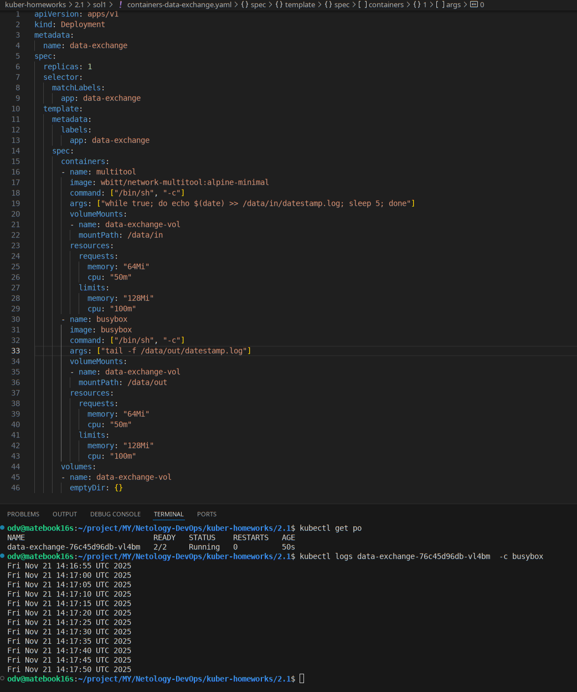
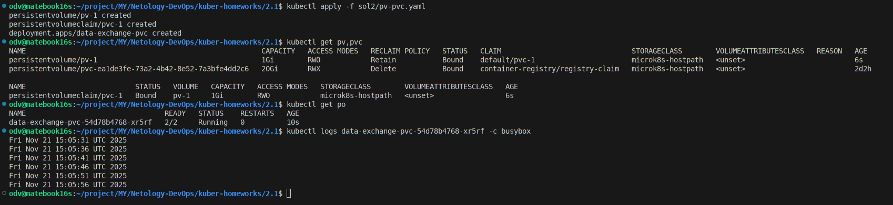
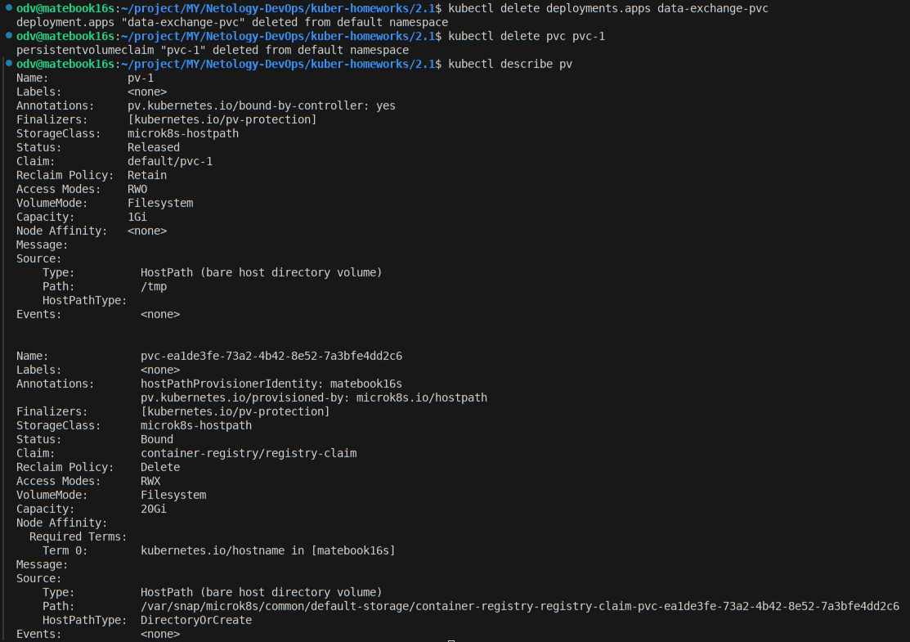
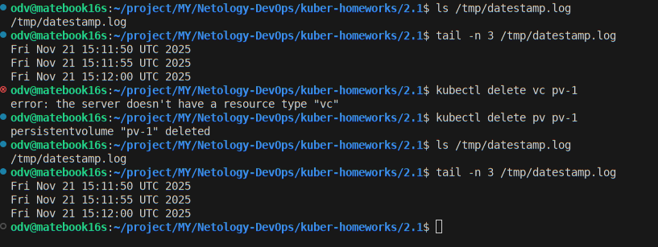
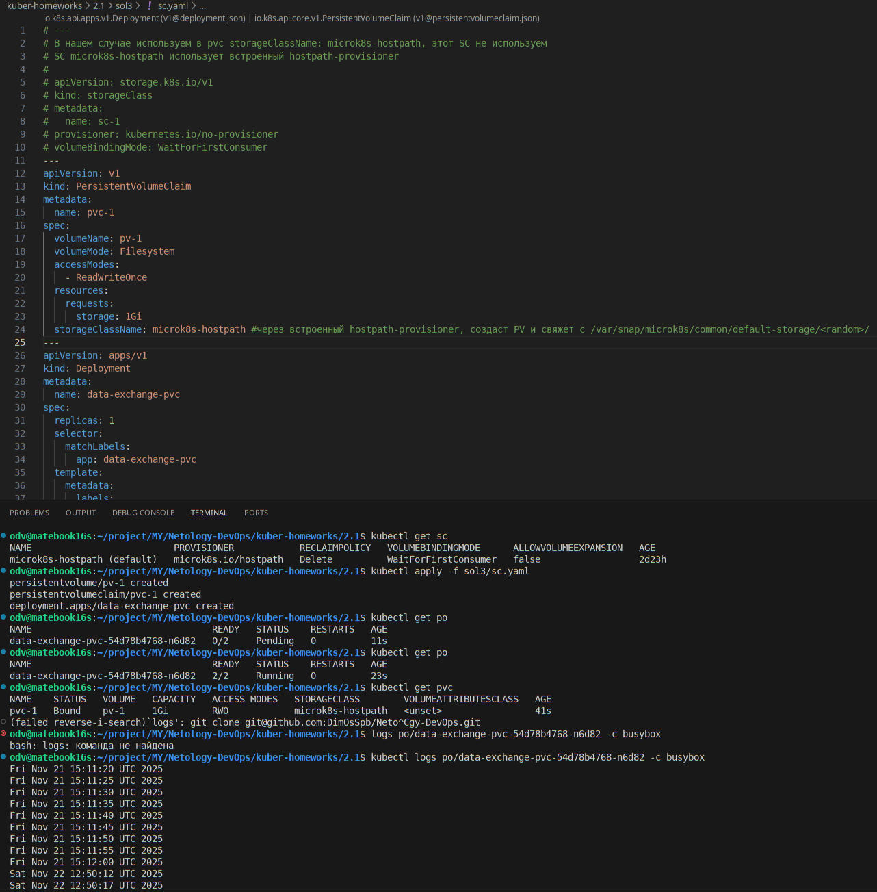

# Домашнее задание к занятию «Хранение в K8s»

### Цель задания

Научиться работать с хранилищами в тестовой среде Kubernetes:
- обеспечить обмен файлами между контейнерами пода;
- создавать **PersistentVolume** (PV) и использовать его в подах через **PersistentVolumeClaim** (PVC);
- объявлять свой **StorageClass** (SC) и монтировать его в под через **PVC**.

------

>## Задание 1. Volume: обмен данными между контейнерами в поде
>### Задача
>
>Создать Deployment приложения, состоящего из двух контейнеров, обменивающихся данными.
>
>### Шаги выполнения
>1. Создать Deployment приложения, состоящего из контейнеров busybox и multitool.
>2. Настроить busybox на запись данных каждые 5 секунд в некий файл в общей директории.
>3. Обеспечить возможность чтения файла контейнером multitool.
>
>
>### Что сдать на проверку
>- Манифесты:
>  - `containers-data-exchange.yaml`
>- Скриншоты:
>  - описание пода с контейнерами (`kubectl describe pods data-exchange`)
>  - вывод команды чтения файла (`tail -f <имя общего файла>`)

---

## - РЕШЕНИЕ - Задания 1

- У меня multitool пишет, а busybox читает. Перепутал, увидел в конце - переделывать не стал. Это не меняет сути задания.
- [1. Манифест sol1/containers-data-exchange.yaml](sol1/containers-data-exchange.yaml)
```shell
odv@matebook16s:~/project/MY/Netology-DevOps/kuber-homeworks/2.1$ kubectl describe pods data-exchange
Name:             data-exchange-76c45d96db-7lsfn
Namespace:        default
Priority:         0
Service Account:  default
Node:             matebook16s/172.16.30.101
Start Time:       Fri, 21 Nov 2025 17:20:50 +0300
Labels:           app=data-exchange
                  pod-template-hash=76c45d96db
Annotations:      cni.projectcalico.org/containerID: 45793c957ae837e5ccbaef1384d0222f9f612032b04a4fe73e4808fabb1e2bbb
                  cni.projectcalico.org/podIP: 10.1.28.161/32
                  cni.projectcalico.org/podIPs: 10.1.28.161/32
Status:           Running
IP:               10.1.28.161
IPs:
  IP:           10.1.28.161
Controlled By:  ReplicaSet/data-exchange-76c45d96db
Containers:
  multitool:
    Container ID:  containerd://dcb89d2199803765134c01cb02cb86a545fe66fe46d28d708fe7d9297cc98408
    Image:         wbitt/network-multitool:alpine-minimal
    Image ID:      docker.io/wbitt/network-multitool@sha256:33914dbb8d3cf046d3971e71f77bd8af0cdd4f7e67a8a3449e0420242f55963c
    Port:          <none>
    Host Port:     <none>
    Command:
      /bin/sh
      -c
    Args:
      while true; do echo $(date) >> /data/in/datestamp.log; sleep 5; done
    State:          Running
      Started:      Fri, 21 Nov 2025 17:20:51 +0300
    Ready:          True
    Restart Count:  0
    Limits:
      cpu:     100m
      memory:  128Mi
    Requests:
      cpu:        50m
      memory:     64Mi
    Environment:  <none>
    Mounts:
      /data/in from data-exchange-vol (rw)
      /var/run/secrets/kubernetes.io/serviceaccount from kube-api-access-rr88j (ro)
  busybox:
    Container ID:  containerd://a09277c2bb8e9ca87ae4a6f159046cfdb15205a46d5d3be81f5e14fb8bce56f1
    Image:         busybox
    Image ID:      docker.io/library/busybox@sha256:e3652a00a2fabd16ce889f0aa32c38eec347b997e73bd09e69c962ec7f8732ee
    Port:          <none>
    Host Port:     <none>
    Command:
      /bin/sh
      -c
    Args:
      tail -f /data/out/datestamp.log
    State:          Running
      Started:      Fri, 21 Nov 2025 17:20:52 +0300
    Ready:          True
    Restart Count:  0
    Limits:
      cpu:     100m
      memory:  128Mi
    Requests:
      cpu:        50m
      memory:     64Mi
    Environment:  <none>
    Mounts:
      /data/out from data-exchange-vol (rw)
      /var/run/secrets/kubernetes.io/serviceaccount from kube-api-access-rr88j (ro)
Conditions:
  Type                        Status
  PodReadyToStartContainers   True 
  Initialized                 True 
  Ready                       True 
  ContainersReady             True 
  PodScheduled                True 
Volumes:
  data-exchange-vol:
    Type:       EmptyDir (a temporary directory that shares a pod's lifetime)
    Medium:     
    SizeLimit:  <unset>
  kube-api-access-rr88j:
    Type:                    Projected (a volume that contains injected data from multiple sources)
    TokenExpirationSeconds:  3607
    ConfigMapName:           kube-root-ca.crt
    Optional:                false
    DownwardAPI:             true
QoS Class:                   Burstable
Node-Selectors:              <none>
Tolerations:                 node.kubernetes.io/not-ready:NoExecute op=Exists for 300s
                             node.kubernetes.io/unreachable:NoExecute op=Exists for 300s
Events:
  Type    Reason     Age   From               Message
  ----    ------     ----  ----               -------
  Normal  Scheduled  11s   default-scheduler  Successfully assigned default/data-exchange-76c45d96db-7lsfn to matebook16s
  Normal  Pulled     11s   kubelet            Container image "wbitt/network-multitool:alpine-minimal" already present on machine
  Normal  Created    10s   kubelet            Created container: multitool
  Normal  Started    10s   kubelet            Started container multitool
  Normal  Pulling    10s   kubelet            Pulling image "busybox"
  Normal  Pulled     9s    kubelet            Successfully pulled image "busybox" in 1.414s (1.414s including waiting). Image size: 2224358 bytes.
  Normal  Created    9s    kubelet            Created container: busybox
  Normal  Started    9s    kubelet            Started container busybox
```
  

>## Задание 2. PV, PVC
>### Задача
>Создать Deployment приложения, использующего локальный PV, созданный вручную.
>
>### Шаги выполнения
>1. Создать Deployment приложения, состоящего из контейнеров busybox и multitool, использующего созданный ранее PVC
>2. Создать PV и PVC для подключения папки на локальной ноде, которая будет использована в поде.
>3. Продемонстрировать, что контейнер multitool может читать данные из файла в смонтированной директории, в который busybox записывает данные каждые 5 секунд. 
>4. Удалить Deployment и PVC. Продемонстрировать, что после этого произошло с PV. Пояснить, почему. (Используйте команду `kubectl describe pv`).
>5. Продемонстрировать, что файл сохранился на локальном диске ноды. Удалить PV.  Продемонстрировать, что произошло с файлом после удаления PV. Пояснить, почему.

--- 

## - РЕШЕНИЕ - Задания 2

- [1-2. Манифест sol2/pv-pvc.yaml](sol2/pv-pvc.yaml)
- (3) Демо применения, busybox читает записаные multitool данные данные каждые 5 секунд:

- (4) После удаления Deployment и PVC. PV остался в статусе Bound - мы его не удаляли, persistentVolumeReclaimPolicy: Retain - PV останется в статусе Released. Данные не удаляются.

- (5) Файл лога на месте. После удаления PV. Файл не удален т.к. у нас задана spec - persistentVolumeReclaimPolicy: Retain. Это определяет что делать с данными, когда PVC или PV удаляется.



------

>## Задание 3. StorageClass
>### Задача
>Создать Deployment приложения, использующего PVC, созданный на основе StorageClass.
>
>### Шаги выполнения
>
>1. Создать Deployment приложения, состоящего из контейнеров busybox и multitool, использующего созданный ранее PVC.
>2. Создать SC и PVC для подключения папки на локальной ноде, которая будет использована в поде.
>3. Продемонстрировать, что контейнер multitool может читать данные из файла в смонтированной директории, в который busybox записывает данные каждые 5 секунд.
>
>### Что сдать на проверку
>- Манифесты:
>  - `sc.yaml`
>- Скриншоты:
>  - каждый шаг выполнения задания, начиная с шага 2

---


## - РЕШЕНИЕ - Задания 3

- [1-2. Манифест sol3/sc.yaml](sol3/sc.yaml)
- Используем встроеный SC hostpath-provisioner microk8s-hostpath в microk8s (kubectl get sc) - его покажет. Иначе его надо включить `microk8s enable storage`
- (3) Демо применения, busybox читает записаные multitool данные данные каждые 5 секунд:


---
---


### Инструменты, которые пригодятся для выполнения задания

1. [Инструкция](https://microk8s.io/docs/getting-started) по установке MicroK8S.
2. [Инструкция](https://minikube.sigs.k8s.io/docs/start/?arch=%2Fwindows%2Fx86-64%2Fstable%2F.exe+download) по установке Minikube. 
3. [Инструкция](https://kubernetes.io/docs/tasks/tools/install-kubectl-windows/) по установке kubectl.
4. [Инструкция](https://marketplace.visualstudio.com/items?itemName=ms-kubernetes-tools.vscode-kubernetes-tools) по установке VS Code

### Дополнительные материалы, которые пригодятся для выполнения задания
1. [Описание Volumes](https://kubernetes.io/docs/concepts/storage/volumes/).
2. [Описание Ephemeral Volumes](https://kubernetes.io/docs/concepts/storage/volumes/).
3. [Описание PersistentVolume](https://kubernetes.io/docs/concepts/storage/persistent-volumes/).
4. [Описание PersistentVolumeClaim](https://kubernetes.io/docs/concepts/storage/persistent-volumes/#persistentvolumeclaims).
5. [Описание StorageClass](https://kubernetes.io/docs/concepts/storage/storage-classes/).
6. [Описание Multitool](https://github.com/wbitt/Network-MultiTool).