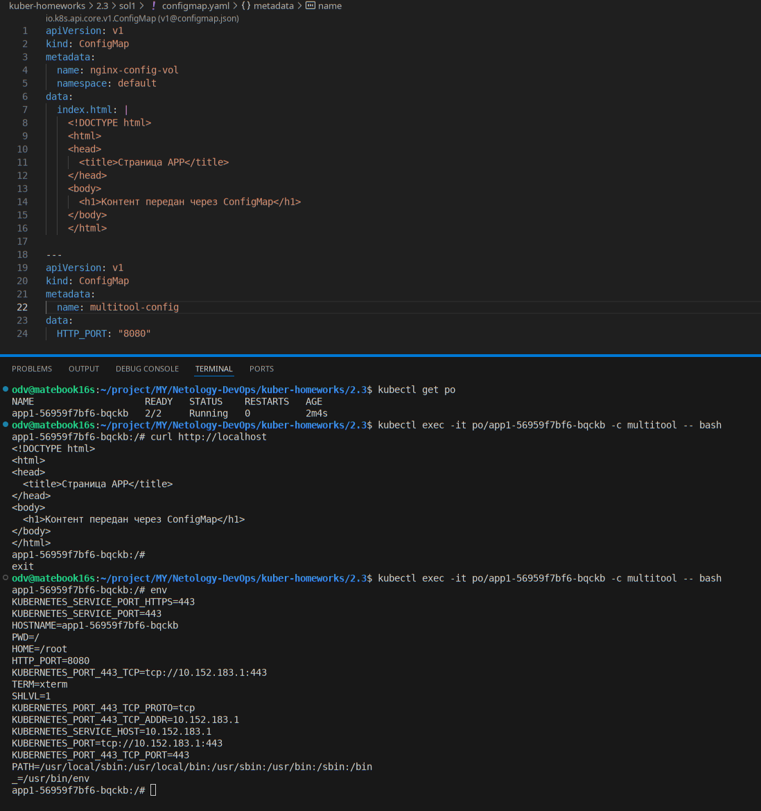
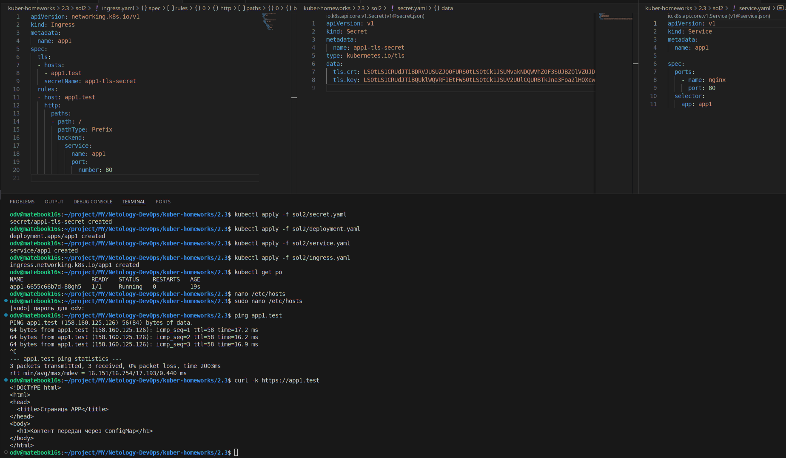
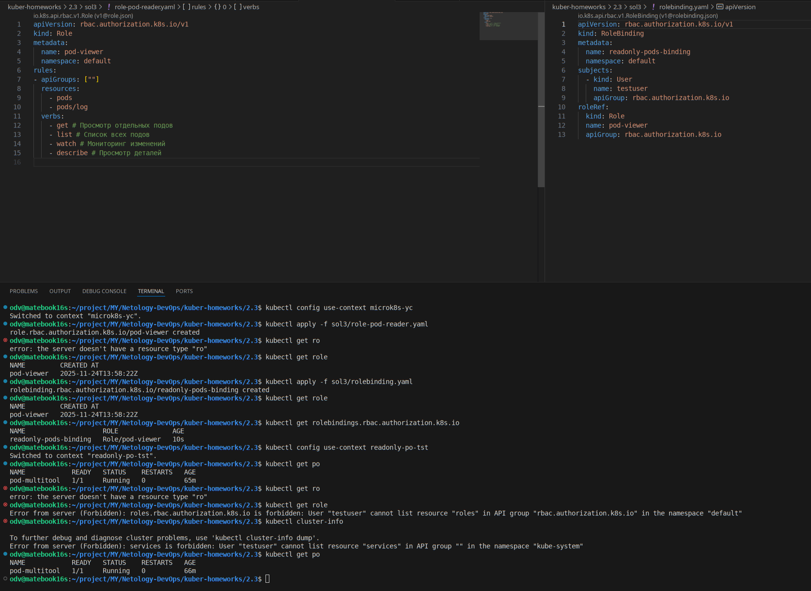

# Домашнее задание к занятию «Настройка приложений и управление доступом в Kubernetes»

### Цель задания

Научиться:
- Настраивать конфигурацию приложений с помощью **ConfigMaps** и **Secrets**
- Управлять доступом пользователей через **RBAC**


------

>## **Задание 1: Работа с ConfigMaps**
>### **Задача**
>Развернуть приложение (nginx + multitool), решить проблему конфигурации через ConfigMap и подключить веб-страницу.
>
>### **Шаги выполнения**
>1. **Создать Deployment** с двумя контейнерами
>   - `nginx`
>   - `multitool`
>3. **Подключить веб-страницу** через ConfigMap
>4. **Проверить доступность**
>
>### **Что сдать на проверку**
>- Манифесты:
>  - `deployment.yaml`
>  - `configmap-web.yaml`
>- Скриншот вывода `curl` или браузера

--- 

## - РЕШЕНИЕ - Задания 1

- [Манифест deployment.yaml](sol1/deployment.yaml), [Манифест comfigmap.yaml](sol1/configmap.yaml)




---
>## **Задание 2: Настройка HTTPS с Secrets**  
>### **Задача**  
>Развернуть приложение с доступом по HTTPS, используя самоподписанный сертификат.
>
>### **Шаги выполнения**  
>1. **Сгенерировать SSL-сертификат**
>2. **Создать Secret**
>3. **Настроить Ingress**
>4. **Проверить HTTPS-доступ**
>
>### **Что сдать на проверку**  
>- Манифесты:
>  - `secret-tls.yaml`
>  - `ingress-tls.yaml`
>- Скриншот вывода `curl -k`

---

## - РЕШЕНИЕ - Задания 2

### Описание решения

- Работаю с облачным microsk8s (YC), развернутым ранее. Для этого (т.к. я не резервирую ip и домен) [исправим в настройках microsk8s внешний ip перегенерим сертификаты, и пропишем настройки в наш локальный kuberctl config](https://github.com/DimOsSpb/Netology-DevOps/blob/main/kuber-homeworks/1.4/infra/README.md#%D0%B4%D0%BB%D1%8F-%D0%BF%D0%BE%D0%B4%D0%BA%D0%BB%D1%8E%D1%87%D0%B5%D0%BD%D0%B8%D1%8F-%D0%BA-%D0%B2%D0%BD%D0%B5%D1%88%D0%BD%D0%B5%D0%BC%D1%83-ip-%D0%B0%D0%B4%D1%80%D0%B5%D1%81%D1%83)
- Переключим контекст на внешний k8s
```
odv@matebook16s:~/project/MY/Netology-DevOps/kuber-homeworks/2.3$ kubectl config use-context microk8s-yc
Switched to context "microk8s-yc".
```
- Клиент (хост управления) будет проверять мой https servise по фиктивному dns имени "app1.test". Пропишем его временно в обра/etc/hosts клиента, связав с внешним ip microsk8s (внешний IP адрес Ingress). Далее используем эти CN,SAN для сертификатов. [san.cnf](sol2/ssl/san.cnf)
- Создадим самоподписной сертификат и ключ.

```
cd sol2/ssl
odv@matebook16s:~/project/MY/Netology-DevOps/kuber-homeworks/2.3/sol2/ssl$ openssl req -x509 -nodes -days 365 -newkey rsa:2048 -keyout tls.key -out tls.crt -config san.cnf
...+..+................+..+.......+...+......+..+....+...+.....+...+....+++++++++++++++++++++++++++++++++++++++*....+.+.....+.......+.....+.+......+.....+.........+.+........+++++++++++++++++++++++++++++++++++++++*....+..+.+..+......+.+........+...+..........+........+.+...+......+..+..........+..+...............+......+.+...+......+..+...+..........+.....+............+...+......+...+...+.......+..+....+...........+....+......+..................+......+......+...+......+.....+...................+............+...+........+...+......+.+..+.+......+...+............+...+...............+...........+......+.+..+......................+.....+.+...+.....+........................+.+............+.....+...++++++
.........+..+++++++++++++++++++++++++++++++++++++++*.+.....+.........+.+..+.......+..................+..+++++++++++++++++++++++++++++++++++++++*.....+...+......+.+......+..+............+......+.......+...+..................+......+...+........+...+.+...+..+....+.....+.........+......+.....................+...............+.+...+..+....+.....+...+.......+......+..+...+....+..............+.......+..+.+......+...........+....+.....+...............+.+............+..+...+......+.+...+...........+.+....................+.+...+..+.......+.................+....+..+.......+...........................+......+..+.......+...+...+........+.+...........+.......+...+..............+......+...+......+......+....+...+......+..+.......+.....+.+..+...+.+...+.................................+........+.+.....+.+............+..+..........+........+...+...+....+...+..+......+......+..........+.....+......+.......+.....++++++
-----
```

- Создадим [secret манифест](sol2/secret.yaml) и пропишем в него в base64 crt & key

```
odv@matebook16s:~/project/MY/Netology-DevOps/kuber-homeworks/2.3/sol2/ssl$ cat tls.crt | base64 -w 0
LS0tLS1CRUdJTiBDRVJUSUZJQ0FURS0tLS0tCk1JSUMvakNDQWVhZ0F3SUJBZ0lVZUJDa3pHZUlhSGdNMnFwQ2RjeXlpZUpmaDBVd0RRWUpLb1pJaHZjTkFRRUwKQlFBd0ZERVNNQkFHQTFVRUF3d0pZWEJ3TVM1MFpYTjBNQjRYRFRJMU1URXlOREE1TXpJeU9Wb1hEVEkyTVRFeQpOREE1TXpJeU9Wb3dGREVTTUJBR0ExVUVBd3dKWVhCd01...
odv@matebook16s:~/project/MY/Netology-DevOps/kuber-homeworks/2.3/sol2/ssl$ cat tls.key | base64 -w 0
LS0tLS1CRUdJTiBQUklWQVRFIEtFWS0tLS0tCk1JSUV2UUlCQURBTkJna3Foa2lHOXcwQkFRRUZBQVNDQktjd2dnU2pBZ0VBQW9JQkFRQzRnRkNRTXpBenpsSUEKT2hwU2VqM2R1c1VxZWNaUGd5cFR0NmdsZEE2U0dlZ1cwZlhzZU1nclp4Y0J0MTZWb1JsQVJ3M0hLak1JSTR1dApUNys2S2FpcjRsL2h3N25CZ0U1aU5YTEtiRHo3ZHNLRUN...
odv@matebook16s:~/project/MY/Netology-DevOps/kuber-homeworks/2.3/sol2/ssl$ 
```

- [Манифест ingress.yaml](sol2/ingress.yaml), [Манифест service.yaml](sol2/service.yaml)
- [Манифест deployment.yaml](sol2/deployment.yaml), [Манифест comfigmap.yaml](sol2/configmap.yaml)




>## **Задание 3: Настройка RBAC**  
>### **Задача**  
>Создать пользователя с ограниченными правами (только просмотр логов и описания подов).
>
>### **Шаги выполнения**  
>1. **Включите RBAC в microk8s**
>```bash
>microk8s enable rbac
>```
>2. **Создать SSL-сертификат для пользователя**
>```bash
>openssl genrsa -out developer.key 2048
>openssl req -new -key developer.key -out developer.csr -subj "/CN={ИМЯ ПОЛЬЗОВАТЕЛЯ}"
>openssl x509 -req -in developer.csr -CA {CA серт вашего кластера} -CAkey {CA ключ вашего кластера} -CAcreateserial -out developer.crt -days 365
>```
>3. **Создать Role (только просмотр логов и описания подов) и RoleBinding**
>4. **Проверить доступ**
>
>### **Что сдать на проверку**  
>- Манифесты:
>  - `role-pod-reader.yaml`
>  - `rolebinding-developer.yaml`
>- Команды генерации сертификатов
>- Скриншот проверки прав (`kubectl get pods --as=developer`)

---

## - РЕШЕНИЕ - Задания 3

- Включем RBAC на нашем microk8s в облаке YC
```
ubuntu@fhm4d7dns6qphuqi0i47:~$ microk8s enable rbac
Infer repository core for addon rbac
Enabling RBAC
Reconfiguring apiserver
Restarting apiserver
RBAC is enabled
ubuntu@fhm4d7dns6qphuqi0i47:~$ microk8s status
microk8s is running
high-availability: no
  datastore master nodes: 127.0.0.1:19001
  datastore standby nodes: none
addons:
  enabled:
    community            # (core) The community addons repository
    dns                  # (core) CoreDNS
    ha-cluster           # (core) Configure high availability on the current node
    helm                 # (core) Helm - the package manager for Kubernetes
    helm3                # (core) Helm 3 - the package manager for Kubernetes
    ingress              # (core) Ingress controller for external access
    rbac                 # (core) Role-Based Access Control for authorisation
```
- Создаём приватный ключ пользователя
```
openssl genrsa -out testuser.key 2048

```
- Создаём запрос с нужным CN
```
openssl req -new -key testuser.key -out testuser.csr -subj "/CN=testuser"

```
- Получим корневой сертификат и приватный ключ microk8s. 
```
scp -i ~/.ssh/netology ubuntu@158.160.125.126:/var/snap/microk8s/current/certs/ca.* .
```
- Подписываем запрос встроенным CA MicroK8s
```
sudo openssl x509 -req -in testuser.csr -CA ca.crt -CAkey ca.key -CAcreateserial -out testuser.crt -days 365

```
- Теперь у меня есть crt и key для пользователя testuser. По заданию нужно создать роль с ограниченым доступом и связать ее с новым пользователем, проверить работу.  
С точки зрения Kubernetes нет API-объекта User. Кластер никак не хранит данные о пользователях, кластер только принимает запрос и проверяет, что клиент представил действительный сертификат/токен с CN,O (имя пользователя, группа).  
Для пользователя создаются только RBAC-права Role/ClusterRole RoleBinding/ClusterRoleBinding.  
Kubectl config вне кластера хранит настройку связи имени пользователя, сертификатов, серверов, контексты. Т.е. нам надо добавить конфигурацию с контекстом для определенного сервера и пользователя. Переключиться на этот контекст и работать с кластером от этого сертификата.
- Есть команда, например добавит в конфиг запись пользователя testuser и его сертификат
```
odv@matebook16s:~/project/MY/Netology-DevOps/kuber-homeworks/2.3$ kubectl config set-credentials testuser --client-certificate=sol3/ssl/testuser.crt --client-key=sol3/ssl/testuser.key --embed-certs=true
User "testuser" set.

```
- Еще добавим контекст с целевым сервером и пользователем
```
odv@matebook16s:~/project/MY/Netology-DevOps/kuber-homeworks/2.3$ kubectl config set-context readonly-po-tst --cluster=microk8s-yc --user=testuser --namespace=default
Context "readonly-po-tst" created.
```
- Переключимся на этот контекст, и проверим что доступа нет (rbac включен вначале!)
```
odv@matebook16s:~/project/MY/Netology-DevOps/kuber-homeworks/2.3$ kubectl config use-context readonly-po-tst
Switched to context "readonly-po-tst".
odv@matebook16s:~/project/MY/Netology-DevOps/kuber-homeworks/2.3$ kubectl get po
Error from server (Forbidden): pods is forbidden: User "testuser" cannot list resource "pods" in API group "" in the namespace "default"
```
- Теперь создадим роль [role-pod-reader.yaml](sol3/role-pod-reader.yaml), и свяжем ее с пользователем testuser [rolebinding.yaml](sol3/rolebinding.yaml).  
- Переключим контекст на админа сново, применим манифесты роли и rolebinding.yaml, проверим их. Для теста у меня запущен pod pod-multitool, проверим что он работает.  
- Переключим контекст обратно на readonly-po-tst и проверим доступ к pod pod/logs - он есть, доступа к другим ресурсам - нет 


```
odv@matebook16s:~/project/MY/Netology-DevOps/kuber-homeworks/2.3$ kubectl logs pod/pod-multitool
The directory /usr/share/nginx/html is not mounted.
Therefore, over-writing the default index.html file with some useful information:
WBITT Network MultiTool (with NGINX) - pod-multitool - 10.1.147.81 - HTTP: 1180 , HTTPS: 443 . (Formerly praqma/network-multitool)
Replacing default HTTP port (80) with the value specified by the user - (HTTP_PORT: 1180).

odv@matebook16s:~/project/MY/Netology-DevOps/kuber-homeworks/2.3$ kubectl get deployments.apps 
Error from server (Forbidden): deployments.apps is forbidden: User "testuser" cannot list resource "deployments" in API group "apps" in the namespace "default"
```


------

### Инструменты, которые пригодятся для выполнения задания

1. [Инструкция](https://microk8s.io/docs/getting-started) по установке MicroK8S
2. [Инструкция](https://minikube.sigs.k8s.io/docs/start/) по установке Minikube
3. [Инструкция](https://kubernetes.io/docs/tasks/tools/) по установке kubectl
4. [Инструкция](https://marketplace.visualstudio.com/items?itemName=ms-kubernetes-tools.vscode-kubernetes-tools) по установке VS Code

### Дополнительные материалы, которые пригодятся для выполнения задания

1. [Описание](https://kubernetes.io/docs/concepts/configuration/secret/) Secret.
2. [Описание](https://kubernetes.io/docs/concepts/configuration/configmap/) ConfigMap.
3. [Описание](https://github.com/wbitt/Network-MultiTool) Multitool.
4. [Описание](https://kubernetes.io/docs/reference/access-authn-authz/rbac/) RBAC.
5. [Пользователи и авторизация RBAC в Kubernetes](https://habr.com/ru/company/flant/blog/470503/).
6. [RBAC with Kubernetes in Minikube](https://medium.com/@HoussemDellai/rbac-with-kubernetes-in-minikube-4deed658ea7b).
