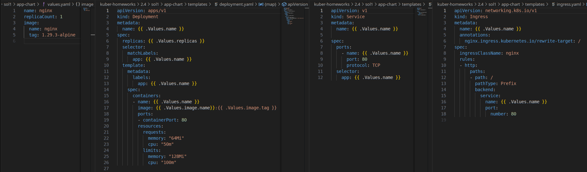
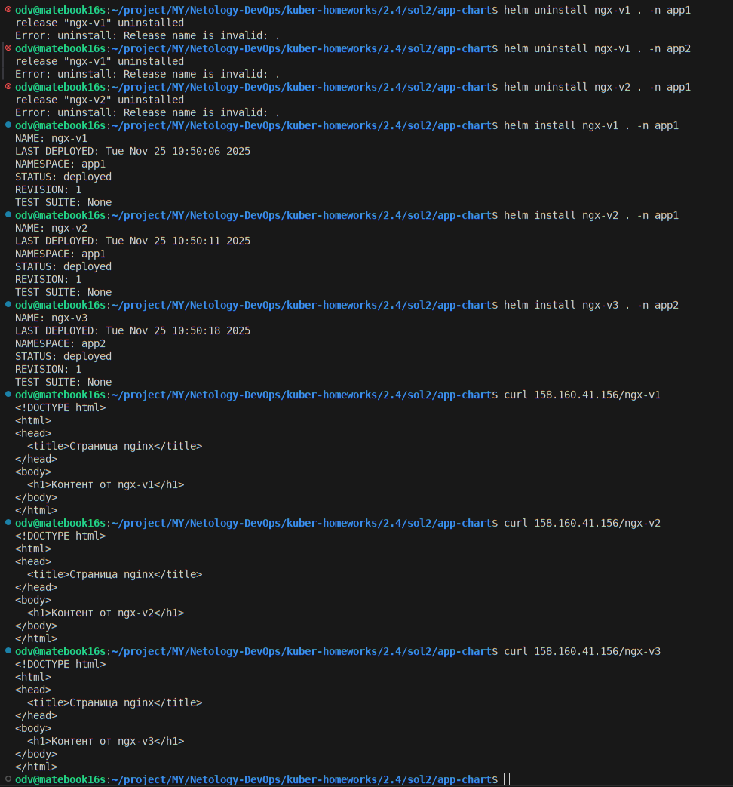

# Домашнее задание к занятию «Helm»

### Цель задания

В тестовой среде Kubernetes необходимо установить и обновить приложения с помощью Helm.

```
odv@matebook16s:~/project/MY/Netology-DevOps/kuber-homeworks/2.3$ helm version
version.BuildInfo{Version:"v3.19.2", GitCommit:"8766e718a0119851f10ddbe4577593a45fadf544", GitTreeState:"clean", GoVersion:"go1.24.9"}
```

------
>### Задание 1. Подготовить Helm-чарт для приложения
>
>1. Необходимо упаковать приложение в чарт для деплоя в разные окружения. 
>2. Каждый компонент приложения деплоится отдельным deployment’ом или statefulset’ом.
>3. В переменных чарта измените образ приложения для изменения версии.

------
## - РЕШЕНИЕ - Задания 1

- [Приложение возьму из 1.4.2](sol1/app-chart/templates/)


>### Задание 2. Запустить две версии в разных неймспейсах
>
>1. Подготовив чарт, необходимо его проверить. Запуститe несколько копий приложения.
>2. Одну версию в namespace=app1, вторую версию в том же неймспейсе, третью версию в namespace=app2.
>3. Продемонстрируйте результат.

## - РЕШЕНИЕ - Задания 2

- [Чарт приложения](sol2/app-chart)
- Используем системную переменную .Release.Name в метаданных для создания уникальных идентификаторов ресурсрв в ns 
- Создадим инсталяции приложения, где --create-namespace создаст ns если его нет



```
helm install ngx-v1 . -n app1 --create-namespace
helm install ngx-v2 . -n app1 --create-namespace
helm install ngx-v3 . -n app2 --create-namespace
```



---

### Инструменты и дополнительные материалы, которые пригодятся для выполнения задания

1. [Инструкция](https://helm.sh/docs/intro/install/) по установке Helm. [Helm completion](https://helm.sh/docs/helm/helm_completion/).