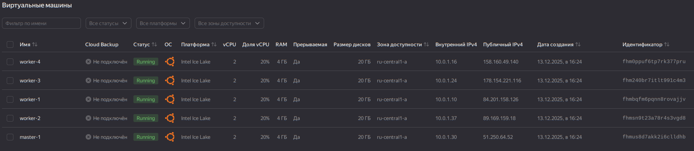
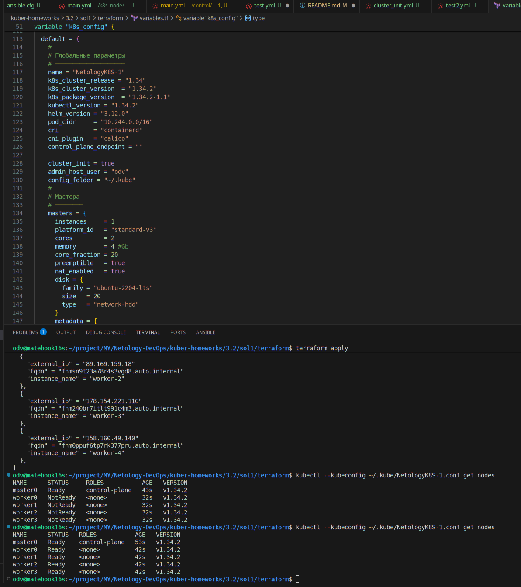

# Домашнее задание к занятию «Установка Kubernetes»

### Цель задания

Установить кластер K8s.

### Чеклист готовности к домашнему заданию

1. Развёрнутые ВМ с ОС Ubuntu 20.04-lts.

-----

>### Задание 1. Установить кластер k8s с 1 master node
>
>1. Подготовка работы кластера из 5 нод: 1 мастер и 4 рабочие ноды.
>2. В качестве CRI — containerd.
>3. Запуск etcd производить на мастере.
>4. Способ установки выбрать самостоятельно.

----
# - РЕШЕНИЕ

## Замечания по решению

- Выбор платформы для установки предопределен в чеклисте. Это уже развернутые ВМ с ОС Ubuntu 20.04-lts. Минимальные требования по ресурсам не позволяют развернуть 5 нод на локальном ПК, используем предоставленный курсом Yandex Cloud.
- На практике может понадобится разворачивать k8s на barremetal. Это может потребоваться для более высокой производительности кластера или для соблюдения соответствующих требований. Но это так-же увеличивает трудоемкость установки/обслуживания (работа инженера(ов) с on-premise физическим оборудованием ) по сравнению с развертыванием кластера в виртуальных средах, где мы можем применить подходы IaC уже на уровне системных требований к узлу (CPU/RAM/Disk...).
- Добавлю сложности в задании:
    - Для развертывания ВМ в облаке, буду использовать terraform, `должен быть установлен и настроен на хосте управления.`
    - Для настройки k8s - ansible, `должен быть установлен и настроен на хосте управления.`
    - Здесь не использую kubespray, а ориентируюсь на kubeadm, но через ansible.

## В деталях:

- Для упращения, весь код предполагает Debian based дистрибутив операционной системы нод.
- [variables.tf/k8s_config/default](sol1/terraform/variables.tf) содержит настройки конфигурации кластера, CRI задается там-же. Через template формируем [ansible/inventory.yml, ansible/group_vars...](sol1/ansible) и запускаем плейбук установки k8s
- На этапе создания terraform узлов в YC и в ansible роли k8s_node [опираемся на общие требования к системе перед установкой компонентов k8s](https://kubernetes.io/docs/setup/production-environment/tools/kubeadm/install-kubeadm/#before-you-begin)
- В настройке k8s_config добавлю переменную bool cluster_init, чтобы иметь возможность только подготовить среду для установки кластера в обраке и на хосте управления.
- Напишу роли для nodes, masters, workers и хоста управления control [Roles](sol1/ansible/roles/)
- Отдельный плейбук для инициализации кластера по настройке k8s_config [Cluster_Init](sol1/ansible/playbooks/cluster_init.yml). В нем дополнительно копируется конфигурация кластера на хост управления для kubectl
- В роли control на хост управления ставятся все необходимое и дополнительно в ~/.kube/config (обновляем) внешний ip кластера [Control](sol1/ansible/roles/control/tasks/main.yml).

# [Исходники решения в каталоге sol1](sol1/)
## [**Лог результата выполнения terraform и ansible. Проверка кластера через kubectl get nodes**](sol1/install.log)





---


## Дополнительные задания (со звёздочкой)

------
>### Задание 2*. Установить HA кластер
>
>1. Установить кластер в режиме HA.
>2. Использовать нечётное количество Master-node.
>3. Для cluster ip использовать keepalived или другой способ.

----
# - РЕШЕНИЕ

## Замечания по решению

- В данном задании, ключевое отличие от первого - это HA режим с несколькими мастерами. 
- HA включается автоматически, когда мы выполняем архитектурные условия, kubeadm сам включает HA, если мастеров несколько
- Если мы не указали внешний etcd, kubeadm по умолчанию использует встроенный (stacked) etcd. Встроенный etcd → автоматически HA, если мастеров ≥2
- Важно - для данного задания, control-plane-endpoint (VIP) - уже виртуальный адрес за балансировщиком, который обеспечивает отказоустойчивый доступ к одному из доступных мастеров.  
- **!** Этот сервис должен быть установлен на мастер нодах, `еще до инициализации кластера`, VIP должен быть задан до kubeadm init, а не после! Рекомендуется - keepalived+HAProxy сервис ставят на всех master-нодах.  
- Ниже подборка вариантов организации control-plane-endpoint:


| Схема                                                      | Где ставятся сервисы                        | Для чего           | Применение     |
| ---------------------------------------------------------- | ------------------------------------------- | ------------------ | -------------- |
| **Keepalived + HAProxy на мастерах**                       | На всех master                              | VIP + балансировка | BEST PRACTICE  |
| **Keepalived на мастерах, HAProxy на выделенных серверах** | keepalived — мастера, LB — отдельные ноды   | VIP + мощный LB    | Enterprise     |
| **Только keepalived (без LB)**                             | На всех master                              | VIP (без баланс.)  | Минимальный HA |
| **Cloud Load Balancer**                                    | Только в облаке                             | LB + VIP           | Cloud-only     |
| **IP одного мастера**                                      | Не прод.                                    | тесты и пр         | HA нет, endpoint = IP мастер-ноды |

## Т.о. скопирую 1-е решение и модифицирую под kuberspray.  

- Установим kubespray

```
odv@matebook16s:~/project/MY/Netology-DevOps/kuber-homeworks/3.2/sol2$ git clone https://github.com/kubernetes-sigs/kubespray.git
Клонирование в «kubespray»...
remote: Enumerating objects: 85122, done.
remote: Counting objects: 100% (227/227), done.
remote: Compressing objects: 100% (130/130), done.
remote: Total 85122 (delta 171), reused 95 (delta 95), pack-reused 84895 (from 4)
Получение объектов: 100% (85122/85122), 27.77 МиБ | 4.71 МиБ/с, готово.
Определение изменений: 100% (47691/47691), готово.
odv@matebook16s:~/project/MY/Netology-DevOps/kuber-homeworks/3.2/sol2$ cd kubespray
odv@matebook16s:~/project/MY/Netology-DevOps/kuber-homeworks/3.2/sol2/kubespray$ python3 -m venv venv
odv@matebook16s:~/project/MY/Netology-DevOps/kuber-homeworks/3.2/sol2/kubespray$ source venv/bin/activate
pip install -r requirements.txt
Collecting ansible==10.7.0 (from -r requirements.txt (line 1))
  Downloading ansible-10.7.0-py3-none-any.whl.metadata (8.0 kB)
Collecting cryptography==46.0.3 (from -r requirements.txt (line 3))
  Downloading cryptography-46.0.3-cp311-abi3-manylinux_2_34_x86_64.whl.metadata (5.7 kB)
Collecting jmespath==1.0.1 (from -r requirements.txt (line 5))
  Downloading jmespath-1.0.1-py3-none-any.whl.metadata (7.6 kB)
Collecting netaddr==1.3.0 (from -r requirements.txt (line 7))
  Downloading netaddr-1.3.0-py3-none-any.whl.metadata (5.0 kB)
Collecting ansible-core~=2.17.7 (from ansible==10.7.0->-r requirements.txt (line 1))
  Downloading ansible_core-2.17.14-py3-none-any.whl.metadata (7.0 kB)
Collecting cffi>=2.0.0 (from cryptography==46.0.3->-r requirements.txt (line 3))
  Downloading cffi-2.0.0-cp313-cp313-manylinux2014_x86_64.manylinux_2_17_x86_64.whl.metadata (2.6 kB)
Collecting jinja2>=3.0.0 (from ansible-core~=2.17.7->ansible==10.7.0->-r requirements.txt (line 1))
  Downloading jinja2-3.1.6-py3-none-any.whl.metadata (2.9 kB)
Collecting PyYAML>=5.1 (from ansible-core~=2.17.7->ansible==10.7.0->-r requirements.txt (line 1))
  Downloading pyyaml-6.0.3-cp313-cp313-manylinux2014_x86_64.manylinux_2_17_x86_64.manylinux_2_28_x86_64.whl.metadata (2.4 kB)
Collecting packaging (from ansible-core~=2.17.7->ansible==10.7.0->-r requirements.txt (line 1))
  Downloading packaging-25.0-py3-none-any.whl.metadata (3.3 kB)
Collecting resolvelib<1.1.0,>=0.5.3 (from ansible-core~=2.17.7->ansible==10.7.0->-r requirements.txt (line 1))
  Downloading resolvelib-1.0.1-py2.py3-none-any.whl.metadata (4.0 kB)
Collecting pycparser (from cffi>=2.0.0->cryptography==46.0.3->-r requirements.txt (line 3))
  Downloading pycparser-2.23-py3-none-any.whl.metadata (993 bytes)
Collecting MarkupSafe>=2.0 (from jinja2>=3.0.0->ansible-core~=2.17.7->ansible==10.7.0->-r requirements.txt (line 1))
  Downloading markupsafe-3.0.3-cp313-cp313-manylinux2014_x86_64.manylinux_2_17_x86_64.manylinux_2_28_x86_64.whl.metadata (2.7 kB)
Downloading ansible-10.7.0-py3-none-any.whl (51.6 MB)
   ━━━━━━━━━━━━━━━━━━━━━━━━━━━━━━━━━━━━━━━━ 51.6/51.6 MB 12.7 MB/s eta 0:00:00
Downloading cryptography-46.0.3-cp311-abi3-manylinux_2_34_x86_64.whl (4.5 MB)
   ━━━━━━━━━━━━━━━━━━━━━━━━━━━━━━━━━━━━━━━━ 4.5/4.5 MB 13.2 MB/s eta 0:00:00
Downloading jmespath-1.0.1-py3-none-any.whl (20 kB)
Downloading netaddr-1.3.0-py3-none-any.whl (2.3 MB)
   ━━━━━━━━━━━━━━━━━━━━━━━━━━━━━━━━━━━━━━━━ 2.3/2.3 MB 14.2 MB/s eta 0:00:00
Downloading ansible_core-2.17.14-py3-none-any.whl (2.2 MB)
   ━━━━━━━━━━━━━━━━━━━━━━━━━━━━━━━━━━━━━━━━ 2.2/2.2 MB 13.7 MB/s eta 0:00:00
Downloading resolvelib-1.0.1-py2.py3-none-any.whl (17 kB)
Downloading cffi-2.0.0-cp313-cp313-manylinux2014_x86_64.manylinux_2_17_x86_64.whl (219 kB)
Downloading jinja2-3.1.6-py3-none-any.whl (134 kB)
Downloading markupsafe-3.0.3-cp313-cp313-manylinux2014_x86_64.manylinux_2_17_x86_64.manylinux_2_28_x86_64.whl (22 kB)
Downloading pyyaml-6.0.3-cp313-cp313-manylinux2014_x86_64.manylinux_2_17_x86_64.manylinux_2_28_x86_64.whl (801 kB)
   ━━━━━━━━━━━━━━━━━━━━━━━━━━━━━━━━━━━━━━━━ 801.6/801.6 kB 12.0 MB/s eta 0:00:00
Downloading packaging-25.0-py3-none-any.whl (66 kB)
Downloading pycparser-2.23-py3-none-any.whl (118 kB)
Installing collected packages: resolvelib, PyYAML, pycparser, packaging, netaddr, MarkupSafe, jmespath, jinja2, cffi, cryptography, ansible-core, ansible
Successfully installed MarkupSafe-3.0.3 PyYAML-6.0.3 ansible-10.7.0 ansible-core-2.17.14 cffi-2.0.0 cryptography-46.0.3 jinja2-3.1.6 jmespath-1.0.1 netaddr-1.3.0 packaging-25.0 pycparser-2.23 resolvelib-1.0.1
```
- Модифицирую [rerraform/inventory.yml.tpl](sol2/terraform/inventory.yml.tpl) и [rerraform/main.tf](sol2/terraform/main.tf) под kubespray
- Разверну в облаке новые хосты для кластера и через tpl сформирую [kubespray/inventory/ha-cluster/hosts.yaml](sol2/kubespray/inventory/ha-cluster/hosts.yaml)

```
(venv) odv@matebook16s:~/project/MY/Netology-DevOps/kuber-homeworks/3.2/sol2/terraform$ terraform apply
data.yandex_compute_image.ubuntu: Reading...
yandex_vpc_network.k8s_network: Refreshing state... [id=enpvusbo5ckg0dgd5tan]
data.yandex_compute_image.ubuntu: Read complete after 0s [id=fd8uhrvvlehn8lrmn6ig]
yandex_vpc_subnet.k8s_subnet: Refreshing state... [id=e9bil105ifkpj64rldpk]
yandex_compute_instance.k8s_master[2]: Refreshing state... [id=fhm14elpomm0apu7fd1m]
yandex_compute_instance.k8s_worker[1]: Refreshing state... [id=fhm008spck2d57rdqp92]
yandex_compute_instance.k8s_master[1]: Refreshing state... [id=fhm6gescedslf62lscvr]
yandex_compute_instance.k8s_worker[2]: Refreshing state... [id=fhm56oa96v8qhbjoukcn]
yandex_compute_instance.k8s_worker[0]: Refreshing state... [id=fhmsdkq37np7s7i41km2]
yandex_compute_instance.k8s_master[0]: Refreshing state... [id=fhms3ee27r49ultm6b7g]
local_file.ansible_inventory_yaml: Refreshing state... [id=ade53e8528d1bb3d4602b99c0245a6c3d912102c]

Terraform used the selected providers to generate the following execution plan. Resource actions are indicated with the following symbols:
  + create

Terraform will perform the following actions:

  # local_file.ansible_inventory_yaml will be created
  + resource "local_file" "ansible_inventory_yaml" {
      + content              = (sensitive value)
      + content_base64sha256 = (known after apply)
      + content_base64sha512 = (known after apply)
      + content_md5          = (known after apply)
      + content_sha1         = (known after apply)
      + content_sha256       = (known after apply)
      + content_sha512       = (known after apply)
      + directory_permission = "0777"
      + file_permission      = "0777"
      + filename             = "./../kubespray/inventory/ha-cluster/hosts.yaml"
      + id                   = (known after apply)
    }

Plan: 1 to add, 0 to change, 0 to destroy.

Do you want to perform these actions?
  Terraform will perform the actions described above.
  Only 'yes' will be accepted to approve.

  Enter a value: yes

local_file.ansible_inventory_yaml: Creating...
local_file.ansible_inventory_yaml: Creation complete after 0s [id=ade53e8528d1bb3d4602b99c0245a6c3d912102c]

Apply complete! Resources: 1 added, 0 changed, 0 destroyed.

Outputs:

master_instances_info = [
  {
    "external_ip" = "178.154.227.94"
    "fqdn" = "fhms3ee27r49ultm6b7g.auto.internal"
    "instance_name" = "master-1"
  },
  {
    "external_ip" = "178.154.224.150"
    "fqdn" = "fhm6gescedslf62lscvr.auto.internal"
    "instance_name" = "master-2"
  },
  {
    "external_ip" = "158.160.114.65"
    "fqdn" = "fhm14elpomm0apu7fd1m.auto.internal"
    "instance_name" = "master-3"
  },
]
workers_instances_info = [
  {
    "external_ip" = "178.154.227.252"
    "fqdn" = "fhmsdkq37np7s7i41km2.auto.internal"
    "instance_name" = "worker-1"
  },
  {
    "external_ip" = "89.169.159.1"
    "fqdn" = "fhm008spck2d57rdqp92.auto.internal"
    "instance_name" = "worker-2"
  },
  {
    "external_ip" = "178.154.227.245"
    "fqdn" = "fhm56oa96v8qhbjoukcn.auto.internal"
    "instance_name" = "worker-3"
  },
]
```


- Настройки kubespray для кластера [k8s-ha-cluster.yml](sol2/k8s_cluster/k8s-ha-cluster.yml)
- Команда установки кластера
```
ansible-playbook -i inventory/ha-cluster/hosts.yaml --become cluster.yml -e "kube_control_plane_ha=true"
```

--
--

** Далее кластер не встал - жуткие задержки по скачиванию ...**   
** Просто не успеваю по времени - в следующий раз.**  


---

### Инструменты и дополнительные материалы, которые пригодятся для выполнения задания

1. [Инструкция по установке kubeadm](https://kubernetes.io/docs/setup/production-environment/tools/kubeadm/create-cluster-kubeadm/).
2. [Документация kubespray](https://kubespray.io/).