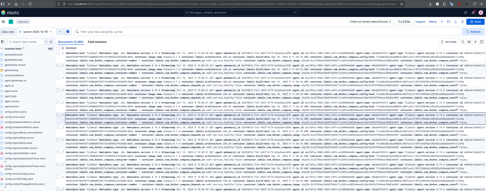

# Домашнее задание к занятию «Микросервисы: подходы»

Вы работаете в крупной компании, которая строит систему на основе микросервисной архитектуры.
Вам как DevOps-специалисту необходимо выдвинуть предложение по организации инфраструктуры для разработки и эксплуатации.


## Задача 1: Обеспечить разработку

    Предложите решение для обеспечения процесса разработки: хранение исходного кода, непрерывная интеграция и непрерывная поставка. 
    Решение может состоять из одного или нескольких программных продуктов и должно описывать способы и принципы их взаимодействия.

    Решение должно соответствовать следующим требованиям:
    - облачная система;
    - система контроля версий Git;
    - репозиторий на каждый сервис;
    - запуск сборки по событию из системы контроля версий;
    - запуск сборки по кнопке с указанием параметров;
    - возможность привязать настройки к каждой сборке;
    - возможность создания шаблонов для различных конфигураций сборок;
    - возможность безопасного хранения секретных данных (пароли, ключи доступа);
    - несколько конфигураций для сборки из одного репозитория;
    - кастомные шаги при сборке;
    - собственные докер-образы для сборки проектов;
    - возможность развернуть агентов сборки на собственных серверах;
    - возможность параллельного запуска нескольких сборок;
    - возможность параллельного запуска тестов.

    Обоснуйте свой выбор.
---

## Решение

По выдвинутым требованиям трудно определить следующие базовые критерии:

- Облочнное решение может быть развернуто приватно, ведь компания крупная, нельзя исключать такую возможность. Это в свою очередь влечет ряд изменений в подходах к реализации и стоимости внедрения и владения. В некоторых компаниях может быть требование хранить все в собственных ДС.
- В частности в России (на 90% уверен что я как DevOps-специалист на текущих реалиях буду работать и решать эту задачу в Российской компании) могут существовать ряд требований и даже если их нет - ситуация подталкивает думать о независимости и гарантиях от негативных факторов санкционного давления. Согласитесь, что неожиданно потерять доступ к инфраструктуре - плохая ситуация. Т.е. тут надо определится на берегу, возможно рассмотреть решения от Сбер, Develocart или подобных, изучение любого из этих вариантов обеспечит независимое жизнеспособные решения в будущем.
- В данной ситуации выбор явно в пользу GitLab, но в выбором версии CE/EE - сильно зависит от предыдущих двух пунктов.

Т.к. эти моменты не озвучены в задании, буду использовать инструменты из курса, и Российскую крупную компанию.
Т.о. по пунктам требований:

- облачная система;
    - Может быть приватной, развернута у провайдера (Yandex Cloud, VK, и т.д.)
- система контроля версий Git;
    - GitLab - полная поддержка
- репозиторий на каждый сервис;
    - GitLab - любое количество проектов
- запуск сборки по событию из системы контроля версий;
    - GitLab - webhooks и GitLab CI работают
- запуск сборки по кнопке с указанием параметров;
    - GitLab - в CE можно запускать pipeline вручную с переменными, но UI ограничен в EE все есть. Но можно использовать REST API и как-то решить эти недостатки и не связываться с EE
- возможность привязать настройки к каждой сборке;
    - GitLab - через variables в pipeline и CI/CD Variables в UI
- возможность создания шаблонов для различных конфигураций сборок;
    - GitLab - в CE нет group-level CI templates (доступна в EE). Но можно хранить шаблоны в отдельном GitLab-проекте и подключать их по include
- возможность безопасного хранения секретных данных (пароли, ключи доступа);
    - GitLab - в CE нет интеграции с внешними secret managers (опять отсыл к  EE), секреты хранятся только в БД GitLab, но можно поднять свой HashiCorp Vault и как-то жить с этим
- несколько конфигураций для сборки из одного репозитория;
    - GitLab - через rules, variables
- кастомные шаги при сборке;
    - GitLab - можно через shell скрипты
- собственные докер-образы для сборки проектов;
    - GitLab - через GitLab Container Registry
- возможность развернуть агентов сборки на собственных серверах;
    - GitLab - можно, но в EE удобней
- возможность параллельного запуска нескольких сборок;
    - GitLab - несколько руннеров потребуется
- возможность параллельного запуска тестов.
    - GitLAb - в CE это есть

**Т.е. GitLab здесь перекрывает все требования своими возможностями и будет логичным выбором для решения.** 

Но так-же возможно здесь использовать комбинацию например GitHub + Jenkins + HashiCorp Vault + Docker Registry - она вполне способна закрыть все требования,
но потребует больше ресурсов и работы, чем GitLab 

---


## Задача 2: Логи

    Предложите решение для обеспечения сбора и анализа логов сервисов в микросервисной архитектуре.
    Решение может состоять из одного или нескольких программных продуктов и должно описывать способы и принципы их взаимодействия.

    Решение должно соответствовать следующим требованиям:
    - сбор логов в центральное хранилище со всех хостов, обслуживающих систему;
    - минимальные требования к приложениям, сбор логов из stdout;
    - гарантированная доставка логов до центрального хранилища;
    - обеспечение поиска и фильтрации по записям логов;
    - обеспечение пользовательского интерфейса с возможностью предоставления доступа разработчикам для поиска по записям логов;
    - возможность дать ссылку на сохранённый поиск по записям логов.

    Обоснуйте свой выбор.
---

## Решение

Для обеспечения сбора и анализа логов в микросервисной архитектуре популярно решение ELK, но в нем Logstash - слабое звено, он может терять сообщения, а в требованиях есть задача - гарантированная доставка логов до центрального хранилища. Эту проблему можно решить заменив Logstash на Vector который прекрасно сочетает мощность обработки данных, подобную Logstash, с гарантиями доставки.  

Обосную исходя из требований:

- сбор логов в центральное хранилище со всех хостов, обслуживающих систему;
    - Filebeat отправляет логи в центральный коллектор Vector, который перенаправляет данные в Elasticsearch.
- минимальные требования к приложениям, сбор логов из stdout;
    - Filebeat собирает логи из stdout запущенных сервисов
- гарантированная доставка логов до центрального хранилища;
    - Filebeat, использует буферизацию и повторные попытки отправки сообщений в случае сбоев сети или недоступности коллектора (Vector). Вектор обеспечивает гарантированную доставку до Elasticsearch, что означает, что каждое событие будет доставлено без дублей и без потерь. Именно эта характеристика отличает Vector от Logstash, который при сбоях может потерять данные.
- обеспечение поиска и фильтрации по записям логов;
    - Elasticsearch индексирует поступившие логи, позволяя производить полнотекстовые поиски, агрегацию и сортировку данных.
- обеспечение пользовательского интерфейса с возможностью предоставления доступа разработчикам для поиска по записям логов;
    - Kibana предоставляет удобный интерфейс для просмотра, фильтрации и анализа логов.
- возможность дать ссылку на сохранённый поиск по записям логов.
    - В Kibana можно сохранять запросы и дашборды, которыми можно поделиться через ссылку

**Т.о. стек - Filebeat как агент, Elasticsearch, Vector и Kibana обеспечивает отказоустойчивый и эффективный сбор и анализ логов, соответствующий всем указанным требованиям.**

## Задача 3: Мониторинг

    Предложите решение для обеспечения сбора и анализа состояния хостов и сервисов в микросервисной архитектуре.
    Решение может состоять из одного или нескольких программных продуктов и должно описывать способы и принципы их взаимодействия.

    Решение должно соответствовать следующим требованиям:
    - сбор метрик со всех хостов, обслуживающих систему;
    - сбор метрик состояния ресурсов хостов: CPU, RAM, HDD, Network;
    - сбор метрик потребляемых ресурсов для каждого сервиса: CPU, RAM, HDD, Network;
    - сбор метрик, специфичных для каждого сервиса;
    - пользовательский интерфейс с возможностью делать запросы и агрегировать информацию;
    - пользовательский интерфейс с возможностью настраивать различные панели для отслеживания состояния системы.

    Обоснуйте свой выбор.
---

## Решение

Для наблюдения за микросервисами и контейнерами активно применяют Prometheus — это ведущая открытая система мониторинга и оповещения, которая умеет собирать метрики не только с хостов но и с контейнеров и даже служб за счет специальных библиотек - экспортеров доступных для различных языков. За счет этого мы получаем возможность наблюдать за производительностью и состоянием приложений на всех уровнях, от фронтенда до бэкенда, обеспечивая целостность мониторинга всей микросервисной архитектуры.

Согласно требованиям требованиям для Prometheus:
- _сбор метрик со всех хостов, обслуживающих систему, их состояния ресурсов: CPU, RAM, HDD, Network;_  
    ► Используем Node Exporter — это специальный агент - экспортер Prometheus, разработанный для сбора метрик с операционных систем - с хостов.
- _сбор метрик потребляемых ресурсов для каждого сервиса: CPU, RAM, HDD, Network;_  
    ► cAdvisor — это экспортер для мониторинга потребления ресурсов контейнерами, он собирает метрики о потреблении ресурсов каждым контейнером, CPU, RAM, диск, сеть. 
- _сбор метрик, специфичных для каждого сервиса;_  
    ► Экспортёры интегрированные в сервис через специальные prometheus client libraries, которые служат для непосредственной публикации метрик в формате, понятном Prometheus. Доступны для JavaScript, Python, Go, Rust, c/c++ и других языков программирования.  
    ► Автономные экспортеры (standalone exporters) - отдельное программное обеспечение, работающее вне контролируемого сервиса. Они собирают метрики из систем, которые не поддерживают публикацию метрик напрямую (аппаратные датчики, MySQL, PostgreSQL, Nginx, Apache...).
- _пользовательский интерфейс с возможностью делать запросы и агрегировать информацию, настраивать различные панели для отслеживания состояния системы;_  
    ► Grafana — это мощный инструмент визуализации данных и построения панелей мониторинга в реальном времени.

Т.о. стек: Prometheus Exporters - Prometheus - Grafana. Применяются повсеместно, доказали свою надежность и масштабируемость, простоту установки и конфигурации, open source решения, бесплатные и поддерживаемые широким сообществом.  
**Эта связка удовлетворяет всем предъявленным требованиям и обеспечивает эффективное наблюдение за состоянием микросервисной архитектуры**

---
## Задача 4: Логи * (необязательная)

    Продолжить работу по задаче API Gateway: сервисы, используемые в задаче, пишут логи в stdout. 

    Добавить в систему сервисы для сбора логов Vector + ElasticSearch + Kibana со всех сервисов, обеспечивающих работу API.

    ### Результат выполнения: 

    docker compose файл, запустив который можно перейти по адресу http://localhost:8081, по которому доступна Kibana.
    Логин в Kibana должен быть admin, пароль qwerty123456.

---

## Решение

- [docker-compose.yaml](api-gateway/docker-compose.yaml) 
- Добавил еще filebeat с отправкой логов через Vector в ELK. Логин в Kibana  admin/qwerty123456 задается через .env и создаются в elk-setup контейнере.

    
    

#### Отладка Vector
```
$ docker exec -it filebeat filebeat test output
logstash: vector:6000...
  connection...
    parse host... OK
    dns lookup... OK
    addresses: 172.18.0.2
    dial up... OK
  TLS... WARN secure connection disabled
  talk to server... OK

$ docker exec -it vector vector validate /etc/vector/vector.yaml
√ Loaded ["/etc/vector/vector.yaml"]
2025-10-19T11:21:32.696579Z  WARN sink{component_kind="sink" component_id=es_cluster component_type=elasticsearch}: vector_core::tls::settings: The `verify_certificate` option is DISABLED, this may lead to security vulnerabilities.
√ Component configuration
√ Health check "debug_console"
√ Health check "es_cluster"
------------------------------------
                           Validated  
```
#### Oтладка ElasticSearch 
```
$ curl -u elastic:ElasticTest -k "https://localhost:9200/_cat/indices?v"
health status index                                                              uuid                   pri rep docs.count docs.deleted store.size pri.store.size dataset.size
green  open   .internal.alerts-transform.health.alerts-default-000001            x3wDCUVrRsqAvy_ALYc4bQ   1   0          0            0       249b           249b         249b
yellow open   vector-2025-10-19                                                  NZcOD4FjRRKUPezkFSMLoQ   1   1      38874            0     30.1mb         30.1mb       30.1mb
....
```
- Для удаления индекса с неудачным контентом
curl -u elastic:ElasticTest -k -X DELETE "https://localhost:9200/vector-2025-10-19"


## Задача 5: Мониторинг * (необязательная)

Продолжить работу по задаче API Gateway: сервисы, используемые в задаче, предоставляют набор метрик в формате prometheus:

- сервис security по адресу /metrics,
- сервис uploader по адресу /metrics,
- сервис storage (minio) по адресу /minio/v2/metrics/cluster.

Добавить в систему сервисы для сбора метрик (Prometheus и Grafana) со всех сервисов, обеспечивающих работу API.
Построить в Graphana dashboard, показывающий распределение запросов по сервисам.

### Результат выполнения: 

docker compose файл, запустив который можно перейти по адресу http://localhost:8081, по которому доступна Grafana с настроенным Dashboard.
Логин в Grafana должен быть admin, пароль qwerty123456.

---

### Как оформить ДЗ?

Выполненное домашнее задание пришлите ссылкой на .md-файл в вашем репозитории.

---
