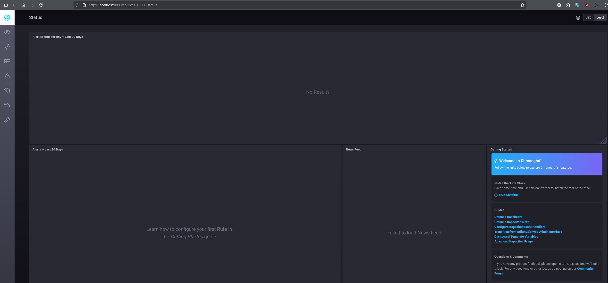
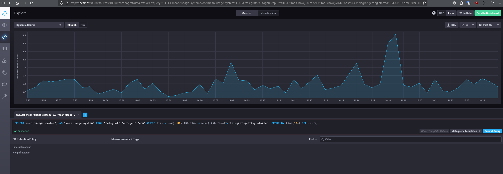
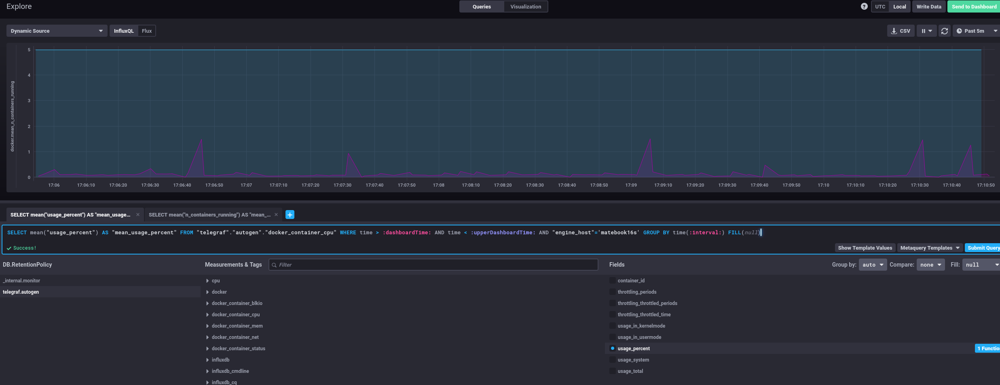
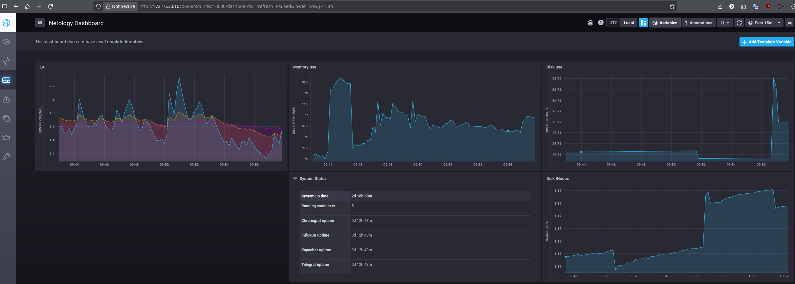

# Домашнее задание к занятию "13.Системы мониторинга"

## Обязательные задания

1. _Вас пригласили настроить мониторинг на проект. На онбординге вам рассказали, что проект представляет из себя 
платформу для вычислений с выдачей текстовых отчетов, которые сохраняются на диск. Взаимодействие с платформой 
осуществляется по протоколу http. Также вам отметили, что вычисления загружают ЦПУ. Какой минимальный набор метрик вы
выведите в мониторинг и почему?_
---

  - Из условия понятно, что сервис:  

    1. Активно работает с вычислениями и грузит ЦПУ. 
    2. Производит регулярную запись данных на диск.
    3. Взаимодействует по HTTP  

  - Минимальные требования мониторинга здесь в соответствии с перечисленными пунктами 1-3:  

    1. **LA** - Необходимо мониторить загруженность процессора(ов). Это необходимо для своевременной корректировки вычислительной мощности. Т.е. можно добавить (или уменьшить количество ядер) или использовать более подходящие по архитектуре процессоры. Этим дать сервису недостающей вычислительной мощности или наоборот - убрать лишние ресурсы СПУ при малой загруженности.  
    Тем самым оптимизировать качество работы сервиса и затраты.  

    2. **%Utilization и %INodes** - надо следить за свободным местом на диске и количеством файлов, иначе место может закончится.   

      **Queue Length, Latency** - оба значения будут показателями, по которым можно сделать выводы о работе системы хранения - справляется она с нагрузкой или требуется мероприятия по оптимизации.  

    3. **Время отклика** и **количество ответов с HTTP-кодами 4хх/5xx** от http сервера, в рамках ограниченого периода, может быть следствием перегрузок из пп 1-2 или сбоем в работе сервиса.
  
#
2. _Менеджер продукта посмотрев на ваши метрики сказал, что ему непонятно что такое RAM/inodes/CPUla. Также он сказал, что хочет понимать, насколько мы выполняем свои обязанности перед клиентами и какое качество обслуживания. Что вы можете ему предложить?_
---
  - Надо интерпретировать технические метрики в понятные менеджеру значения например SLI.
  Предоставить SLI, расчитаный на базе технических метрик, как текущий показатель указывающий на соответствие или не соответствие уровню обслуживания SLO.
  

#
3. _Вашей DevOps команде в этом году не выделили финансирование на построение системы сбора логов. Разработчики в свою очередь хотят видеть все ошибки, которые выдают их приложения. Какое решение вы можете предпринять в этой ситуации, чтобы разработчики получали ошибки приложения?_
---
  - Ключевой момент - предпринять). Т.е. финансирования нет, но сделать надо **чтобы разработчики получали ошибки приложения**  

    **=>** Развернуть готовое Open Source решение по сбору и поставке ошибок приложений. 

    Например, из лекции и поиска сразу выплывает [Sentry](https://sentry.io/pricing/) где доступно:  
      - SaaS-версия (облачная)  
      Тариф "Developer": Бесплатный тариф с ежемесячным лимитом в 10 000 багов. 
      - Self-Hosted версия предлагает тот же функционал, что и облачная версия

    Self-Hosted Sentry - это как раз бесплатное ПО с открытым исходным кодом. Много информации: 
     - [Sentry: мониторинг и отслеживание ошибок](https://help.sweb.ru/sentry-monitoring-i-otslezhivanie-oshibok_1383.html)
     - [Self-Hosted Sentry](https://develop.sentry.dev/self-hosted/)
     - [GitHub](https://github.com/getsentry/self-hosted?tab=readme-ov-file)

#
4. _Вы, как опытный SRE, сделали мониторинг, куда вывели отображения выполнения SLA=99% по http кодам ответов. Вычисляете этот параметр по следующей формуле: summ_2xx_requests/summ_all_requests. Данный параметр не поднимается выше 70%, но при этом в вашей системе нет кодов ответа 5xx и 4xx. Где у вас ошибка?_

  - Ну предположу, что коды перенаправления 3хх могут быть весомой суммой в данном случае и 
  SLI = (summ_2xx_requests + **summ_3xx_requests**) / (summ_all_requests) покажет более похожее для целевой SLA значение.

#
5. _Опишите основные плюсы и минусы pull и push систем мониторинга._
---

  - Т.к. сервер аккумулирует метрики:  

    - __PUSH (пушат клиенты):__  
    ++ Более гибкая и универсальная модель  
    ++ При большом количестве клиентов, серверу легче - он только получает и не занимается организацией отправки.  
    ++ UDP - быстрее  
    ++ Нет необходимости установки клиенских агентов  
    -- Может перегрузить сервер, если тот не успевает собирать все пакеты  
    -- UDP, нет хранения на клиенте - потенциальная потеря пакетов метрик  

    - __PULL (забирает сервер):__  
    ++ Гарантированная доставка  
    ++ Полный контроль над организацией сбора метрик  
    -- Больше нагрузка, т.к. надо обслуживать процесс сбора метрик  
    -- Требует установки специального агента на клиенте  
    -- Медленней  

#
6. _Какие из ниже перечисленных систем относятся к push модели, а какие к pull? А может есть гибридные?_
---
  - Prometheus - **pull**
  - TICK - **гибрид**
  - Zabbix - **гибрид**
  - VictoriaMetrics - **pull**, есть push интеграции
  - Nagios - **pull**, но может работать с push клиентами

#
7. _Склонируйте себе [репозиторий](https://github.com/influxdata/sandbox/tree/master) и запустите TICK-стэк, 
используя технологии docker и docker-compose._
_В виде решения на это упражнение приведите скриншот веб-интерфейса ПО chronograf (`http://localhost:8888`)._ 

---
  - **Что сделал:**
    - Скрипт sandbox требует адаптации: docker-compose -> docker compose
    - Все Dockerfile содержат неверное чтение переменной из .env: val=$VAR -> val=${VAR}
    - sudo chown -R 999:999 ./kapacitor/data
    - sudo chown -R 999:999 ./chronograf
    - Для доступа к docker.sock добавить № группы docker в docker-compose.yaml для telegraf. Закомментировать непотдерживаемые парамметры для конфига telegram
    - По непонятным причинам chronograf не отдавал WebUI с хоста по localhost:8888 (по ip хоста работает, по localhost - нет).  
    После смены 8888 на 5555 - завелось с localhost.  
    Прописал через docker-compose в environment согласно [Chronograf service options](https://docs.influxdata.com/chronograf/v1/administration/config-options/)  
    
    

#
8.  _Перейдите в веб-интерфейс Chronograf (http://localhost:8888) и откройте вкладку Data explorer._
        
    - _Нажмите на кнопку Add a query_
    - _Изучите вывод интерфейса и выберите БД telegraf.autogen_
    - _В `measurments` выберите cpu->host->telegraf-getting-started, а в `fields` выберите usage_system. Внизу появится график утилизации cpu._
    - _Вверху вы можете увидеть запрос, аналогичный SQL-синтаксису. Поэкспериментируйте с запросом, попробуйте изменить группировку и интервал наблюдений._

    _Для выполнения задания приведите скриншот с отображением метрик утилизации cpu из веб-интерфейса._

    
#
9. _Изучите список [telegraf inputs](https://github.com/influxdata/telegraf/tree/master/plugins/inputs). 
Добавьте в конфигурацию telegraf следующий плагин - [docker](https://github.com/influxdata/telegraf/tree/master/plugins/inputs/docker):
...
После настройке перезапустите telegraf, обновите веб интерфейс и приведите скриншотом список `measurments` в 
веб-интерфейсе базы telegraf.autogen . Там должны появиться метрики, связанные с docker.
Факультативно можете изучить какие метрики собирает telegraf после выполнения данного задания._

    

## Дополнительное задание (со звездочкой*) - необязательно к выполнению

1. _Вы устроились на работу в стартап. На данный момент у вас нет возможности развернуть полноценную систему_
_мониторинга, и вы решили самостоятельно написать простой python3-скрипт для сбора основных метрик сервера. Вы, как_
_опытный системный-администратор, знаете, что системная информация сервера лежит в директории `/proc`._
_Также, вы знаете, что в системе Linux есть  планировщик задач cron, который может запускать задачи по расписанию._

_Суммировав все, вы спроектировали приложение, которое:_
- _является python3 скриптом_
- _собирает метрики из папки `/proc`_
- _складывает метрики в файл 'YY-MM-DD-awesome-monitoring.log' в директорию /var/log (YY - год, MM - месяц, DD - день)_
- _каждый сбор метрик складывается в виде json-строки, в виде:_
  + _timestamp (временная метка, int, unixtimestamp)_
  + _metric1 (метрика 1)_
  + _metric2 (метрика 2)_
  
     ...
     
  + _metricN (метрика N)_
  
- _сбор метрик происходит каждую 1 минуту по cron-расписанию_

_Для успешного выполнения задания нужно привести:_

_a) работающий код python3-скрипта,_

---
  - [код python3-скрипта](Observer/src/observer.py)

б) _конфигурацию cron-расписания,_

---
  ```
  * * * * * python3 /usr/bin/observer.py
  ```

в) _пример верно сформированного 'YY-MM-DD-awesome-monitoring.log', имеющий не менее 5 записей,_
_P.S.: количество собираемых метрик должно быть не менее 4-х._
_P.P.S.: по желанию можно себя не ограничивать только сбором метрик из `/proc`._

---
  ```shell
  odv@matebook16s:/var/log$ cat 25-09-21-awesome-monitoring.log 
  {"timestamp": "1758446401", "load1": 2.15, "load5": 2.06, "load15": 1.79, "MemTotal": 16090520, "MemAvailable": 6322300, "/dev/nvme0n1p5": 64, "/dev/nvme0n1p1": 69}
  {"timestamp": "1758446461", "load1": 2.17, "load5": 2.08, "load15": 1.82, "MemTotal": 16090520, "MemAvailable": 6307800, "/dev/nvme0n1p5": 64, "/dev/nvme0n1p1": 69}
  {"timestamp": "1758446521", "load1": 2.12, "load5": 2.08, "load15": 1.84, "MemTotal": 16090520, "MemAvailable": 6278312, "/dev/nvme0n1p5": 64, "/dev/nvme0n1p1": 69}
  {"timestamp": "1758446581", "load1": 2.28, "load5": 2.13, "load15": 1.87, "MemTotal": 16090520, "MemAvailable": 6277884, "/dev/nvme0n1p5": 64, "/dev/nvme0n1p1": 69}
  {"timestamp": "1758446641", "load1": 2.72, "load5": 2.26, "load15": 1.93, "MemTotal": 16090520, "MemAvailable": 6268436, "/dev/nvme0n1p5": 64, "/dev/nvme0n1p1": 69}
  {"timestamp": "1758456515", "load1": 2.69, "load5": 2.32, "load15": 1.98, "MemTotal": 16090520, "MemAvailable": 5933008, "/dev/nvme0n1p5": 64, "/dev/nvme0n1p1": 69}
  {"timestamp": "1758456541", "load1": 2.36, "load5": 2.28, "load15": 1.97, "MemTotal": 16090520, "MemAvailable": 6020716, "/dev/nvme0n1p5": 64, "/dev/nvme0n1p1": 69}
  {"timestamp": "1758456601", "load1": 2.34, "load5": 2.29, "load15": 2.0, "MemTotal": 16090520, "MemAvailable": 6497780, "/dev/nvme0n1p5": 64, "/dev/nvme0n1p1": 69}
  {"timestamp": "1758456661", "load1": 2.31, "load5": 2.28, "load15": 2.01, "MemTotal": 16090520, "MemAvailable": 6323232, "/dev/nvme0n1p5": 64, "/dev/nvme0n1p1": 69}
  {"timestamp": "1758456721", "load1": 2.17, "load5": 2.24, "load15": 2.01, "MemTotal": 16090520, "MemAvailable": 6489700, "/dev/nvme0n1p5": 64, "/dev/nvme0n1p1": 69}
  {"timestamp": "1758456781", "load1": 2.27, "load5": 2.26, "load15": 2.03, "MemTotal": 16090520, "MemAvailable": 6446916, "/dev/nvme0n1p5": 64, "/dev/nvme0n1p1": 69}
  {"timestamp": "1758456841", "load1": 2.21, "load5": 2.25, "load15": 2.04, "MemTotal": 16090520, "MemAvailable": 6463624, "/dev/nvme0n1p5": 64, "/dev/nvme0n1p1": 69}
  {"timestamp": "1758456901", "load1": 2.25, "load5": 2.25, "load15": 2.05, "MemTotal": 16090520, "MemAvailable": 6463112, "/dev/nvme0n1p5": 64, "/dev/nvme0n1p1": 69}
  ```

2. _В веб-интерфейсе откройте вкладку `Dashboards`. Попробуйте создать свой dashboard с отображением:_

    - _утилизации ЦПУ_
    - _количества использованного RAM_
    - _утилизации пространства на дисках_
    - _количество поднятых контейнеров_
    - -аптайм_
    - ...
    - _фантазируйте)_
    
---

  1. [Установим на целевой сервер telegtaf](https://github.com/influxdata/telegraf/releases)
  2. Добавим в /etc/telegraf/telegraf.conf [[inputs.system]] плагин. Рестартанем сервис
  3. В System Status из скриншота ниже поигрался с Flux. Основная идея - компактное размещение метрик из одного текущего значения в таблице:

    


