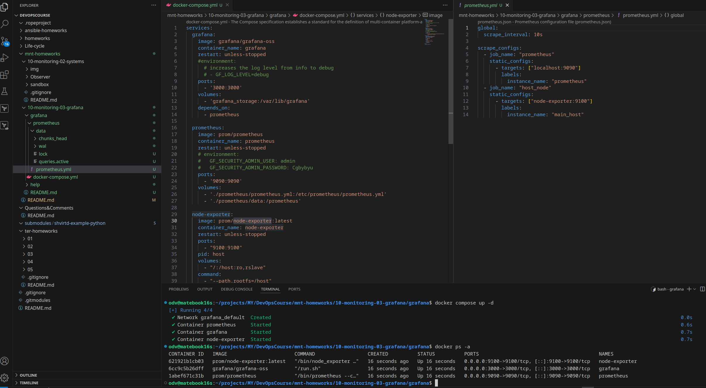
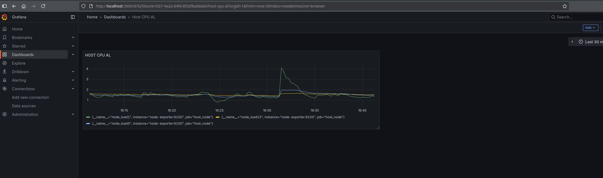
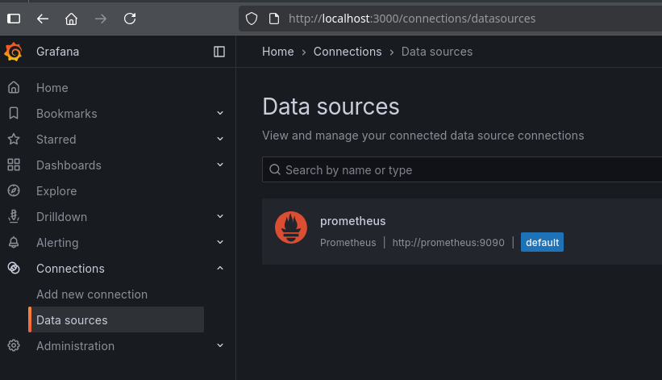
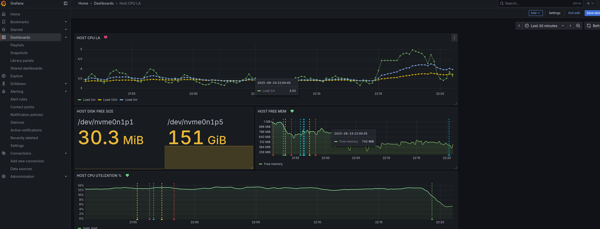
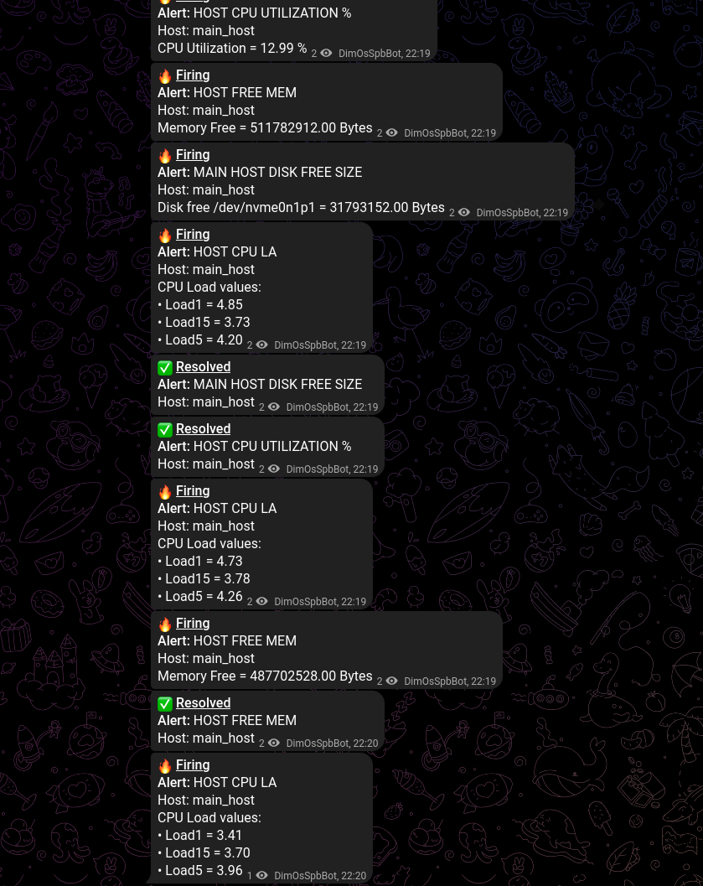

# Домашнее задание к занятию 14 «Средство визуализации Grafana»

## Задание повышенной сложности

    **При решении задания 1** не используйте директорию [help](./help) для сборки проекта. Самостоятельно разверните grafana, где в роли источника данных будет выступать prometheus, а сборщиком данных будет node-exporter:

    - grafana;
    - prometheus-server;
    - prometheus node-exporter.

    За дополнительными материалами можете обратиться в официальную документацию grafana и prometheus.

    В решении к домашнему заданию также приведите все конфигурации, скрипты, манифесты, которые вы 
    использовали в процессе решения задания.

 - [Буду собирать три сервиса через docker-compose](https://grafana.com/docs/grafana/latest/setup-grafana/configure-docker/)
 - Для данных prometheus:

```shell
docker run --rm -it --entrypoint sh prom/prometheus:latest -c "id"
sudo chown -R 65534:65534 ./prometheus/
```
 - Для grafana делал по аналогии, с анализом логов...  





    ## Обязательные задания

    ### Задание 1

    1. Используя директорию [help](./help) внутри этого домашнего задания, запустите связку prometheus-grafana.
    1. Зайдите в веб-интерфейс grafana, используя авторизационные данные, указанные в манифесте docker-compose.
    1. Подключите поднятый вами prometheus, как источник данных.
    1. Решение домашнего задания — скриншот веб-интерфейса grafana со списком подключенных Datasource.

---


## Задание 2

    Изучите самостоятельно ресурсы:

    1. [PromQL tutorial for beginners and humans](https://valyala.medium.com/promql-tutorial-for-beginners-9ab455142085).
    1. [Understanding Machine CPU usage](https://www.robustperception.io/understanding-machine-cpu-usage).
    1. [Introduction to PromQL, the Prometheus query language](https://grafana.com/blog/2020/02/04/introduction-to-promql-the-prometheus-query-language/).

    Создайте Dashboard и в ней создайте Panels:
    Для решения этого задания приведите promql-запросы для выдачи этих метрик, а также скриншот получившейся Dashboard.

---
# Promql-запросы:

- _утилизация CPU для nodeexporter (в процентах, 100-idle);_

**100 - (avg by (instance) (rate(node_cpu_seconds_total{instance_name="main_host", mode="idle"}[30s])) * 100)**

- _CPULA 1/5/15;_

**{__name__=~"node_load(1|5|15)", instance="node-exporter:9100"}**

- _количество свободной оперативной памяти;_

**node_memory_MemFree_bytes{instance_name="main_host"}**

- _количество места на файловой системе._

**node_filesystem_avail_bytes{fstype!~"tmpfs|overlay|cifs", instance_name="main_host"}**




## Задание 3

1. Создайте для каждой Dashboard подходящее правило alert — можно обратиться к первой лекции в блоке «Мониторинг».
1. В качестве решения задания приведите скриншот вашей итоговой Dashboard.
**При решении задания 3** вы должны самостоятельно завести удобный для вас канал нотификации, например, Telegram или email, и отправить туда тестовые события.

В решении приведите скриншоты тестовых событий из каналов нотификаций.

---

- Для парсинга алертов темплейта telegram пришлось прокинуть в контейнер grafana [фиктивных Provisioned алертов с нужными labels](grafana_home/grafana/alerting/alerts.yaml) в UI алерта не добавить свои labels, а так ини появились в списках. Т.о. можно красиво разобрать алерты в [telegram custom template](grafana_home/grafana/keep_work/telegram.gotmpl)




## Задание 4

1. Сохраните ваш Dashboard.Для этого перейдите в настройки Dashboard, выберите в боковом меню «JSON MODEL». Далее скопируйте отображаемое json-содержимое в отдельный файл и сохраните его.
1. В качестве решения задания приведите листинг этого файла.

---
[Dashboard.json](grafana_home/grafana/Dashboard.json)


