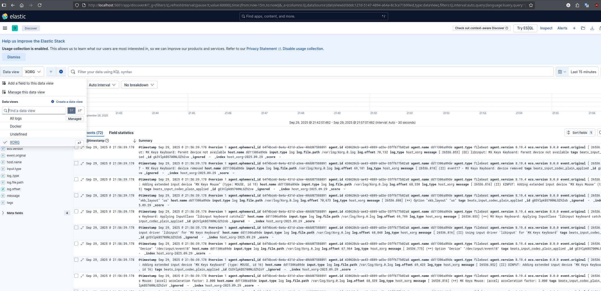

# Домашнее задание к занятию 15 «Система сбора логов Elastic Stack»

    ## Дополнительные ссылки

    При выполнении задания используйте дополнительные ресурсы:

    - [поднимаем elk в docker](https://www.elastic.co/guide/en/elastic-stack-get-started/current/get-started-docker.html);
    - [поднимаем elk в docker с filebeat и docker-логами](https://www.sarulabs.com/post/5/2019-08-12/sending-docker-logs-to-elasticsearch-and-kibana-with-filebeat.html);
    - [конфигурируем logstash](https://www.elastic.co/guide/en/logstash/current/configuration.html);
    - [плагины filter для logstash](https://www.elastic.co/guide/en/logstash/current/filter-plugins.html);
    - [конфигурируем filebeat](https://www.elastic.co/guide/en/beats/libbeat/5.3/config-file-format.html);
    - [привязываем индексы из elastic в kibana](https://www.elastic.co/guide/en/kibana/current/index-patterns.html);
    - [как просматривать логи в kibana](https://www.elastic.co/guide/en/kibana/current/discover.html);
    - [решение ошибки increase vm.max_map_count elasticsearch](https://stackoverflow.com/questions/42889241/how-to-increase-vm-max-map-count).

    В процессе выполнения в зависимости от системы могут также возникнуть не указанные здесь проблемы.

    Используйте output stdout filebeat/kibana и api elasticsearch для изучения корня проблемы и её устранения.

    ## Задание повышенной сложности

    Не используйте директорию [help](./help) при выполнении домашнего задания.

## Задание 1

    Вам необходимо поднять в докере и связать между собой:

    - elasticsearch (hot и warm ноды);
    - logstash;
    - kibana;
    - filebeat.

    Logstash следует сконфигурировать для приёма по tcp json-сообщений.

    Filebeat следует сконфигурировать для отправки логов docker вашей системы в logstash.

    В директории [help](./help) находится манифест docker-compose и конфигурации filebeat/logstash для быстрого 
    выполнения этого задания.

    Результатом выполнения задания должны быть:

    - скриншот `docker ps` через 5 минут после старта всех контейнеров (их должно быть 5);
    - скриншот интерфейса kibana;
    - docker-compose манифест (если вы не использовали директорию help);
    - ваши yml-конфигурации для стека (если вы не использовали директорию help).

---
## Решение. Задание 1*

- Каталог help не использую, ставлю стек самостоятельно через docker compose.
    - [The Elastic Stack](https://www.elastic.co/docs/get-started/the-stack)
    - [Start a single-node cluster in Docker](https://www.elastic.co/docs/deploy-manage/deploy/self-managed/install-elasticsearch-docker-basic)
    - [Configure and start the cluster](https://www.elastic.co/docs/deploy-manage/deploy/self-managed/install-elasticsearch-docker-compose)

- Чтобы Elasticsearch и Kibana могли работать по HTTPS и доверять друг другу, нужно сгенерировать сертификаты для них. в [примере сборки кластера](https://github.com/elastic/elasticsearch/blob/main/docs/reference/setup/install/docker/docker-compose.yml) это делается через комманды Elasticsearch с созданием общего volume для сертификатов. Kibana ждет выполнения этой работы, и только потом стартует сама.  
Будем делать по аналогии.

- Elasticsearch использует очень много memory-mapped файлов. Linux ограничивает их через параметр vm.max_map_count это ~65K (65530), а Elasticsearch требует минимум 262144, по этому надо на хосте добавить (перманентно в /etc/sysctl.conf vm.max_map_count=262144) ++ [Increase ulimits for nofile and nproc](https://www.elastic.co/docs/deploy-manage/deploy/self-managed/install-elasticsearch-docker-prod): 
```
sudo sysctl -w vm.max_map_count=262144
```
- Конфиг filebeat.yml должен принадлежать root, и меть права не шире 0644. Иначе Filebeat падает с ошибкой.
```
sudo chown root:root filebeat/filebeat.yml
sudo chmod 0644 filebeat/filebeat.yml
```



- [docker-compose](ELK/docker-compose.yml)
- filebeat.yml 
```ini
filebeat.inputs:
  - type: container
    paths: 
      - '/var/lib/docker/containers/*/*.log'
    fields:
      log_type: docker
    fields_under_root: true

    processors:
      - add_docker_metadata:
          host: "unix:///var/run/docker.sock"
      - decode_json_fields:
          fields: ["message"]
          target: "json"
          overwrite_keys: true

# Это как вариант...
  - type: log
    enabled: true
    fields:
      log_type: host_xorg
    paths:
      - /var/log/Xorg.0.log
    fields_under_root: true


output.logstash:
  hosts: ["logstash:5044"]

logging.json: true
logging.metrics.enabled: false

```
- [logstash pipeline](ELK/logstash/pipeline/filebeat.conf)
- [logstash configs all](ELK/logstash)
- [Все здесь](ELK)


 