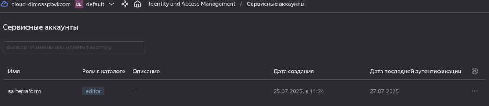
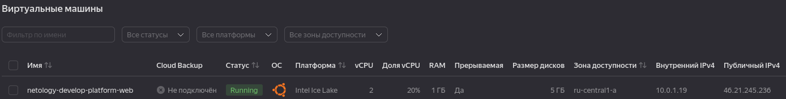
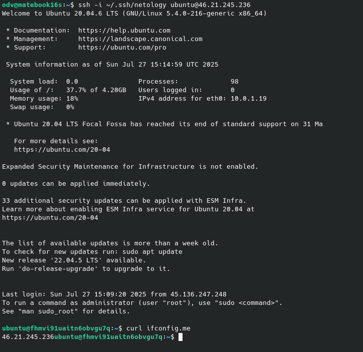
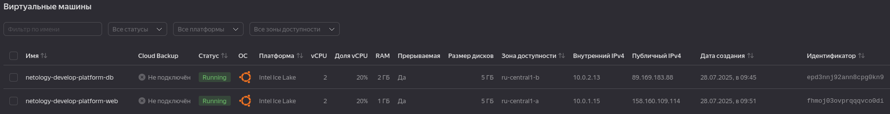

# Домашнее задание к занятию «Основы Terraform. Yandex Cloud»

### Цели задания

1. Создать свои ресурсы в облаке Yandex Cloud с помощью Terraform.
2. Освоить работу с переменными Terraform.


### Задание 1

Убедитесь что ваша версия **Terraform** ~>1.8.4

  ```shell
  terraform -v
  Terraform v1.12.0
  on linux_amd64
  ```

1. Изучите проект. В файле variables.tf объявлены переменные для Yandex provider.
2. Создайте сервисный аккаунт и ключ. [service_account_key_file](https://terraform-provider.yandexcloud.net).

  

4. Сгенерируйте новый или используйте свой текущий ssh-ключ. Запишите его открытую(public) часть в переменную **vms_ssh_public_root_key**.
    ```c
    variable "vms_ssh_root_key" {
    type        = string
    default     = "ssh-ed25519 AAAAC3NzaC1l...Vcjy dimosspb@vk.ru"
    ...
    ```
5. Инициализируйте проект, выполните код. Исправьте намеренно допущенные синтаксические ошибки. Ищите внимательно, посимвольно. Ответьте, в чём заключается их суть.
  - . Добавить значения в variables.tf через поля default id облака и каталога (по аналогии с др. переменными, можно еще через variables.auto.tfvars, env или командную строку)
  - Исправить адрес файла с ключем сервисного каталога  в providers.tf, у меня так   ```service_account_key_file = file("~/.secret/key.json"```
  - Исправить ошибку в типе платформы ```platform_id = "standart-v3"``` -> ```standard-v3``` и согласно - [Допустимые конфигурации vCPU и RAM](https://yandex.cloud/ru/docs/compute/concepts/performance-levels) приведем в соответствие значения:
      ```c
        platform_id = "standard-v3"   # Исправим ..art -> ard
      resources {
        cores         = 2             # 1 -> 2
        memory        = 1
        core_fraction = 20            # 5 -> 20
      ```  
6. Подключитесь к консоли ВМ через ssh и выполните команду ``` curl ifconfig.me```...
8. Ответьте, как в процессе обучения могут пригодиться параметры ```preemptible = true``` и ```core_fraction=5``` в параметрах ВМ.

  - Это вопрос ценообразования. Прерываемая вм дешевле, меньше ресурсов потребляет вм - дешевле...

В качестве решения:
  
  
  


### Задание 2

1. Замените все хардкод-**значения** для ресурсов **yandex_compute_image** и **yandex_compute_instance** на **отдельные** переменные. К названиям переменных ВМ добавьте в начало префикс **vm_web_** .  Пример: **vm_web_name**.
2. Объявите нужные переменные в файле variables.tf, обязательно указывайте тип переменной. Заполните их **default** прежними значениями из main.tf. 
3. Проверьте terraform plan. Изменений быть не должно.

    [variables.tf](src/variables.tf), [main.tf](src/main.tf)
    
    ```shell
    odv@matebook16s:~/projects/MY/DevOpsCourse/ter-homeworks/02/src$ terraform apply
    data.yandex_compute_image.ubuntu: Reading...
    yandex_vpc_network.develop: Refreshing state... [id=enpeb6s2laa6a8fjnb36]
    data.yandex_compute_image.ubuntu: Read complete after 0s [id=fd87o7enmgb6d3qrs2lg]
    yandex_vpc_subnet.develop: Refreshing state... [id=e9bqqua2vdgcdnrcjs9b]
    yandex_compute_instance.platform: Refreshing state... [id=fhmvi91uaitn6obvgu7q]

    No changes. Your infrastructure matches the configuration.

    Terraform has compared your real infrastructure against your configuration and found no differences, so no changes are needed.

    Apply complete! Resources: 0 added, 0 changed, 0 destroyed.
    ```

### Задание 3

1. Создайте в корне проекта файл 'vms_platform.tf' . Перенесите в него все переменные первой ВМ.
2. Скопируйте блок ресурса и создайте с его помощью вторую ВМ в файле main.tf: **"netology-develop-platform-db"** ,  ```cores  = 2, memory = 2, core_fraction = 20```. Объявите её переменные с префиксом **vm_db_** в том же файле ('vms_platform.tf').  ВМ должна работать в зоне "ru-central1-b"
3. Примените изменения.

  - Для db в зоне b добавил подсеть "10.0.2.0/24". Соответственно ввел новые и изменил переменные, поднастроил ресурсы.

     


### Задание 4

1. Объявите в файле outputs.tf **один** output , содержащий: instance_name, external_ip, fqdn для каждой из ВМ в удобном лично для вас формате.(без хардкода!!!)
2. Примените изменения.

- [outputs.tf](src/outputs.tf)

    ```shell
    Outputs:

    instances_info = [
      {
        "external_ip" = "158.160.109.114"
        "fqdn" = "fhmoj03ovprqqqvco0di.auto.internal"
        "instance_name" = "netology-develop-platform-web"
      },
      {
        "external_ip" = "89.169.183.88"
        "fqdn" = "epd3nnj92ann8cpg0kn9.auto.internal"
        "instance_name" = "netology-develop-platform-db"
      },
    ]
    ```

  - [Terraform for Expressions](https://developer.hashicorp.com/terraform/language/expressions/for#result-types)
  - [Examples](https://stackoverflow.com/questions/71668905/terraform-building-an-output-map)


### Задание 5

  - [locals.tf](src/locals.tf)


### Задание 6

1. Вместо использования трёх переменных  ".._cores",".._memory",".._core_fraction" в блоке  resources {...}, объедините их в единую map-переменную **vms_resources** и  внутри неё конфиги обеих ВМ в виде вложенного map(object).  
3. Создайте и используйте отдельную map(object) переменную для блока metadata, она должна быть общая для всех ваших ВМ.

- [vms_platform.tf](src/vms_platform.tf), [locals.tf](src/locals.tf), [main.tf](src/main.tf) 
  
5. Найдите и закоментируйте все, более не используемые переменные проекта.
6. Проверьте terraform plan. Изменений быть не должно.

    ```shell
    odv@matebook16s:~/projects/MY/DevOpsCourse/ter-homeworks/02/src$ terraform plan
    data.yandex_compute_image.ubuntu: Reading...
    yandex_vpc_network.develop: Refreshing state... [id=enpeb6s2laa6a8fjnb36]
    data.yandex_compute_image.ubuntu: Read complete after 0s [id=fd8t5r9buvoj23vl655i]
    yandex_vpc_subnet.develop_b: Refreshing state... [id=e2l9rptml7ql0tlpp9tk]
    yandex_vpc_subnet.develop: Refreshing state... [id=e9bqqua2vdgcdnrcjs9b]
    yandex_compute_instance.platform: Refreshing state... [id=fhmhnof2s0pa8neqc9dr]
    yandex_compute_instance.platform_db: Refreshing state... [id=epd42h95d8pregpb4fho]

    No changes. Your infrastructure matches the configuration.

    Terraform has compared your real infrastructure against your configuration and found no differences, so no changes are needed.
    ```

------

## Дополнительное задание (со звёздочкой*)

**Настоятельно рекомендуем выполнять все задания со звёздочкой.**   
Они помогут глубже разобраться в материале. Задания со звёздочкой дополнительные, не обязательные к выполнению и никак не повлияют на получение вами зачёта по этому домашнему заданию. 


------
### Задание 7*

Изучите содержимое файла console.tf. Откройте terraform console, выполните следующие задания: 

1. Напишите, какой командой можно отобразить **второй** элемент списка test_list.
2. Найдите длину списка test_list с помощью функции length(<имя переменной>).
3. Напишите, какой командой можно отобразить значение ключа admin из map test_map.
4. Напишите interpolation-выражение, результатом которого будет: "John is admin for production server based on OS ubuntu-20-04 with X vcpu, Y ram and Z virtual disks", используйте данные из переменных test_list, test_map, servers и функцию length() для подстановки значений.

**Примечание**: если не догадаетесь как вычленить слово "admin", погуглите: "terraform get keys of map"

В качестве решения предоставьте необходимые команды и их вывод.

------

### Задание 8*
1. Напишите и проверьте переменную test и полное описание ее type в соответствии со значением из terraform.tfvars:
```
test = [
  {
    "dev1" = [
      "ssh -o 'StrictHostKeyChecking=no' ubuntu@62.84.124.117",
      "10.0.1.7",
    ]
  },
  {
    "dev2" = [
      "ssh -o 'StrictHostKeyChecking=no' ubuntu@84.252.140.88",
      "10.0.2.29",
    ]
  },
  {
    "prod1" = [
      "ssh -o 'StrictHostKeyChecking=no' ubuntu@51.250.2.101",
      "10.0.1.30",
    ]
  },
]
```
2. Напишите выражение в terraform console, которое позволит вычленить строку "ssh -o 'StrictHostKeyChecking=no' ubuntu@62.84.124.117" из этой переменной.
------

------

### Задание 9*

Используя инструкцию https://cloud.yandex.ru/ru/docs/vpc/operations/create-nat-gateway#tf_1, настройте для ваших ВМ nat_gateway. Для проверки уберите внешний IP адрес (nat=false) у ваших ВМ и проверьте доступ в интернет с ВМ, подключившись к ней через serial console. Для подключения предварительно через ssh измените пароль пользователя: ```sudo passwd ubuntu```

### Правила приёма работыДля подключения предварительно через ssh измените пароль пользователя: sudo passwd ubuntu
В качестве результата прикрепите ссылку на MD файл с описанием выполненой работы в вашем репозитории. Так же в репозитории должен присутсвовать ваш финальный код проекта.

**Важно. Удалите все созданные ресурсы**.


