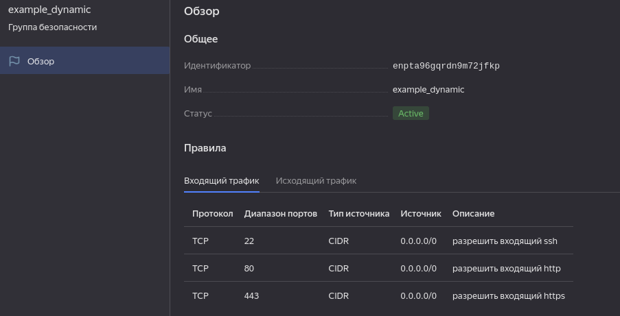
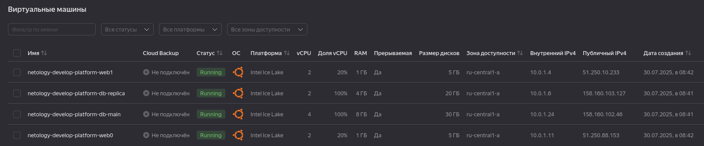
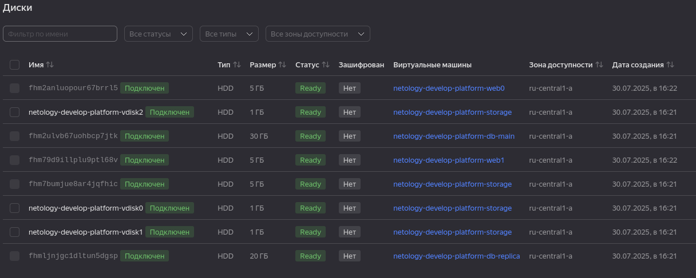

# Домашнее задание к занятию «Управляющие конструкции в коде Terraform»

### Цели задания

1. Отработать основные принципы и методы работы с управляющими конструкциями Terraform.
2. Освоить работу с шаблонизатором Terraform (Interpolation Syntax).

------
### Задание 1

1. Изучите проект.
2. Инициализируйте проект, выполните код. 
3. Приложите скриншот входящих правил «Группы безопасности» в ЛК Yandex Cloud .

    

------

### Задание 2

1. Создайте файл count-vm.tf. Опишите в нём создание двух **одинаковых** ВМ  web-1 и web-2 (не web-0 и web-1) с минимальными параметрами, используя мета-аргумент **count loop**. Назначьте ВМ созданную в первом задании группу безопасности.(как это сделать узнайте в документации провайдера yandex/compute_instance )
2. Создайте файл for_each-vm.tf. Опишите в нём создание двух ВМ для баз данных с именами "main" и "replica" **разных** по cpu/ram/disk_volume , используя мета-аргумент **for_each loop**. Используйте для обеих ВМ одну общую переменную типа:
```
variable "each_vm" {
  type = list(object({  vm_name=string, cpu=number, ram=number, disk_volume=number }))
}
```  
При желании внесите в переменную все возможные параметры.
4. ВМ из пункта 2.1 должны создаваться после создания ВМ из пункта 2.2.

  - Используем depens_on для web.

5. Используйте функцию file в local-переменной для считывания ключа ~/.ssh/id_rsa.pub и его последующего использования в блоке metadata, взятому из ДЗ 2.

  - [В конце variables.tf](variables.tf)

6. Инициализируйте проект, выполните код.

    ```shell
    Plan: 7 to add, 0 to change, 0 to destroy.

    Do you want to perform these actions?
      Terraform will perform the actions described above.
      Only 'yes' will be accepted to approve.

      Enter a value: yes

    yandex_vpc_network.develop: Creating...
    yandex_vpc_network.develop: Creation complete after 4s [id=enp1151fh0updii5msk2]
    yandex_vpc_subnet.develop: Creating...
    yandex_vpc_security_group.example: Creating...
    yandex_vpc_subnet.develop: Creation complete after 0s [id=e9b7sv14s3dofietmohs]
    yandex_vpc_security_group.example: Creation complete after 2s [id=enpto75rhsqulf317ifd]
    yandex_compute_instance.db["replica"]: Creating...
    yandex_compute_instance.db["main"]: Creating...
    yandex_compute_instance.db["replica"]: Still creating... [10s elapsed]
    yandex_compute_instance.db["main"]: Still creating... [10s elapsed]
    yandex_compute_instance.db["main"]: Still creating... [20s elapsed]
    yandex_compute_instance.db["replica"]: Still creating... [20s elapsed]
    yandex_compute_instance.db["replica"]: Still creating... [30s elapsed]
    yandex_compute_instance.db["main"]: Still creating... [30s elapsed]
    yandex_compute_instance.db["replica"]: Still creating... [40s elapsed]
    yandex_compute_instance.db["main"]: Still creating... [40s elapsed]
    yandex_compute_instance.db["main"]: Creation complete after 42s [id=fhmeaqeu209o189c198h]
    yandex_compute_instance.db["replica"]: Still creating... [50s elapsed]
    yandex_compute_instance.db["replica"]: Creation complete after 59s [id=fhmc9aqpb7befpgfv24n]
    yandex_compute_instance.web[0]: Creating...
    yandex_compute_instance.web[1]: Creating...
    yandex_compute_instance.web[1]: Still creating... [10s elapsed]
    yandex_compute_instance.web[0]: Still creating... [10s elapsed]
    yandex_compute_instance.web[1]: Still creating... [20s elapsed]
    yandex_compute_instance.web[0]: Still creating... [20s elapsed]
    yandex_compute_instance.web[0]: Still creating... [30s elapsed]
    yandex_compute_instance.web[1]: Still creating... [30s elapsed]
    yandex_compute_instance.web[0]: Still creating... [40s elapsed]
    yandex_compute_instance.web[1]: Still creating... [40s elapsed]
    yandex_compute_instance.web[1]: Creation complete after 40s [id=fhm4ors4j1e5cpsp68so]
    yandex_compute_instance.web[0]: Creation complete after 43s [id=fhmh1aaunl2qlvdqbanj]

    Apply complete! Resources: 7 added, 0 changed, 0 destroyed.
    ```
    

    ```shell
    odv@matebook16s:~/projects/MY/DevOpsCourse/ter-homeworks/03/src$ terraform destroy
    ...
    ```

------

### Задание 3

1. Создайте 3 одинаковых виртуальных диска размером 1 Гб с помощью ресурса yandex_compute_disk и мета-аргумента count в файле **disk_vm.tf** .

  - [disk_vm.tf](src/disk_vm.tf)
    - _[Создать пустой диск](https://yandex.cloud/ru/docs/compute/operations/disk-create/empty)_

2. Создайте в том же файле **одиночную**(использовать count или for_each запрещено из-за задания №4) ВМ c именем "storage"  . Используйте блок **dynamic secondary_disk{..}** и мета-аргумент for_each для подключения созданных вами дополнительных дисков.

  - [disk_vm.tf](src/disk_vm.tf)
    - _[Dynamic Blocks](https://developer.hashicorp.com/terraform/language/expressions/dynamic-blocks)_

    ```shell
    odv@matebook16s:~/projects/MY/DevOpsCourse/ter-homeworks/03/src$ terraform apply

    ...
    ...

    Plan: 11 to add, 0 to change, 0 to destroy.

    Do you want to perform these actions?
      Terraform will perform the actions described above.
      Only 'yes' will be accepted to approve.

      Enter a value: yes

    yandex_vpc_network.develop: Creating...
    yandex_compute_disk.disks[0]: Creating...
    yandex_compute_disk.disks[1]: Creating...
    yandex_compute_disk.disks[2]: Creating...
    yandex_vpc_network.develop: Creation complete after 3s [id=enp4sl5qbodl0m6otns0]
    yandex_vpc_subnet.develop: Creating...
    yandex_vpc_security_group.example: Creating...
    yandex_vpc_subnet.develop: Creation complete after 0s [id=e9bvidlq4e1q4gd7l7ns]
    yandex_vpc_security_group.example: Creation complete after 2s [id=enpic26qv2uh07trji0i]
    yandex_compute_instance.db["replica"]: Creating...
    yandex_compute_instance.db["main"]: Creating...
    yandex_compute_disk.disks[0]: Still creating... [10s elapsed]
    yandex_compute_disk.disks[1]: Still creating... [10s elapsed]
    yandex_compute_disk.disks[2]: Still creating... [10s elapsed]
    yandex_compute_disk.disks[2]: Creation complete after 10s [id=fhm2fjiopjmtb5rsvkm1]
    yandex_compute_disk.disks[0]: Creation complete after 12s [id=fhmfjsr99hcaoc349s7g]
    yandex_compute_instance.db["replica"]: Still creating... [10s elapsed]
    yandex_compute_instance.db["main"]: Still creating... [10s elapsed]
    yandex_compute_disk.disks[1]: Creation complete after 15s [id=fhmkmnrse5lssdbo3b4p]
    yandex_compute_instance.storage: Creating...
    yandex_compute_instance.db["replica"]: Still creating... [20s elapsed]
    yandex_compute_instance.db["main"]: Still creating... [20s elapsed]
    yandex_compute_instance.storage: Still creating... [10s elapsed]
    yandex_compute_instance.db["main"]: Still creating... [30s elapsed]
    yandex_compute_instance.db["replica"]: Still creating... [30s elapsed]
    yandex_compute_instance.storage: Still creating... [20s elapsed]
    yandex_compute_instance.db["main"]: Still creating... [40s elapsed]
    yandex_compute_instance.db["replica"]: Still creating... [40s elapsed]
    yandex_compute_instance.storage: Still creating... [30s elapsed]
    yandex_compute_instance.db["replica"]: Still creating... [50s elapsed]
    yandex_compute_instance.db["main"]: Still creating... [50s elapsed]
    yandex_compute_instance.storage: Still creating... [40s elapsed]
    yandex_compute_instance.db["main"]: Creation complete after 53s [id=fhmf66j7tsdhbr76of29]
    yandex_compute_instance.db["replica"]: Creation complete after 58s [id=fhmkhura12grfl7i68ae]
    yandex_compute_instance.web[1]: Creating...
    yandex_compute_instance.web[0]: Creating...
    yandex_compute_instance.storage: Creation complete after 50s [id=fhme9vj65iifcm68hu02]
    yandex_compute_instance.web[0]: Still creating... [10s elapsed]
    yandex_compute_instance.web[1]: Still creating... [10s elapsed]
    yandex_compute_instance.web[0]: Still creating... [20s elapsed]
    yandex_compute_instance.web[1]: Still creating... [20s elapsed]
    yandex_compute_instance.web[0]: Still creating... [30s elapsed]
    yandex_compute_instance.web[1]: Still creating... [30s elapsed]
    yandex_compute_instance.web[0]: Still creating... [40s elapsed]
    yandex_compute_instance.web[1]: Still creating... [40s elapsed]
    yandex_compute_instance.web[1]: Creation complete after 49s [id=fhmd195q6msn79qdeaj3]
    yandex_compute_instance.web[0]: Still creating... [50s elapsed]
    yandex_compute_instance.web[0]: Creation complete after 54s [id=fhmdmorpb5hqdkqn6gfa]

    Apply complete! Resources: 11 added, 0 changed, 0 destroyed
    ```

    

------

### Задание 4

1. В файле ansible.tf создайте inventory-файл для ansible.
Используйте функцию tepmplatefile и файл-шаблон для создания ansible inventory-файла из лекции.
Готовый код возьмите из демонстрации к лекции [**demonstration2**](https://github.com/netology-code/ter-homeworks/tree/main/03/demo).
Передайте в него в качестве переменных группы виртуальных машин из задания 2.1, 2.2 и 3.2, т. е. 5 ВМ.

  - НЕ НАШЕЛ, может случайно удален - [**demonstration2**](https://github.com/netology-code/ter-homeworks/tree/main/03/demo), есть **demonstration1**

  - [ansible.tf](src/ansible.tf) 
    - _[Ansible docs (inventory)](https://docs.ansible.com/ansible/latest/inventory_guide/intro_inventory.html)_

2. Инвентарь должен содержать 3 группы и быть динамическим, т. е. обработать как группу из 2-х ВМ, так и 999 ВМ.

  - Здесь есть проблема в том, что ресурс созданый:
    - for_each = {...}	- это **map**
    - count =  - это **tuple**
    - без loop оператора - это **object**

    По этому способ передачи в template разный. К сожалению terraform не умеет пользовательские функции и плохо (я не нашел) умеет определять, что у нас на входе map, tuple или object

    Данный код перестанет работать правильно, если для  ресурсов db, web или storage поменять способ создания (loop или без). Если существует код, который определит что на входе 100% map, то можно убрать эту потенциальную проблему.


3. Добавьте в инвентарь переменную  [**fqdn**](https://cloud.yandex.ru/docs/compute/concepts/network#hostname).

  - [hosts.tftpl](src/hosts.tftpl)

4. Выполните код. Приложите скриншот получившегося файла. 

      ```shell
      odv@matebook16s:~/projects/MY/DevOpsCourse/ter-homeworks/03/src$ terraform apply
      data.yandex_compute_image.ubuntu: Reading...
      yandex_vpc_network.develop: Refreshing state... [id=enp4sl5qbodl0m6otns0]
      yandex_compute_disk.disks[2]: Refreshing state... [id=fhm2fjiopjmtb5rsvkm1]
      yandex_compute_disk.disks[1]: Refreshing state... [id=fhmkmnrse5lssdbo3b4p]
      yandex_compute_disk.disks[0]: Refreshing state... [id=fhmfjsr99hcaoc349s7g]
      data.yandex_compute_image.ubuntu: Read complete after 0s [id=fd8t5r9buvoj23vl655i]
      yandex_vpc_subnet.develop: Refreshing state... [id=e9bvidlq4e1q4gd7l7ns]
      yandex_vpc_security_group.example: Refreshing state... [id=enpic26qv2uh07trji0i]
      yandex_compute_instance.db["replica"]: Refreshing state... [id=fhmkhura12grfl7i68ae]
      yandex_compute_instance.db["main"]: Refreshing state... [id=fhmf66j7tsdhbr76of29]
      yandex_compute_instance.storage: Refreshing state... [id=fhme9vj65iifcm68hu02]
      yandex_compute_instance.web[0]: Refreshing state... [id=fhmdmorpb5hqdkqn6gfa]
      yandex_compute_instance.web[1]: Refreshing state... [id=fhmd195q6msn79qdeaj3]
      local_file.hosts_templatefile: Refreshing state... [id=37e41500400c163776d77fb341b53c1d79b217eb]

      No changes. Your infrastructure matches the configuration.

      Terraform has compared your real infrastructure against your configuration and found no differences, so no changes are needed.

      Apply complete! Resources: 0 added, 0 changed, 0 destroyed.
      ```
      **[hosts.ini](src/hosts.ini)**

      ```ini
      [webservers]
      netology-develop-platform-web0   ansible_host=158.160.104.107    fqdn=fhmdmorpb5hqdkqn6gfa.auto.internal
      netology-develop-platform-web1   ansible_host=158.160.108.151    fqdn=fhmd195q6msn79qdeaj3.auto.internal

      [databases]
      netology-develop-platform-db-main   ansible_host=158.160.118.93    fqdn=fhmf66j7tsdhbr76of29.auto.internal
      netology-develop-platform-db-replica   ansible_host=130.193.38.67    fqdn=fhmkhura12grfl7i68ae.auto.internal

      [storages]
      netology-develop-platform-storage   ansible_host=158.160.116.29    fqdn=fhme9vj65iifcm68hu02.auto.internal
      ```


------

### Задание 5* 
1. Напишите output, который отобразит ВМ из ваших ресурсов count и for_each в виде списка словарей :

    - [outputs.tf](src/outputs.tf)
    ```shell
    odv@matebook16s:~/projects/MY/DevOpsCourse/ter-homeworks/03/src$ terraform output
    instances_info = [
      {
        "fqdn" = "fhmdmorpb5hqdkqn6gfa.auto.internal"
        "id" = "fhmdmorpb5hqdkqn6gfa"
        "name" = "netology-develop-platform-web0"
      },
      {
        "fqdn" = "fhmd195q6msn79qdeaj3.auto.internal"
        "id" = "fhmd195q6msn79qdeaj3"
        "name" = "netology-develop-platform-web1"
      },
      {
        "fqdn" = "fhmf66j7tsdhbr76of29.auto.internal"
        "id" = "fhmf66j7tsdhbr76of29"
        "name" = "netology-develop-platform-db-main"
      },
      {
        "fqdn" = "fhmkhura12grfl7i68ae.auto.internal"
        "id" = "fhmkhura12grfl7i68ae"
        "name" = "netology-develop-platform-db-replica"
      },
    ]
    ```

------

### Задание 6* 

1. Используя null_resource и local-exec, примените ansible-playbook к ВМ из ansible inventory-файла.
Готовый код возьмите из демонстрации к лекции [**demonstration2**](https://github.com/netology-code/ter-homeworks/tree/main/03/demo).

  - НЕ НАШЕЛ, может случайно удален - [**demonstration2**](https://github.com/netology-code/ter-homeworks/tree/main/03/demo), есть **ter-homeworks/03/demo/ansible.tf** где похоже смысл задания)
      
      вот пару источников от куда еще пичитал:
    - [Terraform Null Resource – What It is & How to Use](https://spacelift.io/blog/terraform-null-resource)
    - [Terraform Provisioners – Why You Should Avoid Them](https://spacelift.io/blog/terraform-provisioners)

3. Модифицируйте файл-шаблон hosts.tftpl. Необходимо отредактировать переменную ```ansible_host="<внешний IP-address или внутренний IP-address если у ВМ отсутвует внешний адрес>```.

  - **Только на этом этапе понял, что требуется использовать весь базовый код terraform c bastion-сервер из демо (не однозначно определен смысл задания). Не буду изменять в этом каталоге, а переделаю в [отдельный каталог src_bastion](src_bastion) из примера с bastion-сервер.**

    - Вот часть вывода terraform aply с работой ansible - **без bastion**

    ```shell
    .....

    null_resource.web_hosts_provision[0] (local-exec): PLAY [test] ********************************************************************

    null_resource.web_hosts_provision[0] (local-exec): TASK [Validating the ssh port is open and] *************************************
    null_resource.web_hosts_provision[0]: Still creating... [10s elapsed]
    null_resource.web_hosts_provision[0] (local-exec): ok: [netology-develop-platform-web-0]
    null_resource.web_hosts_provision[0] (local-exec): ok: [netology-develop-platform-web-1]

    null_resource.web_hosts_provision[0] (local-exec): TASK [debug host identity] *****************************************************
    null_resource.web_hosts_provision[0] (local-exec): ok: [netology-develop-platform-web-0] => {
    null_resource.web_hosts_provision[0] (local-exec):     "msg": "inventory_hostname: netology-develop-platform-web-0\nansible_host: 89.169.158.190\nsecrets keys: ['netology-develop-platform-web-0', 'netology-develop-platform-web-1']\n"
    null_resource.web_hosts_provision[0] (local-exec): }
    null_resource.web_hosts_provision[0] (local-exec): ok: [netology-develop-platform-web-1] => {
    null_resource.web_hosts_provision[0] (local-exec):     "msg": "inventory_hostname: netology-develop-platform-web-1\nansible_host: 84.201.133.101\nsecrets keys: ['netology-develop-platform-web-0', 'netology-develop-platform-web-1']\n"
    null_resource.web_hosts_provision[0] (local-exec): }

    null_resource.web_hosts_provision[0] (local-exec): TASK [save own secret] *********************************************************
    null_resource.web_hosts_provision[0]: Still creating... [20s elapsed]
    null_resource.web_hosts_provision[0] (local-exec): changed: [netology-develop-platform-web-0]
    null_resource.web_hosts_provision[0] (local-exec): changed: [netology-develop-platform-web-1]

    null_resource.web_hosts_provision[0] (local-exec): TASK [save all secrets] ********************************************************
    null_resource.web_hosts_provision[0]: Still creating... [30s elapsed]
    null_resource.web_hosts_provision[0] (local-exec): changed: [netology-develop-platform-web-1]
    null_resource.web_hosts_provision[0] (local-exec): changed: [netology-develop-platform-web-0]

    null_resource.web_hosts_provision[0] (local-exec): PLAY RECAP *********************************************************************
    null_resource.web_hosts_provision[0] (local-exec): netology-develop-platform-web-0 : ok=4    changed=2    unreachable=0    failed=0    skipped=0    rescued=0    ignored=0
    null_resource.web_hosts_provision[0] (local-exec): netology-develop-platform-web-1 : ok=4    changed=2    unreachable=0    failed=0    skipped=0    rescued=0    ignored=0

    null_resource.web_hosts_provision[0]: Creation complete after 31s [id=3285233462125165969]

    Apply complete! Resources: 1 added, 0 changed, 1 destroyed.

    Outputs:

    vms = {
      "bastion" = null
    }
    ```

Для проверки работы уберите у ВМ внешние адреса(nat=false). Этот вариант используется при работе через bastion-сервер.

  - Исходный код в [src_bastion/](src_bastion/)
  - В коде из примера уже все прописано- при установке бастиона nat=false устанавливается автоматом. Вот вывод работы ansible через ssh тунель бастиона


    ```shell
    ....

    null_resource.web_hosts_provision[0] (local-exec): PLAY [test] ********************************************************************

    null_resource.web_hosts_provision[0] (local-exec): TASK [Validating the ssh port is open and] *************************************
    null_resource.web_hosts_provision[0] (local-exec): ok: [netology-develop-platform-web-0]
    null_resource.web_hosts_provision[0] (local-exec): ok: [bastion]
    null_resource.web_hosts_provision[0] (local-exec): ok: [netology-develop-platform-web-1]

    null_resource.web_hosts_provision[0] (local-exec): TASK [debug host identity] *****************************************************
    null_resource.web_hosts_provision[0] (local-exec): ok: [netology-develop-platform-web-0] => {
    null_resource.web_hosts_provision[0] (local-exec):     "msg": "inventory_hostname: netology-develop-platform-web-0\nansible_host: 10.0.1.18\nsecrets keys: ['netology-develop-platform-web-0', 'netology-develop-platform-web-1', 'bastion']\n"
    null_resource.web_hosts_provision[0] (local-exec): }
    null_resource.web_hosts_provision[0] (local-exec): ok: [netology-develop-platform-web-1] => {
    null_resource.web_hosts_provision[0] (local-exec):     "msg": "inventory_hostname: netology-develop-platform-web-1\nansible_host: 10.0.1.7\nsecrets keys: ['netology-develop-platform-web-0', 'netology-develop-platform-web-1', 'bastion']\n"
    null_resource.web_hosts_provision[0] (local-exec): }
    null_resource.web_hosts_provision[0] (local-exec): ok: [bastion] => {
    null_resource.web_hosts_provision[0] (local-exec):     "msg": "inventory_hostname: bastion\nansible_host: 84.201.172.67\nsecrets keys: ['netology-develop-platform-web-0', 'netology-develop-platform-web-1', 'bastion']\n"
    null_resource.web_hosts_provision[0] (local-exec): }

    null_resource.web_hosts_provision[0] (local-exec): TASK [save own secret] *********************************************************
    null_resource.web_hosts_provision[0]: Still creating... [10s elapsed]
    null_resource.web_hosts_provision[0] (local-exec): ok: [netology-develop-platform-web-0]
    null_resource.web_hosts_provision[0] (local-exec): ok: [netology-develop-platform-web-1]
    null_resource.web_hosts_provision[0] (local-exec): changed: [bastion]

    null_resource.web_hosts_provision[0] (local-exec): TASK [save all secrets] ********************************************************
    null_resource.web_hosts_provision[0] (local-exec): changed: [netology-develop-platform-web-0]
    null_resource.web_hosts_provision[0] (local-exec): changed: [netology-develop-platform-web-1]
    null_resource.web_hosts_provision[0] (local-exec): changed: [bastion]

    null_resource.web_hosts_provision[0] (local-exec): PLAY RECAP *********************************************************************
    null_resource.web_hosts_provision[0] (local-exec): bastion                    : ok=4    changed=2    unreachable=0    failed=0    skipped=0    rescued=0    ignored=0
    null_resource.web_hosts_provision[0] (local-exec): netology-develop-platform-web-0 : ok=4    changed=1    unreachable=0    failed=0    skipped=0    rescued=0    ignored=0
    null_resource.web_hosts_provision[0] (local-exec): netology-develop-platform-web-1 : ok=4    changed=1    unreachable=0    failed=0    skipped=0    rescued=0    ignored=0

    null_resource.web_hosts_provision[0]: Creation complete after 13s [id=304499516821563154]

    Apply complete! Resources: 2 added, 0 changed, 1 destroyed.

    Outputs:

    vms = {
      "bastion" = "84.201.172.67"
    }
    ```


### Задание 7* 
Ваш код возвращает вам следущий набор данных: 
```
> local.vpc
{
  "network_id" = "enp7i560tb28nageq0cc"
  "subnet_ids" = [
    "e9b0le401619ngf4h68n",
    "e2lbar6u8b2ftd7f5hia",
    "b0ca48coorjjq93u36pl",
    "fl8ner8rjsio6rcpcf0h",
  ]
  "subnet_zones" = [
    "ru-central1-a",
    "ru-central1-b",
    "ru-central1-c",
    "ru-central1-d",
  ]
}
```
Предложите выражение в terraform console, которое удалит из данной переменной 3 элемент из: subnet_ids и subnet_zones.(значения могут быть любыми) Образец конечного результата:

  ```go
  > {network_id = local.vpc.network_id, subnet_ids = [for i, x in local.vpc.subnet_ids : x if i != 2], subnet_zones = [for i, x in local.vpc.subnet_zones : x if i != 2]}
  {
    "network_id" = "enp7i560tb28nageq0cc"
    "subnet_ids" = [
      "e9b0le401619ngf4h68n",
      "e2lbar6u8b2ftd7f5hia",
      "fl8ner8rjsio6rcpcf0h",
    ]
    "subnet_zones" = [
      "ru-central1-a",
      "ru-central1-b",
      "ru-central1-d",
    ]
  }
  >  
  ```
### Задание 8* 
Идентифицируйте и устраните намеренно допущенную в tpl-шаблоне ошибку. Обратите внимание, что terraform сам сообщит на какой строке и в какой позиции ошибка!
```
[webservers]
%{~ for i in webservers ~}
${i["name"]} ansible_host=${i["network_interface"][0]["nat_ip_address"] platform_id=${i["platform_id "]}}
                                                                      ^нет}                         ^пробел
%{~ endfor ~}
```

- Исправлено:

```ini
[webservers]
%{~ for i in webservers ~}
${i["name"]} ansible_host=${i["network_interface"][0]["nat_ip_address"]} platform_id=${i["platform_id"]}
%{~ endfor ~}
```
### Задание 9* 
Напишите  terraform выражения, которые сформируют списки:
1. ["rc01","rc02","rc03","rc04",rc05","rc06",rc07","rc08","rc09","rc10....."rc99"] те список от "rc01" до "rc99"

    ```c
    [for i in range(1, 100) : format("rc%02d", i)]
    ```

2. ["rc01","rc02","rc03","rc04",rc05","rc06","rc11","rc12","rc13","rc14",rc15","rc16","rc19"....."rc96"] те список от "rc01" до "rc96", пропуская все номера, заканчивающиеся на "0","7", "8", "9", за исключением "rc19"

    ```c
    [for i in range(1, 100) : format("rc%02d", i) if  !(i%10==0) && !contains([7,8,9], i%10)]
    ```


