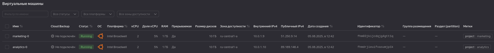
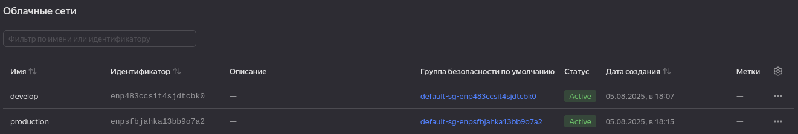
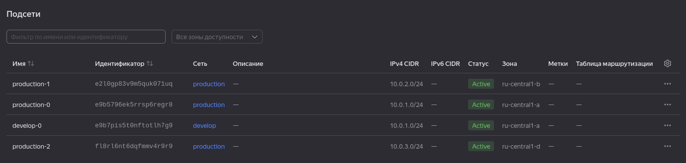
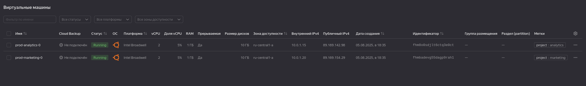
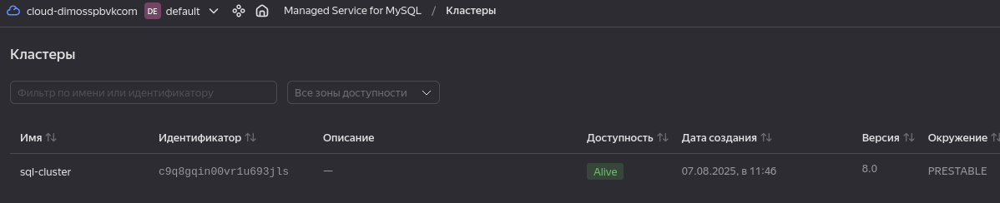
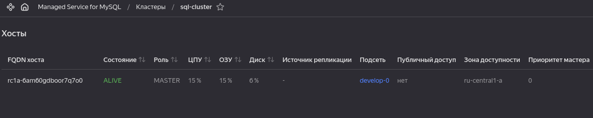
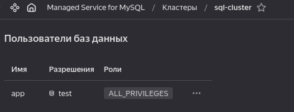
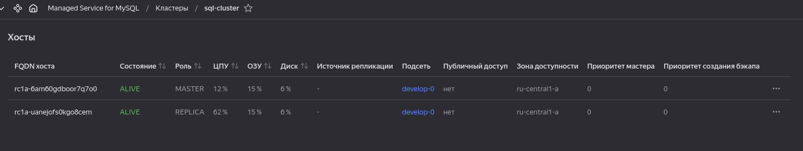

# Домашнее задание к занятию «Продвинутые методы работы с Terraform»

### Цели задания

1. Научиться использовать модули.
2. Отработать операции state.
3. Закрепить пройденный материал.

### Задание 1

1. Возьмите из [демонстрации к лекции готовый код](https://github.com/netology-code/ter-homeworks/tree/main/04/demonstration1) для создания с помощью двух вызовов remote-модуля -> двух ВМ, относящихся к разным проектам(marketing и analytics) используйте labels для обозначения принадлежности.  В файле cloud-init.yml необходимо использовать переменную для ssh-ключа вместо хардкода. Передайте ssh-ключ в функцию template_file в блоке vars ={} .
Воспользуйтесь [**примером**](https://grantorchard.com/dynamic-cloudinit-content-with-terraform-file-templates/). Обратите внимание, что ssh-authorized-keys принимает в себя список, а не строку.
3. Добавьте в файл cloud-init.yml установку nginx.
4. Предоставьте скриншот подключения к консоли и вывод команды ```sudo nginx -t```, скриншот консоли ВМ yandex cloud с их метками. Откройте terraform console и предоставьте скриншот содержимого модуля. Пример: > module.marketing_vm

  - Решение:

    

    ```shell
    ubuntu@marketing-0:~$ sudo nginx -t
    nginx: the configuration file /etc/nginx/nginx.conf syntax is ok
    nginx: configuration file /etc/nginx/nginx.conf test is successful
    ```
    ```cpp
    odv@matebook16s:~/projects/MY/DevOpsCourse/ter-homeworks/04/src$ terraform console
    > module.vm-marketing
    {
      "external_ip_address" = [
        "51.250.9.14",
      ]
      "fqdn" = [
        "marketing-0.ru-central1.internal",
      ]
      "internal_ip_address" = [
        "10.0.1.9",
      ]
      "labels" = [
        tomap({
          "project" = "marketing"
        }),
      ]
      "network_interface" = [
        tolist([
          {
            "dns_record" = tolist([])
            "index" = 0
            "ip_address" = "10.0.1.9"
            "ipv4" = true
            "ipv6" = false
            "ipv6_address" = ""
            "ipv6_dns_record" = tolist([])
            "mac_address" = "d0:0d:1c:e9:29:b1"
            "nat" = true
            "nat_dns_record" = tolist([])
            "nat_ip_address" = "51.250.9.14"
            "nat_ip_version" = "IPV4"
            "security_group_ids" = toset([])
            "subnet_id" = "e9bdbudoi1pvih5g22r1"
          },
        ]),
      ]
    }
    >  
    ```
------

### Задание 2

1. Напишите локальный модуль vpc, который будет создавать 2 ресурса: **одну** сеть и **одну** подсеть в зоне, объявленной при вызове модуля, например: ```ru-central1-a```.
2. Вы должны передать в модуль переменные с названием сети, zone и v4_cidr_blocks.
3. Модуль должен возвращать в root module с помощью output информацию о yandex_vpc_subnet. Пришлите скриншот информации из terraform console о своем модуле. Пример: > module.vpc_dev  
4. Замените ресурсы yandex_vpc_network и yandex_vpc_subnet созданным модулем. Не забудьте передать необходимые параметры сети из модуля vpc в модуль с виртуальной машиной.

  - Исходный код данного задания будет сохранен в ветке [ter-04-task2](https://github.com/DimOsSpb/Netology-DevOps/tree/terr-04-task2/ter-homeworks/04/src)

    ```cpp
    odv@matebook16s:~/projects/MY/DevOpsCourse/ter-homeworks/04/src$ terraform console
    > module.vpc
    {
      "cidr" = tolist([
        "10.0.1.0/24",
      ])
      "name" = "develop"
      "subnet_id" = "e9bhhs7b3ta66joc11b5"
      "vpc_id" = "enplukq57f419hophos3"
      "zone" = "ru-central1-a"
    }
    >  

5. Сгенерируйте документацию к модулю с помощью terraform-docs.
 
  - [vpc-doc.md](src/modules/vpc/vpc-doc.md)

### Задание 3
1. Выведите список ресурсов в стейте.

    ```bash
    odv@matebook16s:~/projects/MY/DevOpsCourse/ter-homeworks/04/src$ terraform state list
    data.template_file.metadata
    data.yandex_compute_image.ubuntu
    module.vm-analytics.data.yandex_compute_image.my_image
    module.vm-analytics.yandex_compute_instance.vm[0]
    module.vm-marketing.data.yandex_compute_image.my_image
    module.vm-marketing.yandex_compute_instance.vm[0]
    module.vpc.yandex_vpc_network.this
    module.vpc.yandex_vpc_subnet.this
    ```
2. Полностью удалите из стейта модуль vpc.
3. Полностью удалите из стейта модуль vm.

    ```bash
    odv@matebook16s:~/projects/MY/DevOpsCourse/ter-homeworks/04/src$ terraform state rm module.vpc.yandex_vpc_network.this
    Removed module.vpc.yandex_vpc_network.this
    Successfully removed 1 resource instance(s).
    odv@matebook16s:~/projects/MY/DevOpsCourse/ter-homeworks/04/src$ terraform state rm module.vpc.yandex_vpc_subnet.this
    Removed module.vpc.yandex_vpc_subnet.this
    Successfully removed 1 resource instance(s).
    odv@matebook16s:~/projects/MY/DevOpsCourse/ter-homeworks/04/src$ terraform state rm module.vm-marketing.yandex_compute_instance.vm[0]
    Removed module.vm-marketing.yandex_compute_instance.vm[0]
    Successfully removed 1 resource instance(s).
    odv@matebook16s:~/projects/MY/DevOpsCourse/ter-homeworks/04/src$ terraform state rm module.vm-marketing.data.yandex_compute_image.my_image
    Removed module.vm-marketing.data.yandex_compute_image.my_image
    Successfully removed 1 resource instance(s).
    odv@matebook16s:~/projects/MY/DevOpsCourse/ter-homeworks/04/src$ terraform state rm module.vm-analytics.yandex_compute_instance.vm[0]
    Removed module.vm-analytics.yandex_compute_instance.vm[0]
    Successfully removed 1 resource instance(s).
    odv@matebook16s:~/projects/MY/DevOpsCourse/ter-homeworks/04/src$ terraform state rm module.vm-analytics.data.yandex_compute_image.my_image
    Removed module.vm-analytics.data.yandex_compute_image.my_image
    Successfully removed 1 resource instance(s).
    odv@matebook16s:~/projects/MY/DevOpsCourse/ter-homeworks/04/src$ terraform state list
    data.template_file.metadata
    data.yandex_compute_image.ubuntu
    ```
4. Импортируйте всё обратно. Проверьте terraform plan. Значимых(!!) изменений быть не должно.
Приложите список выполненных команд и скриншоты процессы.


    ```bash
    cat terraform.tfstate.1754397696.backup | jq -r '
    .resources[]
    | select(.module != null and (.module | test("^module\\.")))
    | "\(.module).\(.type).\(.name) \(.instances[0].attributes.id)"'
    module.vm-analytics.yandex_compute_image.my_image fd8383qtki9fpldbhtmd
    module.vm-analytics.yandex_compute_instance.vm fhmvih6kv91e9f06pgt2
    module.vm-marketing.yandex_compute_image.my_image fd8383qtki9fpldbhtmd
    module.vm-marketing.yandex_compute_instance.vm fhmhestqe88va8llcv2t
    module.vpc.yandex_vpc_network.this enplukq57f419hophos3
    module.vpc.yandex_vpc_subnet.this e9bhhs7b3ta66joc11b5
    ```
    - Здесь ввод весь, вывод последней команды импорта (так короче). Не сразу понял, что для loop ресурсов нужен индекс [0].

    ```bash
    terraform import module.vpc.yandex_vpc_network.this enplukq57f419hophos3
    terraform import module.vpc.yandex_vpc_subnet.this e9bhhs7b3ta66joc11b5
    terraform import module.vm-analytics.yandex_compute_image.my_image fd8383qtki9fpldbhtmd    
    terraform import module.vm-analytics.yandex_compute_instance.vm[0] fhmvih6kv91e9f06pgt2
    terraform import module.vm-marketing.yandex_compute_image.my_image fd8383qtki9fpldbhtmd

    ...

    odv@matebook16s:~/projects/MY/DevOpsCourse/ter-homeworks/04/src$ terraform import module.vm-marketing.yandex_compute_instance.vm[0] fhmhestqe88va8llcv2t
    data.template_file.metadata: Reading...
    data.template_file.metadata: Read complete after 0s [id=e29077f3afdfd9a900a80f4434d788a45af29af8406df4ff2dd5da66999f5971]
    data.yandex_compute_image.ubuntu: Reading...
    data.yandex_compute_image.ubuntu: Read complete after 0s [id=fd8383qtki9fpldbhtmd]
    module.vm-marketing.data.yandex_compute_image.my_image: Reading...
    module.vm-analytics.data.yandex_compute_image.my_image: Reading...
    module.vm-marketing.data.yandex_compute_image.my_image: Read complete after 0s [id=fd8383qtki9fpldbhtmd]
    module.vm-marketing.yandex_compute_instance.vm[0]: Importing from ID "fhmhestqe88va8llcv2t"...
    module.vm-marketing.yandex_compute_instance.vm[0]: Import prepared!
      Prepared yandex_compute_instance for import
    module.vm-marketing.yandex_compute_instance.vm[0]: Refreshing state... [id=fhmhestqe88va8llcv2t]
    module.vm-analytics.data.yandex_compute_image.my_image: Read complete after 0s [id=fd8383qtki9fpldbhtmd]

    Import successful!

    The resources that were imported are shown above. These resources are now in
    your Terraform state and will henceforth be managed by Terraform.

    ```

    ```bash
    odv@matebook16s:~/projects/MY/DevOpsCourse/ter-homeworks/04/src$ terraform state list
    data.template_file.metadata
    data.yandex_compute_image.ubuntu
    module.vm-analytics.data.yandex_compute_image.my_image
    module.vm-analytics.yandex_compute_instance.vm[0]
    module.vm-marketing.data.yandex_compute_image.my_image
    module.vm-marketing.yandex_compute_instance.vm[0]
    module.vpc.yandex_vpc_network.this
    module.vpc.yandex_vpc_subnet.this


    odv@matebook16s:~/projects/MY/DevOpsCourse/ter-homeworks/04/src$ terraform plan
    data.template_file.metadata: Reading...
    data.template_file.metadata: Read complete after 0s [id=e29077f3afdfd9a900a80f4434d788a45af29af8406df4ff2dd5da66999f5971]
    data.yandex_compute_image.ubuntu: Reading...
    module.vpc.yandex_vpc_network.this: Refreshing state... [id=enplukq57f419hophos3]
    data.yandex_compute_image.ubuntu: Read complete after 0s [id=fd8383qtki9fpldbhtmd]
    module.vm-analytics.data.yandex_compute_image.my_image: Reading...
    module.vm-marketing.data.yandex_compute_image.my_image: Reading...
    module.vm-analytics.data.yandex_compute_image.my_image: Read complete after 0s [id=fd8383qtki9fpldbhtmd]
    module.vm-marketing.data.yandex_compute_image.my_image: Read complete after 0s [id=fd8383qtki9fpldbhtmd]
    module.vpc.yandex_vpc_subnet.this: Refreshing state... [id=e9bhhs7b3ta66joc11b5]
    module.vm-analytics.yandex_compute_instance.vm[0]: Refreshing state... [id=fhmvih6kv91e9f06pgt2]
    module.vm-marketing.yandex_compute_instance.vm[0]: Refreshing state... [id=fhmhestqe88va8llcv2t]

    Terraform used the selected providers to generate the following execution plan. Resource actions are indicated with the following symbols:
      ~ update in-place

    Terraform will perform the following actions:

      # module.vm-analytics.yandex_compute_instance.vm[0] will be updated in-place
      ~ resource "yandex_compute_instance" "vm" {
          + allow_stopping_for_update = true
            id                        = "fhmvih6kv91e9f06pgt2"
            name                      = "analytics-0"
            # (15 unchanged attributes hidden)

            # (6 unchanged blocks hidden)
        }

      # module.vm-marketing.yandex_compute_instance.vm[0] will be updated in-place
      ~ resource "yandex_compute_instance" "vm" {
          + allow_stopping_for_update = true
            id                        = "fhmhestqe88va8llcv2t"
            name                      = "marketing-0"
            # (15 unchanged attributes hidden)

            # (6 unchanged blocks hidden)
        }

    Plan: 0 to add, 2 to change, 0 to destroy.
    ```

---

### Задание 4*

1. Измените модуль vpc так, чтобы он мог создать подсети во всех зонах доступности, переданных в переменной типа list(object) при вызове модуля.  
  
Пример вызова
```
module "vpc_prod" {
  source       = "./vpc"
  env_name     = "production"
  subnets = [
    { zone = "ru-central1-a", cidr = "10.0.1.0/24" },
    { zone = "ru-central1-b", cidr = "10.0.2.0/24" },
    { zone = "ru-central1-c", cidr = "10.0.3.0/24" },
  ]
}

module "vpc_dev" {
  source       = "./vpc"
  env_name     = "develop"
  subnets = [
    { zone = "ru-central1-a", cidr = "10.0.1.0/24" },
  ]
}
```

Предоставьте код, план выполнения, результат из консоли YC.

---

  - Исходный код данного задания будет сохранен в ветке [ter-04-task4](https://github.com/DimOsSpb/Netology-DevOps/tree/terr-04-task4/ter-homeworks/04/src)

  - [Вывод terraform plan](src/task-4.plan)

  - Далее подвох в лимите vpc, пришлось ручками удалить default сеть. Второе это zone = "ru-central1-c" которой нет у яндекс, есть ru-central1-d

    
    
    
    
### Задание 5*

1. Напишите модуль для создания кластера managed БД Mysql в Yandex Cloud с одним или несколькими(2 по умолчанию) хостами в зависимости от переменной HA=true или HA=false. Используйте ресурс yandex_mdb_mysql_cluster: передайте имя кластера и id сети.

    - Код будет сохранен в ветке [terr-04-task5](https://github.com/DimOsSpb/Netology-DevOps/tree/terr-04-task5/ter-homeworks/04)
    - Кластер из 2-х узлов - не рекомендуемая конфигурация. Но для теста и экономии ресурсов - допустимо. Для реальных сред для HA кластера минимум 3 узла разнесённых по зонам.  
    Т.е. потребуется изменить код модуля и добавить функциональность согласно рекомендациям [Managed Service for MySQL](https://yandex.cloud/ru/docs/terraform/resources/mdb_mysql_cluster)
    - Важные параметры для переменных [Классы хостов MySQL](https://yandex.cloud/ru/docs/managed-mysql/concepts/instance-types)
    - В модуль передаётся только VPC ID и подсети, модуль сам определяет зоны, распределяет по ним узлы. Требуется минимум одна подсеть.
    - [Модуль mysql](/home/odv/projects/MY/DevOpsCourse/ter-homeworks/04/src/modules/mysql)

2. Напишите модуль для создания базы данных и пользователя в уже существующем кластере managed БД Mysql. Используйте ресурсы yandex_mdb_mysql_database и yandex_mdb_mysql_user: передайте имя базы данных, имя пользователя и id кластера при вызове модуля.

    - [yandex_mdb_mysql_database](https://yandex.cloud/ru/docs/terraform/resources/mdb_mysql_database)
    - [yandex_mdb_mysql_user](https://yandex.cloud/ru/docs/terraform/resources/mdb_mysql_database)
    - [Модуль mysql_db](/home/odv/projects/MY/DevOpsCourse/ter-homeworks/04/src/modules/mysql_db)

3. Используя оба модуля, создайте кластер example из одного хоста, а затем добавьте в него БД test и пользователя app. Затем измените переменную и превратите сингл хост в кластер из 2-х серверов.
    
    - [plan sql cluster](src/sqlcluster.plan)

    
    

    - [plan sql + db + user](src/sqldb.plan)
    
    

    - [plan cluster -> 2 hosts](src/sqlcluster2.plan)

    

    ```shell
    odv@matebook16s:~/projects/MY/DevOpsCourse/ter-homeworks/04/src$ terraform destroy

    ...

    module.mysql.yandex_mdb_mysql_cluster.this: Still destroying... [id=c9q8gqin00vr1u693jls, 1m10s elapsed]
    module.mysql.yandex_mdb_mysql_cluster.this: Destruction complete after 1m14s
    module.vpc_dev.yandex_vpc_subnet.this["develop-0"]: Destroying... [id=e9b6fu1dokcjqdfv5hk8]
    module.vpc_dev.yandex_vpc_subnet.this["develop-0"]: Destruction complete after 3s
    module.vpc_dev.yandex_vpc_network.this: Destroying... [id=enpsljcpopf8u4i834q0]
    module.vpc_dev.yandex_vpc_network.this: Destruction complete after 0s

    Destroy complete! Resources: 5 destroyed.

    ```
[### Задание 6* (Ветка main)](https://github.com/DimOsSpb/Netology-DevOps/blob/main/ter-homeworks/04/README.md#%D0%B7%D0%B0%D0%B4%D0%B0%D0%BD%D0%B8%D0%B5-6)
